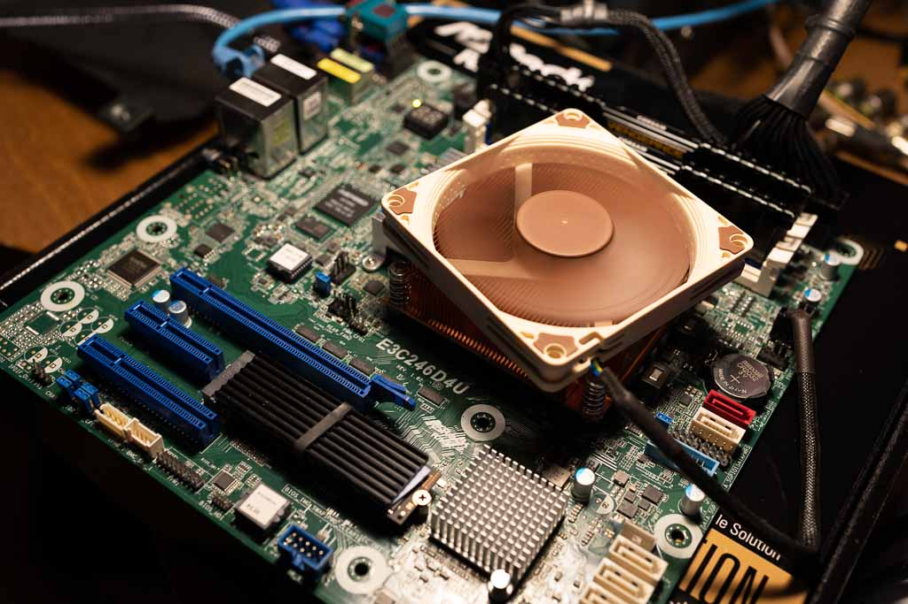
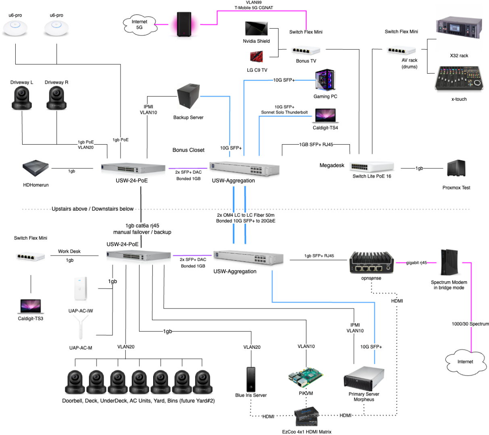

# Alex's PMS Stack

Here's a high level overview snapshot of my PMS implementation as it stands right now.

!!! info
    Access the living and breathing repository I use to configure all my infrastructure on GitHub at [ironicbadger/infra](https://github.com/ironicbadger/infra).

## On this day in history

=== "August 2023"

    PMS wise the last 18 months have been very stable. The only changes have been cycling in and out a couple of hard drives. There's been a complete [rebuild](https://www.youtube.com/watch?v=nlB73DqNFxY) of the network around PMS with a 10 gigabit fiber upgrade in the Spring of 2023. January saw a "Jellyfin January" challenge on the Self-Hosted podcast which led to my ditching Plex almost entirely (except for Audiobooks for my wife). With the demise of Twitter and reddit, I've turned back to RSS - note the entry of FreshRSS and Wallbag in the containers section.

    Goals for the next year are to build a new server with more PCIe lanes to add more NVME storage to take better advantage of the 10gig network in the house now I'm editing a lot more video!
    
    ## August 2023
    ### Hardware

    | Device       | Model                                                  | Reason                                                                                                                     |
    | ------------ | ------------------------------------------------------ | -------------------------------------------------------------------------------------------------------------------------- |
    | CPU          | [Intel i5 8500](https://amzn.to/3LMgZBH)               | iGPU with built-in [Quicksync](../06-hardware/intel-quicksync.md) transcoding hardware                                        |
    | Motherboard  | [ASRock Rack E3C246D4U](https://amzn.to/3LMh88d)       | IPMI + iGPU support. Full write-up [here](https://blog.ktz.me/asrock-rack-e3c246d4u-the-perfect-media-server-motherboard/) |
    | Case         | [Rosewill RSV-L4500](https://amzn.to/37eVqKS)          | Pre-covid this case was often under $100 but at current prices of $200 and up, it's a tough recommendation                 |
    | Memory       | [Corsair DDR4 64GB - Non ECC](https://amzn.to/3w8LWcN) | 64GB is enough to run my entire production stack without being tempted to use it as a dev environment too                  |
    | Boot Drive   | [Samsung 500GB M.2 NVMe SSD](https://amzn.to/37kBI0l)  |                                                                                                                            |
    | Power Supply | [Seasonic PRIME 850 Gold](https://amzn.to/3OXvMLP)     | Electricity makes computer go brrrrrr. 850w is probably overkill for this use case. 5-600w would be adequate.              |
    | Hard Drives  | A mix of drives from 8-16tb                            | See [HDD purchasing methodology](../06-hardware/hdd-purchase-methodology.md) for more details                                 |

    ### Software

    | Type              | Product / Version                                          | Reason                                               |
    | ----------------- | ---------------------------------------------------------- | ---------------------------------------------------- |
    | OS                | [Proxmox 8.0](../02-tech-stack/proxmox.md)                    | ZFS support and VM UI is nice to have.               |
    | Parity            | [SnapRAID](../02-tech-stack/snapraid.md)                      | Increases uptime and fights bit-rot style corruption |
    | Drive pooling     | [mergerfs](../02-tech-stack/mergerfs.md)                      | Present many disks under one mountpoint              |
    | Container runtime | [docker](../02-tech-stack/docker.md)                          | Is there another way to run software?               |
    | VM(s)             | [Home Assistant](../04-day-two/top10apps.md#3-home-assistant) | Because turning lights on and off at the switch is so 200-late   |

    ### Containers

    | Container                                        | Purpose                                    | Relevant content link                                            |
    | ------------------------------------------------ | ------------------------------------------ | ---------------------------------------------------------------- |
    | [Traefik](https://traefik.io/)                   | Reverse proxy                              | [Traefik 101 Guide](../04-day-two/remote-access/traefik101.md)              |
    | [Jellyfin](https://jellyfin.org/)                | Media server - replacing Plex              | [Top 10 Apps - Jellyfin](../04-day-two/top10apps.md#1-jellyfin)             |
    | [Nextcloud](https://nextcloud.com/)              | An awesome self-hosted dropbox alternative | [Top 10 Apps - Nextcloud](../04-day-two/top10apps.md#2-nextcloud)        |
    | [Immich](https://github.com/immich-app/immich)   | Self-hosted photo and video backup         | - tbd -   |
    | [FreshRSS](https://freshrss.org/index.html)      | Self-hosted RSS and Atom feed aggregator   | - tbd -   |
    | [Wallabag](https://wallabag.org/)                | Save and classify articles. Read them later.   | - tbd -   |

    See my infra repo for a full list [here](https://github.com/ironicbadger/infra/blob/master/group_vars/morpheus.yaml#L275).

=== "May 2022"
    
    ## May 2022
    ### Hardware

    | Device       | Model                                                  | Reason                                                                                                                     |
    | ------------ | ------------------------------------------------------ | -------------------------------------------------------------------------------------------------------------------------- |
    | CPU          | [Intel i5 8500](https://amzn.to/3LMgZBH)               | iGPU with built-in [Quicksync](../06-hardware/intel-quicksync.md) transcoding hardware                                        |
    | Motherboard  | [ASRock Rack E3C246D4U](https://amzn.to/3LMh88d)       | IPMI + iGPU support. Full write-up [here](https://blog.ktz.me/asrock-rack-e3c246d4u-the-perfect-media-server-motherboard/) |
    | Case         | [Rosewill RSV-L4500](https://amzn.to/37eVqKS)          | Pre-covid this case was often under $100 but at current prices of $200 and up, it's a tough recommendation                 |
    | Memory       | [Corsair DDR4 64GB - Non ECC](https://amzn.to/3w8LWcN) | 64GB is enough to run my entire production stack without being tempted to use it as a dev environment too                  |
    | Boot Drive   | [Samsung 500GB M.2 NVMe SSD](https://amzn.to/37kBI0l)  |                                                                                                                            |
    | Power Supply | [Seasonic PRIME 850 Gold](https://amzn.to/3OXvMLP)     | Electricity makes computer go brrrrrr. 850w is probably overkill for this use case. 5-600w would be adequate.              |
    | Hard Drives  | A mix of drives from 8-14tb                            | See [HDD purchasing methodology](../06-hardware/hdd-purchase-methodology.md) for more details                                 |

    ### Software

    | Type              | Product / Version                                          | Reason                                               |
    | ----------------- | ---------------------------------------------------------- | ---------------------------------------------------- |
    | OS                | [Proxmox 7.2](../02-tech-stack/proxmox.md)                    | ZFS support and VM UI is nice to have.               |
    | Parity            | [SnapRAID](../02-tech-stack/snapraid.md)                      | Increases uptime and fights bit-rot style corruption |
    | Drive pooling     | [mergerfs](../02-tech-stack/mergerfs.md)                      | Present many disks under one mountpoint              |
    | Container runtime | [docker](../02-tech-stack/docker.md)                          | Is there another way to run software?               |
    | VM                | [Home Assistant](../04-day-two/top10apps.md#3-home-assistant) | Because turning lights on and off at the switch is so 200-late       |

    ### Containers

    | Container                                        | Purpose                                    | Relevant content link                                            |
    | ------------------------------------------------ | ------------------------------------------ | ---------------------------------------------------------------- |
    | [Traefik](https://traefik.io/)                   | Reverse proxy                              | [Traefik 101 Guide](../04-day-two/remote-access/traefik101.md)              |
    | [Authelia](https://www.authelia.com/)            | Basic auth frontend                        |                                                                  |
    | [Flame](https://github.com/pawelmalak/flame)     | Dashboard                                  |                                                                  |
    | [Plex](https://www.plex.tv/)                     | Media server                               | [Top 10 Apps - Plex](../04-day-two/top10apps.md)             |
    | [Tautulli](https://github.com/Tautulli/Tautulli) | Plex analytics                             |                                                                  |
    | [Nextcloud](https://nextcloud.com/)              | An awesome self-hosted dropbox alternative | [Top 10 Apps - Nextcloud](../04-day-two/top10apps.md#2-nextcloud)        |
    | [Smokeping](https://oss.oetiker.ch/smokeping/)   | Latency measurement and graphing tool      | [Top 10 Apps - Smokeping](../04-day-two/top10apps.md#6-smokeping)   |
    | [Librespeed](https://librespeed.org/)            | Self-hosted speedtest tool                 | [Top 10 Apps - Librespeed](../04-day-two/top10apps.md#8-librespeed) |

    See my infra repo for a full list [here](https://github.com/ironicbadger/infra/blob/master/group_vars/morpheus.yaml#L275).

## Network Diagram

