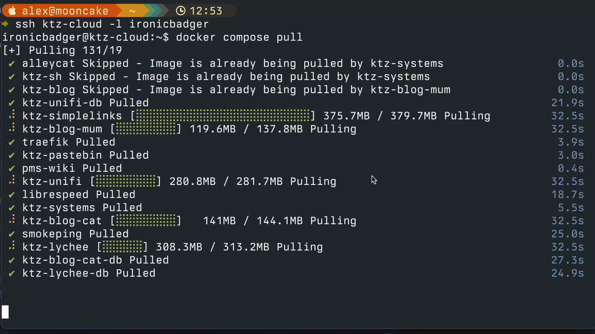

# docker compose

[docker compose](https://docs.docker.com/compose/) touts itself as a tool for managing and deploying multi-container applications. However, it excels at managing the application containers most of us will run on our PMS systems. Declaratively define the image, container name, volumes, ports, and so on that a container needs to run in a YAML file in a self-documenting system that saves you from that "how did I do this 6 months ago again?" question we've all faced at one time or another.

Compose is now part of the core docker package and as v2 (which was released in 2022) the `docker-compose` (note the hyphen) syntax was deprecated. All commands are now available via `docker compose` instead with no extra installations or configurations required.

Familiarise yourself with the [compose docs](https://docs.docker.com/compose/) as it is a very valuable tool on the belt of any self-hoster. I use it daily and it completely removes the need for any kind of container UI layer like portainer. Manage your config files via git (being careful not to commit any secrets) and you'll have a system that lasts for years. See [this video](https://www.youtube.com/watch?v=CUh8FDLbj8M) I made on how I manage my compose files using Ansible if you're curious.

Here's an screen recording example of updating the containers on the cloud VPS I use to run my personal blog, and this very website (plus a couple of other useful self-hosted services).

<figure markdown="span">
  { width="1280" }
</figure>

## How do I use docker compose?

Here is an example `compose.yaml` snippet for [Librespeed](https://github.com/librespeed/speedtest), a self-hosted speed test app.

```yaml
---
services:
  librespeed:
    image: linuxserver/librespeed
    container_name: librespeed
    ports:
      - 8008:80
    environment:
      - PUID=1001
      - PGID=1001
      - TZ=America/New_York
      - MODE=standalone
      - TELEMETRY=true
      - PASSWORD=badger1
```

YAML[^2] stands for Yet Another Markup Language and for correct parsing of these files careful attention to indentations made up of spaces are key. The specific number of spaces in the indentation is unimportant as long as parallel elements have the same left justification and the hierarchically nested elements are indented further.

In short, make sure everything lines up vertically and you'll be OK. Use an editor which highlights spaces for bonus points. VSCode has some nice syntax plug-ins and YAML is one of them.

To create the container defined above copy and paste the above into a file placed at `~/compose.yaml`, run `docker compose up -d` and watch. When the output has finished updating, your Librespeed container will be accessible at `serverip:8008`. Try it out!

[^1]: [Docker - docker-compose](https://docs.docker.com/compose/)
[^2]: [YAML.org - Spec](https://yaml.org/spec/)
