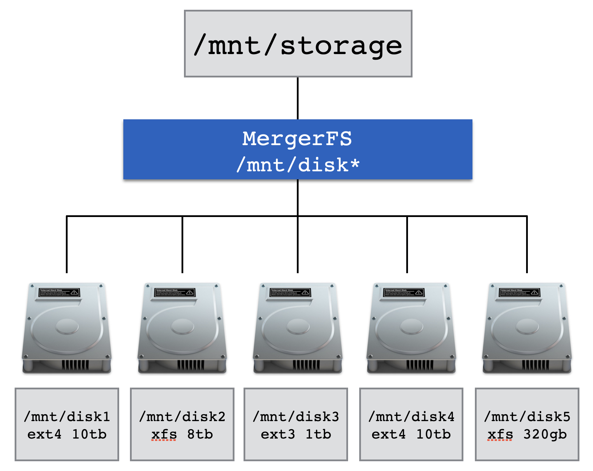

# mergerfs

The GitHub page describes mergerfs as "a featureful union filesystem ... geared towards simplifying storage and management of files across numerous commodity storage devices. It is similar to mhddfs, unionfs, and aufs".

This amazing project is developed and maintained by Antonio SJ Musumeci (aka [@_trapexit](https://twitter.com/_trapexit)). Back in 2019 I got the chance to speak with Antonio for an episode of [_Extras_](https://extras.show/) by [Jupiter Broadcasting](https://www.jupiterbroadcasting.com/) - if you're interested in this technology who better to hear about it from than the developer himself?!

<p align="center">
<iframe src="https://player.fireside.fm/v2/WTrMvATU+NSbz5Jst?theme=dark" width="740" height="200" frameborder="0" scrolling="no"></iframe>
</p>

## What is mergerfs?

mergerfs takes JBOD and turns them into what appears like a single drive. It's sort of like RAID in that sense but is actually nothing _at all_ like RAID - there are some major differences - see ["is this RAID?"](#is-this-raid)

## Installing mergerfs

For Debian and Proxmox installs, PMS provides a small helper script that downloads the latest mergerfs release from GitHub and installs the matching `.deb` package. It is safe to run again later.

```
curl -fsSL https://perfectmediaserver.com/scripts/install_mergerfs.sh | sh
```

For non-interactive use, such as a systemd timer, pass `--force`.

```
curl -fsSL https://perfectmediaserver.com/scripts/install_mergerfs.sh | sh -s -- --force
```

### Automating mergerfs updates with a systemd timer

Create `/etc/systemd/system/pms-mergerfs-update.service`.

```
[Unit]
Description=Update mergerfs from GitHub

[Service]
Type=oneshot
ExecStart=/bin/sh -c 'curl -fsSL https://perfectmediaserver.com/scripts/install_mergerfs.sh | sh -s -- --force'
```

Create `/etc/systemd/system/pms-mergerfs-update.timer`.

```
[Unit]
Description=Run PMS mergerfs update monthly

[Timer]
OnCalendar=monthly
Persistent=true

[Install]
WantedBy=timers.target
```

Enable the timer.

```
systemctl daemon-reload
systemctl enable --now pms-mergerfs-update.timer
```

## Why mergerfs?

Here are the key features of mergerfs that make it perfect for PMS:

* Pools multiple drives into one mountable volume
* Supports addition _and_ removal of devices with no rebuild times
* Permits drives with mismatched sizes with no penalties
* Each drive has an individually readable filesystem (ext4, xfs, zfs, etc)
    * Drives may contain data when mounted via Mergerfs
* Simple configuration with one line in `/etc/fstab`

For the home user the incremental addition of hard drives is a very important consideration. ZFS still lacks easy expandability and for most people, adding 4 or more drives at once is prohibitively expensive - see ["The hidden cost of ZFS"](https://louwrentius.com/the-hidden-cost-of-using-zfs-for-your-home-nas.html).

Drives of a useful capacity cost upwards of $150 (x4 = $600). $600 is a chunk of change to plop down in one go just because you filled up your last drive - why not have a system that grows as your needs do?

This doesn't take into consideration the increased simultaneous failure risk of buying 4 drives from the same batch (when drives go bad they usually fail at a similar point if from the same batch)! With mergerfs the drive addition process is as simple as partitioning the drive, adding it to the mount command in `/etc/fstab` and you’re done.

I do however suggest considering your use case carefully. For example mergerfs is best suited to large, primarily write once read many datasets like media files. Last year I decided to start using a ZFS mirror for my most critical data and merging that using mergerfs as well - see [combining ZFS and mergerfs](../05-advanced/combine-zfs-and-others.md).

## Drive Pooling

In the following diagram there are five separate disks. Each disk is a different size, is formatted with differing filesystems and they may already contain data - all of this is fine for mergerfs.



Configuration is performed via a single line of configuration in `/etc/fstab`[^1]. mergerfs has a lot of knobs and dials to turn should you wish, and they are detailed in the [mergerfs docs](https://trapexit.github.io/mergerfs/latest/).

!!! example "An example `/etc/fstab` entry for mergerfs"
    ```
    /mnt/disk* /mnt/storage mergerfs cache.files=off,category.create=pfrd,func.getattr=newest,dropcacheonclose=false,minfreespace=200G,branches-mount-timeout=30,branches-mount-timeout-fail=true,x-systemd.mount-timeout=45s,fsname=mergerfs 0 0
    ```

The example above is the required configuration to take every drive which matches `/mnt/disk*` such as `/mnt/disk1` or `/mnt/disk95` and merge it together presenting it to the user at `/mnt/storage`.

This follows the current [mergerfs QuickStart](https://trapexit.github.io/mergerfs/latest/quickstart/) for Linux 6.6 and newer. Recent mergerfs versions no longer need older options like `nonempty`, `allow_other`, or `use_ino`.

The `branches-mount-timeout` options help mergerfs wait for the data disks to mount before it builds the pool. This avoids accidentally pooling the empty mountpoint directories on the boot drive.

!!! tip
    mergerfs also supports [`passthrough.io`](https://trapexit.github.io/mergerfs/latest/config/passthrough/) on Linux 6.9 and newer for faster reads and writes. This example does not enable it by default because it changes how writes are handled and prevents `moveonenospc` from working. Benchmark it for your own workload before using it.

!!! note
    The directories and names used (`disk1` or `/mnt/storage`) are completely arbitrary and can take any form you wish.

It's possible to string multiple drives together manually as well. The syntax for that is to place a single `:` between the path to each drive to be mounted like `/mnt/disk*:/mnt/tank/fuse:/mnt/usb`.

## Create policies

A fundamentally important part of having a successful experience with mergerfs is setting the correct [policies](https://trapexit.github.io/mergerfs/latest/config/functions_categories_policies/) for your use case.

!!! info
    For most people, most of the time, the current upstream defaults will be fine.

The current upstream QuickStart recommends `category.create=pfrd`. This means percentage free random distribution. It chooses a destination branch randomly, but weights the choice by how much free space each branch has. Drives with more free space are more likely to receive new files.

Older mergerfs examples often used `mfs` or `epmfs`. `mfs` always picks the branch with the most free space. `epmfs` is path preserving, which means it only picks branches where the destination path already exists. That can surprise new users because a set of empty drives can end up using one drive for a whole directory tree.

!!! info
    Take a moment to read [this](https://github.com/trapexit/mergerfs/issues/634) issue on the mergerfs GitHub if you want more context on create policies. They can be a bit confusing to begin with.

    A good general option for PMS is `category.create=pfrd`. It spreads new files across the pool without requiring the same directory layout to exist on every drive.

If you do want path preservation you'll need to perform the manual act of creating paths on the drives you want the data to land on before transferring your data[^3].

## Is this RAID?

No, mergerfs differs from RAID in a few key ways.

The first is that mergerfs has _nothing whatsoever_ to do with parity[^2]. mergerfs has **zero** fault tolerance - if the drive that data is stored on fails, that data is gone. With RAID if the fault tolerance of the array is exceeded all data is lost but with mergerfs only the failed drive is affected.

To add a parity like feature, mergerfs is often paired with [SnapRAID](snapraid.md). SnapRAID takes a snapshot of the data disks at a set interval providing some local redundancy. Whilst these two projects are complimentary to each other their relationship is coincidental.

Second is that mergerfs does not stripe data. RAID achieves a level of redundancy by placing enough data from each drive on each of the other drives such that it can compute what was on the drive that just failed. This is useful but with modern drives leads to long rebuild times which creates unnecessary wear and tear on the drives leading, ironically, to premature failure - often during the most critical time, a rebuild!

The third way is related to the second. Because data is not striped each disk remains individually readable. That means that you can pull any combination of drives and put them into _any other_ system capable of reading that filesystem and it will just work. This is not possible without all the members of a RAID array.

## An example file layout

Here's an example of what mergerfs enables us to do. Take data spread out across multiple locations and present it to us as one location transparently.

```
alex@cartman:/mnt$ tree -L 2
.
├── disk1
│   ├── music
│   ├── photos
│   ├── movies
│   └── tv
├── disk2
│   └── movies
├── disk3
│   ├── drone
│   └── sports
└── storage
    ├── drone
    ├── movies
    ├── music
    ├── photos
    ├── software
    ├── sports
    └── tv
```

As you can see we now have data spread across multiple filesystems or physical disks that is merged transparently into `/mnt/storage` by mergerfs from drives with different filesystem.

As discussed in [create policies](#create-policies), the current upstream recommendation is `category.create=pfrd`. If you want strict path preservation, use a path preserving policy and create those paths on the drives where you want new data to land.

[^1]: More information about `/etc/fstab` is detailed in the [manual installation](../03-installation/manual-install-ubuntu.md) section.
[^2]: [What is Parity?](https://en.wikipedia.org/wiki/Standard_RAID_levels#Simplified_parity_example)
[^3]: [trapexit/mergerfs docs](https://trapexit.github.io/mergerfs/latest/faq/why_isnt_it_working/#why-are-all-my-files-ending-up-on-1-filesystem)
