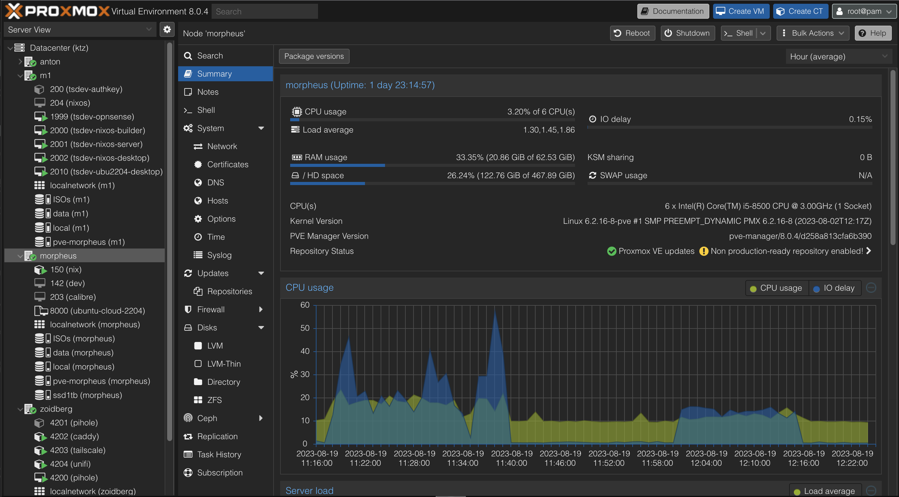

# Proxmox

Is Proxmox right for you? See *[which distro should I pick?](os/linux.md#which-distro-should-i-pick)*.

## What is Proxmox?

Proxmox Virtual Environment is an open-source server virtualization management platform. It is a Debian-based Linux distribution with a modified Ubuntu LTS kernel which specialises in managing virtual machines and containers.

It is provided as a standalone distribution or as a package to be installed on top of an existing Debian installation. Which route you take for installation doesn't really matter but if you're in doubt, use the pre-built Proxmox ISO as it will save you some work.

## Why use Proxmox?

Proxmox is open-source and provides extremely simple Virtual Machine management via its unique webUI. Under the hood, it uses KVM built right into the Linux kernel - no proprietary "virtualisation engines" here.

Proxmox also natively supports running LXC (LinuX Containers) containers from the UI. These are similar to docker containers but behave more like a traditional VM would with a full init system, often systemd. I've been running my [Pihole DNS](https://blog.ktz.me/fully-automated-dns-and-dhcp-with-pihole-and-dnsmasq/) out of one for a while and it just works - makes me think I should do more this way but I'm quite attached to my docker-compose workflow for media apps.

!!! info
    For the longest time I avoided Proxmox because of a nag screen that is displayed on new installations asking for subscriptions. I assumed, incorrectly, that Proxmox was demo-ware. That is not the case and I maintain an Ansible role to remove the nag screen completely [here](https://github.com/IronicBadger/ansible-role-proxmox-nag-removal).

## Do I need Proxmox?

[Proxmox](../02-tech-stack/proxmox.md) is the PMS defacto base OS these days. It's a bastardized version of debian and ubuntu smushed together with some "proxmox sauce" thrown in on top. 

This means you get ZFS support out the box, a VM and LXC hosting platform with a fully featured web interface and an API to automate tools like Ansible and Terraform against if that floats your boat. Combine that with Proxmox's ability to cluster multiple nodes together for failover, migration, and storage and it becomes quite a compelling option as a base OS for PMS.

!!! success "Is Proxmox the right choice for me?"
    NixOS is the right choice for you if:

    1. You like a stable base distro in debian
    2. You want to run Virtual Machines
    3. You want to run LXC containers
    4. You want to use ZFS
    5. You'd like to cluster multiple servers together
    6. The idea of NixOS is a bit much yet

I have found a lot value from running Proxmox. For example, running a dedicated Home Assistant VM so you can benefit from the built-in "app store". Or if you just want to spin up a VM to test something out it's hard to beat. The virtualisation layer that ships with Proxmox adds minimal bloat and even if you don't plan on using it right away, knowing it's there is handy.

If you want to dive deep into the rabbit hole, you can with Proxmox. Because Proxmox is just Linux underneath you can use it like you would any other installation. This also means things like PCI passthrough or ZFS don't require waiting for vendor patches or releases, it just works.

## What about VMware / ESXI?

ESXI by VMware is a juggernaut in the enterprise space but it comes with a steep cost. VMware make licenses available for home users that cost $200 per year via the VMUG program if you want to get fancy and start using Terraform to automate against vSphere [^1].

However, ESXI is not open source. And for that simple fact, Proxmox is my goto recommendation for home users looking to virtualise all the things.

[^1]: [How to Install OpenShift 4.6 using Terraform on VMware with UPI](https://www.openshift.com/blog/how-to-install-openshift-4.6-on-vmware-with-upi)
