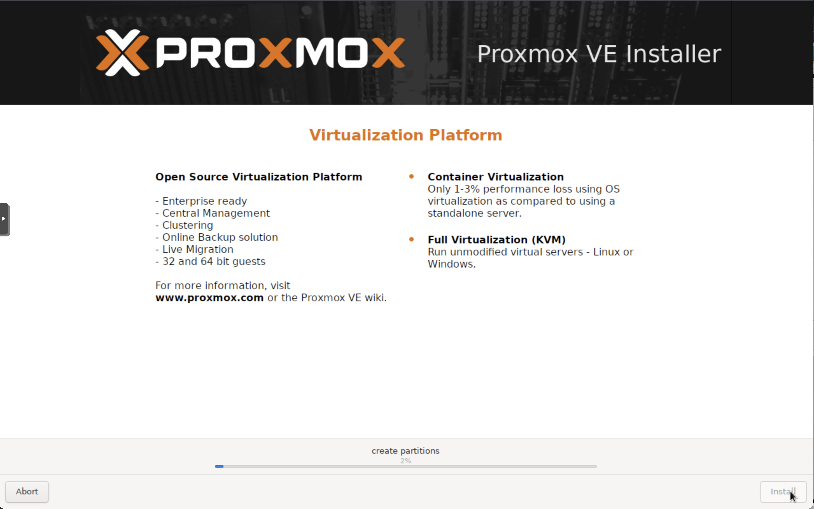
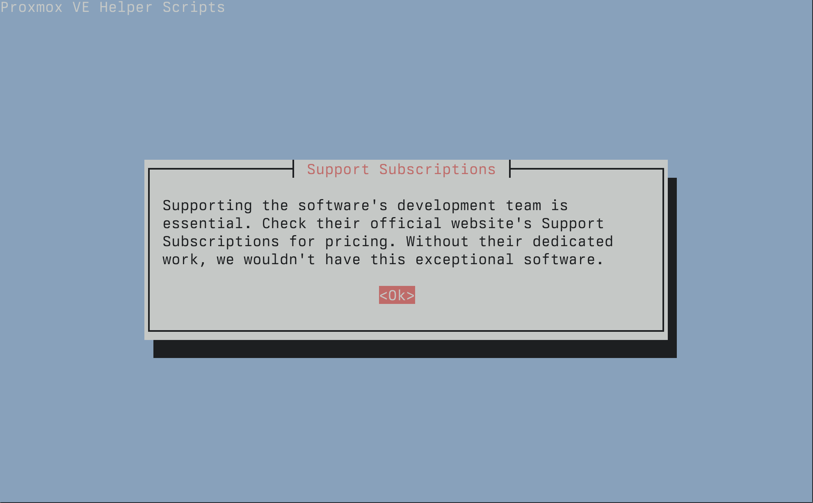

# Manual PMS install on Proxmox

The section walks you through a manual setup of a Perfect Media Server atop of Proxmox. It was written at the start of 2025 and tested against Proxmox v8.3.2.

By the time you've worked through this section, you should have a functioning system. Proxmox will be the base OS, we'll cover the basics of partitioning drives and configuring them to use mergerfs, as well as some other useful stuff like how to setup shares with samba etc.

For a full rationale of why Proxmox is recommended as the Base OS, please refer to [tech-stack/proxmox](../../02-tech-stack/proxmox).

## Base OS installation



There are two ways to install Proxmox.

1. Download the Proxmox ISO from their site and install that (recommended)
2. Install Debian first, then put Proxmox on top of that

!!! danger
    To prevent accidentally installing Ubuntu on the wrong drive and overwriting data it is recommended to disconnect data drives during installation.

Proxmox make a [full installation guide](https://pve.proxmox.com/pve-docs/chapter-pve-installation.html) available on their site. Creating a bootable USB stick to install Linux from used to be a tricky thing. There is a [guide](https://pve.proxmox.com/pve-docs/chapter-pve-installation.html#_prepare_a_usb_flash_drive_as_installation_medium) on the Proxmox website for the official method.

When installing Proxmox you are offered a "graphical" or "terminal" installation. Pick your preference, it doesn't make a difference long term.

You will want a dedicated SSD to install the OS onto. It can be tempting to overengineer this step and think about mirrored disks, but for a home media server there's no need. Have a spare in a drawer perhaps, but don't worry too much about mirrored boot drives. They require extra complexity and cost that only provides more uptime - useful if you are a business but as a home user it's total overkill.

During the installation process you'll be prompted to create users, set timezones and such. This guide resumes once you have rebooted into a working Proxmox system.

## First steps

It is time to configure repositories. By default Proxmox ships with enterprise repos enabled and a subscription nag screen to push users towards a paid tier. We can use the excellent [Proxmox helper scripts](https://community-scripts.github.io/ProxmoxVE/scripts) to make this much easier for us.

!!! info
    These scripts are the legacy of [tteck](https://github.com/tteck/Proxmox). He sadly passed away in 2024 but left the community with this excellent resource. Thanks tteck - RIP.

    They are now under new stewardship at [community-scripts/proxmox-ve](https://github.com/community-scripts/ProxmoxVE).

Load up the community scripts website and look for `Proxmox VE tools -> Proxmox VE Post Install`. This script provides options for managing Proxmox VE repositories, including disabling the Enterprise Repo, adding or correcting PVE sources, enabling the No-Subscription Repo, adding the test Repo, disabling the subscription nag, updating Proxmox VE, and rebooting the system.



From the Proxmox command line, execute:

```
bash -c "$(wget -qLO - https://github.com/community-scripts/ProxmoxVE/raw/main/misc/post-pve-install.sh)"
```

Follow the prompts (defaults are good), reboot and continue here once complete. Feel free to run any other community helper scripts too - there's a lot of _great_ stuff over there.

!!! info
    Whenever updating packages in Proxmox you must use a special command. `apt update` followed by `pveupgrade`.

## mergerfs

It's time to start thinking about our disks. [mergerfs](https://github.com/trapexit/mergerfs) is what we'll use to make multiple mismatched sized drives appear as one single volume. Here's a more detailed [explanation](../02-tech-stack/mergerfs.md).

At the time of writing the version of mergerfs in the Debian upstream repos is `2.33.5-1` but the most recent release available on Github upstream is `2.40-2`. Therefore it is not recommended to use the version in the repos.

This one liner will query the Github API for the latest release, query your local OS for which release you are running and then download the correct `.deb` package before installing it with `dpkg`. You can perform these steps manually if you prefer, this one liner is provided for convenience. (You will need `sudo` installed - `apt install sudo` will do this).

```
## Downloads latest version from github for your os_release
curl -s https://api.github.com/repos/trapexit/mergerfs/releases/latest | grep "browser_download_url.*$(grep VERSION_CODENAME /etc/os-release | cut -d= -f2)_$(dpkg --print-architecture).deb\"" | cut -d '"' -f 4 | wget -qi - && sudo dpkg -i mergerfs_*$(grep VERSION_CODENAME /etc/os-release | cut -d= -f2)_$(dpkg --print-architecture).deb && rm mergerfs_*.deb

## Verify installation
root@pxtest:~# apt list mergerfs
Listing... Done
mergerfs/now 2.40.2~debian-bookworm amd64 [installed,local]
```

Remember to do this every few months to get a fresh version of mergerfs. We aren't using the repo version here so updates are not automatic.

## Hard Drive setup

The following section details the steps to identify, mount and partition the hard drives in your system.

### Mounting drives manually

In order to use these disks our OS needs to mount them. *Mounting* means that we are providing the OS with instructions on how to read or write data to a specific drive. The most common way of configuring drives for use with PMS is to create one large partition and format it with a single filesystem which spans the entire drive, often `ext4` or `xfs`, and then mounting it.

!!! success
    You may now connect your data disks.

The filesystem wars have raged for decades and there is no right or wrong one to pick. However, we recommended either `ext4` or `xfs` to keep things simple. `xfs` allegedly works slightly better with large files (like media files) but there is not much in it. Red Hat have a great article on choosing your filesystem [here](https://access.redhat.com/articles/3129891).

Remember with mergerfs you are able to safely mix and match filesystems and drive sizes which is part of it's real magic. This means you don't have to stress too much about picking exactly the right filesystem up front because you aren't locked in.

### Identifying drives

First, check that all your disks show up with `inxi -xD` (`apt install inxi`).

```
root@deepthought:~# inxi -xD
Drives:
  Local Storage: total: raw: 92.63 TiB usable: 45.84 TiB used: 19.66 TiB (42.9%)
  ID-1: /dev/nvme0n1 vendor: Western Digital model: WD BLACK SN850X 4000GB size: 3.64 TiB
    temp: 27.9 C
  ID-2: /dev/nvme1n1 vendor: Western Digital model: WD BLACK SN850X 4000GB size: 3.64 TiB
    temp: 25.9 C
  ID-7: /dev/sda vendor: Crucial model: CT1000MX500SSD1 size: 931.51 GiB temp: 13.0 C
  ID-8: /dev/sdb vendor: Samsung model: SSD 870 EVO 1TB size: 931.51 GiB temp: 15.0 C
  ID-9: /dev/sdc vendor: Western Digital model: WD201KFGX-68BKJN0 size: 18.19 TiB temp: 20.0 C
```

Once you're happy that everything is showing up, list all drives in a system with:

    ls /dev/disk/by-id

The output will look something like this:

```
root@pxtest:~# ls /dev/disk/by-id
ata-HGST_HDN728080ALE604_R6GPPDTY                     ata-WDC_WD100EMAZ-00WJTA0_2YJ373DD
ata-SPCC_Solid_State_Disk_BA1B0788165300033582
ata-WDC_WD100EMAZ-00WJTA0_2YJ2S3AD                    ata-WDC_WD100EMAZ-00WJTA0_2YJ7E2VD
ata-WDC_WD100EMAZ-00WJTA0_2YJ2S3AD-part1              wwn-0x5000cca263c9dc2c
```

We now need to create a map between ephemeral drive mappings such as `/dev/sdc` and `ata-HGST_HDN728080ALE604_R6GPPDTY`. We can do this using `ls -la /dev/disk/by-id/ata-HGST_HDN728080ALE604_R6GPPDTY`. The following output is generated:

```
root@pxtest:~# ls -la /dev/disk/by-id/ata-HGST_HDN728080ALE604_R6GPPDTY
lrwxrwxrwx 1 root root 9 Sep  9 23:08 /dev/disk/by-id/ata-HGST_HDN728080ALE604_R6GPPDTY -> ../../sdc
```

Therefore, we can ascertain that `/dev/sdc` is mapped to this physical drive. Never use `/dev/sdX` as a long term solution for drive identification as these identifiers can and do change without warning due to other hardware changes, kernel upgrades, etc. The `/dev/disk/by-id` identifier is tied to that specific piece of hardware by drive model and serial number and will therefore never change which is why it is recommended over using `/dev/sdc`.

### Brand new drives

Before we create a partition on a brand new disk, ensure you have 'burned it in' as we cover under *Hardware* -> [New Drive Burn-In Rituals](../06-hardware/new-drive-burnin.md).

!!! warning
    **BE CAREFUL HERE** - We are about to perform destructive steps to the partition table of the drive. If there is *any* existing data on this drive - **IT WILL BE WIPED**. Make sure you proceed with caution! You have been warned!

The following steps will require root access. To become the root user type `sudo su`. Using our example drive from the prior section we will use `gdisk` to create a new partition and filesystem. Run `gdisk /dev/sdX` (replacing `sdX` with your drive), for example:

    root@cartman:~# gdisk /dev/sdc
    GPT fdisk (gdisk) version 1.0.5

    Partition table scan:
        MBR: protective
        BSD: not present
        APM: not present
        GPT: not present

Once `gdisk` is loaded we are presented with an interactive prompt `Command (? for help):`. To see all options simply type `?`. In the initial output from gdisk we can see there is no partition table present on this drive - it's a good sanity check you have the right drive before erasing the partition and file allocation tables.

!!! danger
    The following sequence will erase everything on this disk. **MAKE SURE YOU HAVE A BACKUP AND USE CAUTION**

Use the following sequence to create one large partition spanning the entire drive. Note that the keys you need to press are at the start of each heading and the answers to the subsequent questions at the ends of the next few lines.

```
* o - creates a new **EMPTY** GPT partition table (GPT is good for large drives over 3TB)
    * Proceed? (Y/N) - **`Y`**
* n - creates a new partition
    * Partition number (1-128, default 1): **`1`**
    * First sector (34-15628053134, default = 2048) or {+-}size{KMGTP}: **`leave blank`**
    * Last sector (2048-15628053134, default = 15628053134) or {+-}size{KMGTP}: **`leave blank`**
    * Hex code or GUID (L to show codes, Enter = 8300): **`8300`**
* p - (optional) validate 1 large partition to be created
    * Model: HGST HDN728080AL
    * Number  Start (sector)    End (sector)  Size       Code  Name
    * 1       2048              15628053134   7.3 TiB    8300  Linux filesystem
* w - writes the changes made thus far
    * Until this point, gdisk has been non-destructive
    * Confirm that making these changes is OK and the changes queued so far will be executed
```

Next up, we'll create a filesystem on that newly created partition.

!!! info
    Rinse and repeat this step for each new drive as required.

#### Filesystem creation

Create an `ext4` filesystem thus (replace `X` with your drive letter):

    mkfs.ext4 /dev/sdX1

Congratulations! Your new drive is now formatted and ready to store data.

Move onto the next section 'Existing drive' to learn how to mount it (make it available to the OS for use).

### Existing drives

[Identify](#identifying-drives) the existing drive and take note of the partition you wish to mount. This is usually displayed as `-part1` using `/dev/disk/by-id`.

!!! info
    Ensure you have the correct supporting libraries for your filesystem installed such as `xfsprogs` for XFS.

    With Debian this is achieved via `sudo apt install xfsprogs`.

You should now be able to mount the drive manually like so:

    mkdir /mnt/manualdiskmounttest
    mount /dev/disk/by-id/ata-HGST_HDN728080ALE604_R6GPPDTY-part1 /mnt/manualdiskmounttest

Verify that the drive mounted and displays the correct size as expected:

    root@cartman:~# df -h
    Filesystem                        Size  Used Avail Use% Mounted on
    /dev/sdc1                         7.3T  2.8T  4.6T  38% /mnt/manualdiskmounttest

### Mountpoints

Mountpoints are where the OS mounts a specific disk partition. For example, you could have multiple partitions on the same disk mounted to different places for redundancy or performance reasons. For our purposes here we'll keep things simple by mounting each data disk partition one by one.

Assuming the previous test went well, it's time to come up with a mountpoint naming scheme. We recommended `/mnt/diskN` because it makes the `fstab` entry for mergerfs simpler thanks to wildcard support (more on this shortly). For example:

    mkdir /mnt/disk{1,2,3,4}
    mkdir /mnt/parity1 # adjust this command based on your parity setup
    mkdir /mnt/storage # this will be the main mergerfs mountpoint

We also just created `/mnt/storage` in addition to our data disk mountpoints of `/mnt/disk1`, `/mnt/disk2` and so on. `/mnt/storage` will be used by [mergerfs](../02-tech-stack/mergerfs.md) to 'pool' or 'merge' our data disks.

### fstab entries

Next we need to create an entry in `/etc/fstab`.

This file tells your OS how, where and which disks to mount. It looks a bit complex but an fstab entry is actually quite simple and breaks down to `<device> <mountpoint> <filesystem> <options> <dump> <fsck>` - [fstab documentation](https://wiki.archlinux.org/index.php/fstab).

!!! note
    Note that mergerfs does *not* mount the parity drive, it only mounts `/mnt/disk*`. mergerfs has *nothing to do* with parity, that is what we use SnapRAID for.

Here's what your `/etc/fstab` file might look like with 4 data disks and 1 SnapRAID parity drive.

```
##/etc/fstab example
/dev/disk/by-id/ata-WDC_WD100EMAZ-00WJTA0_16G0Z7RZ-part1 /mnt/parity1 ext4 defaults 0 0
/dev/disk/by-id/ata-WDC_WD100EMAZ-00WJTA0_16G10VZZ-part1 /mnt/disk1   ext4 defaults 0 0
/dev/disk/by-id/ata-WDC_WD100EMAZ-00WJTA0_2YHV69AD-part1 /mnt/disk2   ext4 defaults 0 0
/dev/disk/by-id/ata-WDC_WD100EMAZ-00WJTA0_2YJ15VJD-part1 /mnt/disk3   ext4 defaults 0 0
/dev/disk/by-id/ata-HGST_HDN728080ALE604_R6GPPDTY-part1  /mnt/disk4   ext4 defaults 0 0

/mnt/disk* /mnt/storage fuse.mergerfs defaults,nonempty,allow_other,use_ino,cache.files=off,moveonenospc=true,dropcacheonclose=true,minfreespace=200G,fsname=mergerfs 0 0
```

In order to reload the new fstab entries you've created and check them before rebooting, use `mount -a`. Then verify the mount points with `df -h`.

```
root@cartman:~# df -h
Filesystem                        Size  Used Avail Use% Mounted on
/dev/sdo2                          59G   22G   34G  39% /
/dev/sdj1                         469G  118G  328G  27% /opt
/dev/sde1                         9.1T  7.1T  2.1T  78% /mnt/disk1
/dev/sdg1                         9.1T  547G  8.6T   6% /mnt/disk2
/dev/sdm1                         9.1T  5.6T  3.6T  62% /mnt/disk3
/dev/sdc1                         7.3T  2.8T  4.6T  38% /mnt/disk4
/dev/sdl1                         9.1T  7.2T  2.0T  79% /mnt/parity1
mergerfs                           34T   24T   10T  69% /mnt/storage
```

If you had any existing files on your data disks they will be visible under `/mnt/storage`.

## SnapRAID

[SnapRAID](https://www.snapraid.it/) is a backup program for disk arrays. It stores parity information of your data and it recovers from up to six disk failures. It is mainly targeted for a home media center, with a lot of big files that rarely change.

!!! info
    The Debian repos contain SnapRAID 12.2-1 at the time of writing. However the most recent release is 12.3 but the release cadence of SnapRAID is [slow](https://github.com/amadvance/snapraid/blob/master/HISTORY) so you likely won't see major issues by using the repo package here (unlike mergerfs).

To install SnapRAID execute:

```
apt install snapraid
```

### Configure SnapRAID

You should familiarise yourself with the documentation provided by [SnapRAID](https://www.snapraid.it/manual) with regards to all the configuration options available.

In it's most simple form, you must provide a configuration file to SnapRAID to tell it where to store parity, which disks are your data disks and what types of files to calculate parity for or not. Here's a very stripped down basic version of a config file:

```
# SnapRAID configuration file

# Parity location(s)
1-parity /mnt/parity1/snapraid.parity
2-parity /mnt/parity2/snapraid.parity

# Content file location(s)
content /var/snapraid.content
content /mnt/disk1/.snapraid.content
content /mnt/disk2/.snapraid.content

# Data disks
data d1 /mnt/disk1
data d2 /mnt/disk3
data d3 /mnt/disk4

# Excludes hidden files and directories
exclude *.unrecoverable
exclude /tmp/
exclude /lost+found/
exclude downloads/
exclude appdata/
exclude *.!sync
```

### Automating Parity Calculation

As SnapRAID is designed to work by taking snapshots we must configure these to be calculated at regular intervals. We could just create a very simple cronjob and execute `snapraid sync` as part of that process, but there are a few situations we want a little more smarts than that.

[snapraid-runner](https://github.com/Chronial/snapraid-runner) is a reliable way to add some logic gates to execution of SnapRAID.

To install, begin by cloning the git repo:

```
git clone https://github.com/Chronial/snapraid-runner.git /opt/snapraid-runner
```

Next, you will need to ensure you have set up your configuration file for SnapRAID as detailed above.

Edit the configuration file for snapraid-runner, a default is provided at `/opt/snapraid-runner/snapraid-runner.conf.example`. The following parameters are of the most interest when configuring this file:

* `config = /etc/snapraid.conf` - Ensure this points to where your `snapraid.conf` file is stored
* `deletethreshold = 250` - abort operation if there are more deletes than this, set to -1 to disable
* `touch = True` - This improves the SnapRAID capability to recognize moved and copied files as it makes the timestamp almost unique, removing possible duplicates.
* `[email]` - If you are using gmail you will need to generate an [app specific password](https://support.google.com/accounts/answer/185833?hl=en).
* `[scrub]` - Configure periodic data verification features
    * `enabled = True`
    * `percentage = 22` - The % of the array to scrub
    * `older-than = 8` - Only scrub data if older than this number of days


Finally, create a cronjob to automatically run `snapraid-runner`. You will want to ensure the file SnapRAID is checking parity for are not changing during this time. Ideally at something like 4 or 5am, it would be a good idea to also temporarily disable any services that write to your storage during this time - that is optional though.

```
root@cartman: crontab -e

00 01 * * * python3 /opt/snapraid-runner/snapraid-runner.py -c /opt/snapraid-runner/snapraid-runner.conf && curl -fsS --retry 3 https://hc-ping.com/123-1103-xyz-abc-123 > /dev/null
```

!!! info
    During a sync SnapRAID will write a `.content` file to `/var/` and will therefore require write access to the this directory. Running via `sudo` or as `root` is a simple, reliable solution here.

With cron, it is a good idea to be as explicit as possible when it comes to file paths. Never rely on relative paths or the `PATH` variable. Perhaps you also noticed that there is a healthcheck configured at `hc-ping.com`.

#### Healthchecks.io

[https://healthchecks.io/](https://healthchecks.io/) notifies you when your nightly backups, weekly reports, cron jobs and scheduled tasks don't run on time.

It is self-hostable in a [container](https://hub.docker.com/r/linuxserver/healthchecks) but that depends on that local system being up - a cheap VPS might be a good idea for this purpose.


## Containers

To run apps on top of the base OS, we'll be using [docker](../02-tech-stack/docker.md).

### docker

We are using Debian which means docker installation is straightforward via docker's [documentation](https://docs.docker.com/engine/install/ubuntu/). Or if you just want a simple one liner:

```
curl -fsSL https://get.docker.com | sh
```

### docker compose

`docker compose` is a tool for defining and running multiple containers at once using docker. Defining, starting, stopped and upgrading dozens of containers all at once is reduced to a single command. It ships with docker itself and requires no extra configuration.

Here's an example `compose.yaml` file for a simple nginx webserver deployment (yep, that's the code used to deploy the site you're viewing right now!).

```
---
services:
  ktz-nginx-pmswiki:
    image: nginx
    container_name: ktz-nginx-pmswiki
    volumes:
      - /tank/appdata/pms-wiki/site:/usr/share/nginx/html:ro
    restart: unless-stopped
```

### Container file permissions

We need to find the user and group IDs for the user we plan to run our containers with. This is important because otherwise we will end up with file permissions errors.

The [LinuxServer.io](https://www.linuxserver.io/) team are one of the most popular containerisation projects on the web. They provide a whole [fleet](https://fleet.linuxserver.io/) of containers that cater to pretty much every need the average Media Server enthusiast has. They pioneered a system of defining `PUID` and `PGID` in container environment variables to ensure permissions issues became a thing of the past.

!!! success
    Ensure any volume directories on the host are owned by the same user you specify and any permissions issues will vanish like magic.

With containers, when using volumes (`-v` flags) permissions issues can arise between the host OS and the container. Avoid this issue by running containers which support the user `PUID` and group `PGID` flags. Not all containers support this but all containers from LSIO do.

In this instance `PUID=1000` and `PGID=1000`, to find yours use `id username` as below:

```
  $ id alex
    uid=1000(dockeruser) gid=1000(dockergroup) groups=1000(dockergroup)
```

You can check the owner of a specific file or directory with `ls -la`.

## Network File Sharing

A NAS or file server is no good without being able to access the data remotely. We're not talking about remotely like over the internet remotely here though, instead we're talking about other computers on your LAN. Raspberry Pis, Media Players ([Kodi](https://kodi.tv), for example), etc. You can find more information on remote file access over the internet in the [remote access](../04-day-two/remote-access/index.md) and [Top 10 Self-Hosted apps list](../04-day-two/top10apps.md#nextcloud).

There are two primary methods for sharing files over the network. Samba for Windows / Mac / Linux and NFS for Linux.

### Samba

There are two parts to samba. The [client](#samba-client) and the [server](#samba-server).

!!! info
    This [guide](https://tldp.org/HOWTO/SMB-HOWTO-8.html) is an excellent, and more detailed, one on setting up samba.

Let's begin by configuring the server side of things.

#### Samba server

As is often the case the [Arch Wiki](https://wiki.archlinux.org/index.php/samba#Server) has a fantastically detailed entry on setting up and configuring a samba server. Despite the fact that PMS recommends Ubuntu, much of the configuration information provided by the Arch Wiki is valid for use by us.

If you just want the most brain dead simple way to get going with samba, here it is.

* First, install samba:

```
apt install samba
```

* Next, create a file at `/etc/samba/smb.conf` with the following contents (adapt this for your needs, change home directory to your own):

```
[global]
    workgroup = KTZ
    server string = cartman
    security = user
    guest ok = yes
    map to guest = Bad Password
    log file = /var/log/samba/%m.log
    max log size = 50
    printcap name = /dev/null
    load printers = no

# Samba Shares
[home]
    comment = alex home folder
    path = /home/alex
    browseable = yes
    read only = no
    guest ok = no

[storage]
    comment = Primary Storage
    path = /mnt/storage
    browseable = yes
    read only = no
    guest ok = yes
```

* Samba requires setting a password separately from that used for login. You may use an existing user or create a new one for this purpose.

```
smbpasswd -a user
```

* Existing samba users can be listed with:

```
pdbedit -L -v
```

* Once you're happy, ensure the samba service is restarted with:

```
systemctl restart smbd
```

* Verify using a client:
    * Linux - `sudo smbstatus`
    * Mac - Open finder, press Command+K and enter `smb://serverip/storage`
    * Windows - Open file explorer and enter into the address bar `\\serverip\share`

#### Samba client

Here's the relevant [Arch Wiki](https://wiki.archlinux.org/index.php/samba#Client) entry for configuring clients. This section assumes mounting is occuring on a Linux CLI based system (a Pi or something like that).

* First you'll need to install the samba client for your OS:

```
apt install smbclient
```

* Now we can verify the available shares thus:

```
alex@cartman:~$ smbclient -L cartman -U%

    Sharename       Type      Comment
    ---------       ----      -------
    home            Disk      alex home folder
    opt             Disk      opt directory
    storage         Disk      Storage on cartman
    photos          Disk      Storage on cartman
    IPC$            IPC       IPC Service (cartman)
SMB1 disabled -- no workgroup available
```

#### Mounting Samba via fstab

On a remote system you might wish to mount your samba shares permanently using `/etc/fstab`. Ensure that client has its equivalent of `smbclient` installed (see above) and then put the following into the `/etc/fstab` file:

```
//SERVER/sharename /mnt/mountpoint cifs _netdev,username=myuser,password=mypass 0 0
```

Ensure the mountpoint exists. If it doesn't, create it with `mkdir /mnt/mountpoint`. Also make sure to set `smbpasswd` as described above.


### NFS

Once again, the [Arch Wiki](https://wiki.archlinux.org/index.php/NFS#Installation) is the best place to dive _deep_ on NFS, and there really is a lot of great information in that article.

There isn't much call for NFS these days for home use and we've found most users can get by with only samba quite happily. If you need NFS, you'll know it.

* Install the required server package with:

```
apt install nfs-kernel-server
```

* Create a list of exports in `/etc/exports` that looks something like this:

```
/mnt/storage        192.168.1.0/24(rw,sync,crossmnt,fsid=0)
```

* If the NFS server is running you will need to re-export for changes to take effect. Do that with:

```
exportfs -arv
```

* View the current exports with:

```
exportfs -v
```
