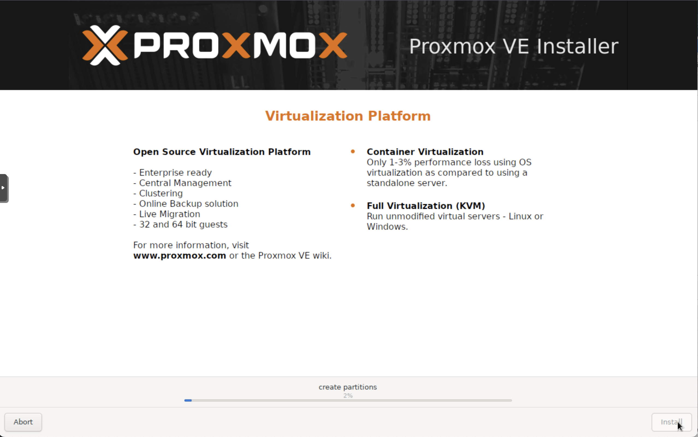
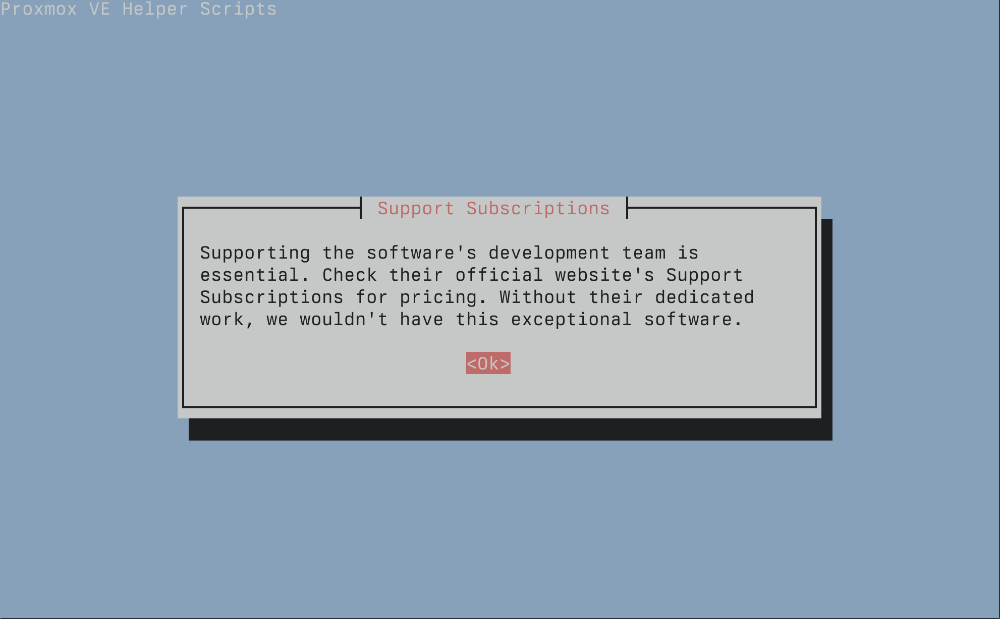
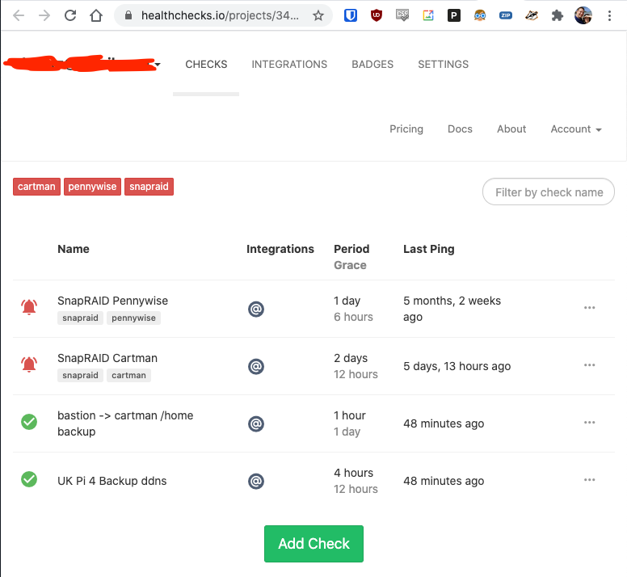

# Manual PMS install on Proxmox

This section walks you through a manual setup of a Perfect Media Server on Proxmox. It was written at the start of 2025 and tested against Proxmox v8.3.2, and updated in June 2026 against Proxmox v9.2.3.

By the end of this section, you will have a functioning system. Proxmox will be the base OS, we'll cover the basics of partitioning drives and configuring them to use mergerfs, as well as some other useful stuff like how to setup shares with samba etc.

By the end of this section, you should have a functioning PMS system with Proxmox as the base OS. This guide details drive partitioning, configuring disks with mergerfs, running your first container, and common supporting tasks such as setting up Samba shares.

!!! info
    For a full rationale of why Proxmox is recommended as the base OS, refer to ["Which distro should I pick?"](index.md#which-distro-should-i-pick).

## Base OS installation



There are two ways to install Proxmox.

1. Download the Proxmox ISO from the Proxmox website and install it directly (recommended)
2. Install Debian first, then install Proxmox on top of it

!!! danger
    To avoid accidentally installing Proxmox on the wrong drive and overwriting important data, disconnect your data drives during installation.

Proxmox provides a [full installation guide](https://pve.proxmox.com/pve-docs/chapter-pve-installation.html) on its website, including the official method for [creating a USB install key](https://pve.proxmox.com/pve-docs/chapter-pve-installation.html#_prepare_a_usb_flash_drive_as_installation_medium).

When installing Proxmox, you can choose either the graphical installer or the terminal installer. Pick whichever you prefer; the end result is the same.

Use a dedicated SSD for the OS. It can be tempting to overengineer this step with mirrored boot disks, but for a home media server that usually is not necessary. If you like, keep a spare SSD available in case your boot drive fails.

During installation, you will be prompted to create users, set your timezone, and configure basic system settings. This guide resumes once you have rebooted into a working Proxmox system.

## First steps

Assuming a successful first boot to the Proxmox login TTY, log in as with your root username / password. Now we need to configure Proxmox repositories.

By default, Proxmox ships with the enterprise repositories enabled and displays a subscription notice for unpaid installations. The excellent [Proxmox helper scripts](https://community-scripts.github.io/ProxmoxVE/scripts) make the initial configuration for our self-hosting purposes much easier.

!!! info
    These scripts began as the work of [tteck](https://github.com/tteck/Proxmox), who sadly passed away in 2024. He left the community an excellent resource. Thanks, tteck. RIP.

    They are now maintained at [community-scripts/proxmox-ve](https://github.com/community-scripts/ProxmoxVE) and are now location at [https://community-scripts.org/](https://community-scripts.org/).

Open the community scripts website and search for `Proxmox VE tools -> Proxmox VE Post Install`. This script helps manage the Proxmox VE repositories, including disabling the enterprise repository, enabling the no-subscription repository, removing the subscription notice, updating Proxmox VE, and rebooting the system.


<figcaption>Proxmox VE is a serious project maintained by real people. If it becomes useful to you and you are able, consider supporting the project with a subscription.</figcaption>

From the Proxmox command line, execute:

```
bash -c "$(wget -qLO - https://github.com/community-scripts/ProxmoxVE/raw/main/tools/pve/post-pve-install.sh)"
```

Follow the prompts, reboot, and continue here once the script has completed. The defaults are sensible. There are many other useful community helper scripts there too, so feel free to explore.

!!! info
    When updating packages in Proxmox, use `apt update` followed by `pveupgrade`.

## mergerfs

It is time to start thinking about disks. If you disconnected your data drives during the Proxmox installation, power down the system and reconnect them now.

[mergerfs](https://github.com/trapexit/mergerfs) lets multiple drives of different sizes appear as a single volume. This is the pooling layer we will use for the media storage array. For more detail, see the [mergerfs explanation](../02-tech-stack/mergerfs.md).

At the time of writing, the version of mergerfs in the Debian upstream repositories is `2.40.2-5`, while the latest upstream release on GitHub is `2.42.0-1`. For that reason, this guide does not use the version directly from the Debian repositories.

The following PMS helper script downloads the latest mergerfs release from GitHub, installs the matching `.deb` package, and skips the install if that version is already present. You can review the script at [perfectmediaserver.com/scripts/install_mergerfs.sh](https://perfectmediaserver.com/scripts/install_mergerfs.sh).

```
curl -fsSL https://perfectmediaserver.com/scripts/install_mergerfs.sh | sh
```

Verify installation with:

```
root@pxtest:~# apt list mergerfs
Listing... Done
mergerfs/now 2.42.0~debian-trixie amd64 [installed,local]
```

Remember to repeat this process every so often to pick up newer mergerfs releases. Because this guide installs mergerfs manually instead of using the Debian repository package, updates are not automatic.

## Hard Drive setup

This section covers how to identify, partition, format, and mount the hard drives in your system.

### Mounting drives manually

Before the OS can use a data disk, it needs to be mounted.

_Mounting_ connects a filesystem on a disk or partition to a directory path, which gives the OS a place to read and write data. The most common PMS layout is one large partition per data drive, formatted with a single filesystem such as `ext4` or `xfs`, and then mounted to a predictable path.

!!! success
    If you have not already done so, connect your data disks before continuing.

The filesystem wars have raged for decades, and there is no single correct choice. For this guide, use either `ext4` or `xfs` to keep things simple. `xfs` can work slightly better with large files, such as media files, but the difference is unlikely to matter much for most PMS builds. Red Hat has a useful article on [choosing your filesystem](https://access.redhat.com/articles/3129891).

With mergerfs, you can safely mix filesystems and drive sizes. This is the magic of mergerfs. You do not need to stress too much about picking the perfect filesystem up front, because you are not locked into one choice forever.

### Identifying drives

First, check that all your disks appear with `inxi -xD` (`apt install inxi`).

```
root@proxtest:~# inxi -xD
Drives:
  Local Storage: total: raw: 92.63 TiB usable: 45.84 TiB used: 19.66 TiB (42.9%)
  ID-1: /dev/nvme0n1 vendor: Western Digital model: WD BLACK SN850X 4000GB size: 3.64 TiB
    temp: 27.9 C
  ID-7: /dev/sda vendor: Crucial model: CT1000MX500SSD1 size: 931.51 GiB temp: 13.0 C
  ID-8: /dev/sdc vendor: Western Digital model: HGST_HDN728080ALE604_R6GPPDTY size: 7.2 TiB temp: 20.0 C
  ID-9: /dev/sdc vendor: Western Digital model: WD201KFGX-68BKJN0 size: 18.19 TiB temp: 20.0 C
```

Once everything is visible, list the stable disk identifiers on the system:

```
ls /dev/disk/by-id
```

The output will look something like this:

```
root@proxtest:~# ls /dev/disk/by-id
ata-HGST_HDN728080ALE604_R6GPPDTY
ata-WDC_WD100EMAZ-00WJTA0_2YJ373DD
ata-WDC_WD201KFGX-68BKJN0_ABC12345
ata-WDC_WD100EMAZ-00WJTA0_2YJ2S3AD
ata-WDC_WD100EMAZ-00WJTA0_2YJ2S3AD-part1
```

Next, map temporary kernel device names, such as `/dev/sdc`, to stable hardware identifiers, such as `ata-HGST_HDN728080ALE604_R6GPPDTY`. The simplest way to do this is to ask which `ata-*` identifier points to the same device:

```
root@proxtest:~# find -L /dev/disk/by-id -samefile /dev/sdc -name 'ata-*'
/dev/disk/by-id/ata-HGST_HDN728080ALE604_R6GPPDTY
```

For a partition, query the partition device instead:

```
root@proxtest:~# find -L /dev/disk/by-id -samefile /dev/sdc1 -name 'ata-*-part*'
/dev/disk/by-id/ata-HGST_HDN728080ALE604_R6GPPDTY-part1
```

**Do not** use `/dev/sdX` names for long-term drive identification, especially in `/etc/fstab`, because they can change after hardware changes, kernel upgrades, or controller changes. Prefer the human-readable `ata-*` identifier when available because it includes the drive model and serial number. If no `ata-*` identifier is available, use another stable `/dev/disk/by-id` path such as `wwn-*`.

### Brand new drives

> If you have pre-existing drives, you can skip this section.

Before creating a partition on a brand new disk, make sure you have burned it in as covered under _Hardware_ -> [New Drive Burn-In Rituals](../06-hardware/new-drive-burnin.md).

!!! warning
    **BE CAREFUL HERE** - The next steps modify the drive's partition table. If there is _any_ existing data on this drive, **IT WILL BE WIPED**. Proceed carefully.

The following steps require root access. On Proxmox you may already be logged in as root. If not, use `sudo su` to switch to root.

If you are new to this, use the `sgdisk` option because it does the same thing every time and is easier to check.

??? example "Recommended: create the partition with sgdisk"

    Using the example drive from the previous section, use `sgdisk` to create a new partition table and one large partition. The package name is `gdisk`, but the command we want here is `sgdisk`.

    Replace `/dev/sdc` with the drive you have intentionally selected.

    !!! danger
        The command below creates a new partition table and removes any existing partition entries. **USE CAUTION**

    ```
    sgdisk --clear --new=1:0:0 --typecode=1:8300 --change-name=1:data /dev/sdc
    ```

    The options above mean:

    | Option | What it does |
    | --- | --- |
    | `--clear` | Creates a fresh GPT partition table |
    | `--new=1:0:0` | Creates partition 1 from the first aligned sector to the end of the disk |
    | `--typecode=1:8300` | Sets partition 1 to the Linux filesystem type |
    | `--change-name=1:data` | Names partition 1 `data` |

    Ask the kernel to re-read the partition table.

    ```
    partprobe /dev/sdc
    ```

    You can verify the result with `sgdisk --print`.

    ```
    sgdisk --print /dev/sdc
    ```

??? example "Alternative: create the partition interactively with gdisk"

    If you prefer an interactive tool, you can use `gdisk` instead of `sgdisk`.

    Replace `/dev/sdc` with the drive you have intentionally selected.

    !!! danger
        The steps below create a new partition table and remove any existing partition entries. **USE CAUTION**

    Start `gdisk`.

    ```
    gdisk /dev/sdc
    ```

    Once `gdisk` has loaded, use the following sequence to create one large partition spanning the whole drive.

    ```text
    o      create a new empty GPT partition table
    Y      confirm
    n      create a new partition
    1      use partition number 1
    Enter  use the default first sector
    Enter  use the default last sector
    8300   use the Linux filesystem type
    p      print the pending partition table
    w      write the changes
    Y      confirm the write
    ```

    Until you press `w`, `gdisk` has not written the partition table to disk.

    Ask the kernel to re-read the partition table after writing the changes.

    ```
    partprobe /dev/sdc
    ```

Next, create a filesystem on the new partition.

!!! info
    Repeat this step for each new drive as required.

#### Filesystem creation

Create an `xfs` filesystem on the new partition, replacing `X` with your drive letter:

```
mkfs.xfs /dev/sdX1
```

Your new drive is now formatted and ready to store data.

Continue to the next section to learn how to mount it and make it available to the OS.

### Existing drives

[Identify](#identifying-drives) the existing drive and note the partition you want to mount. When using `/dev/disk/by-id`, the first partition is usually shown with a `-part1` suffix (but not always!).

!!! info
    Make sure you have the supporting tools for your filesystem installed, such as `xfsprogs` for XFS.

    On Debian or Proxmox, install them with `sudo apt install xfsprogs`.

You should now be able to mount the drive manually:

```
mkdir /mnt/test
mount /dev/disk/by-id/ata-HGST_HDN728080ALE604_R6GPPDTY-part1 /mnt/test
```

Verify that the drive mounted and shows the expected size:

```
root@proxtest:~# df -h
Filesystem                        Size  Used Avail Use% Mounted on
/dev/sdc1                         7.3T  2.8T  4.6T  38% /mnt/test
```

To unmount the disk use `umount /mnt/test`.

### Mountpoints

Mountpoints map the physical drive partitions to directories on your system. This is how you interface with the data stored on the disk.

Assuming the manual mount test went well, choose a mountpoint naming scheme. This guide recommends `/mnt/diskN` because it makes the `fstab` entry for mergerfs simpler thanks to wildcard support. For example:

```
mkdir /mnt/disk{1,2,3,4}
mkdir /mnt/parity1 # adjust this command based on your parity setup
mkdir /mnt/storage # this will be the main mergerfs mountpoint
mkdir /mnt/appdata # this will be where your self-hosted app configs + data live
```

The commands above also create `/mnt/storage`, and `/mnt/appdata`. Additionally also the individual data disk mountpoints such as `/mnt/disk1` and `/mnt/disk2` and so on.

`/mnt/storage` will be used by [mergerfs](../02-tech-stack/mergerfs.md) to pool the data disks into one merged view. This is the path you'd point Jellyfin at, for example as this merges all your individual disks into one place.

### fstab entries

Next, create entries in `/etc/fstab` so the disks mount automatically at boot.

This file tells the OS which disks to mount, where to mount them, and which options to use. It can look complex, but each `fstab` entry breaks down to `<device> <mountpoint> <filesystem> <options> <dump> <fsck>`. See the [fstab documentation](https://wiki.archlinux.org/index.php/fstab) for more detail.

!!! note
    mergerfs does _not_ mount the parity drive; it only mounts `/mnt/disk*`. mergerfs has _nothing to do_ with parity. SnapRAID handles that later.

Here is what `/etc/fstab` might look like with four data disks and one SnapRAID parity drive:

```
##/etc/fstab example
/dev/disk/by-id/ata-WDC_WD100EMAZ-00WJTA0_16G0Z7RZ-part1 /mnt/parity1 ext4 defaults 0 0
/dev/disk/by-id/ata-WDC_WD100EMAZ-00WJTA0_16G10VZZ-part1 /mnt/disk1   ext4 defaults 0 0
/dev/disk/by-id/ata-WDC_WD100EMAZ-00WJTA0_2YHV69AD-part1 /mnt/disk2   ext4 defaults 0 0
/dev/disk/by-id/ata-WDC_WD100EMAZ-00WJTA0_2YJ15VJD-part1 /mnt/disk3   ext4 defaults 0 0
/dev/disk/by-id/ata-HGST_HDN728080ALE604_R6GPPDTY-part1  /mnt/disk4   ext4 defaults 0 0

/mnt/disk* /mnt/storage mergerfs cache.files=off,category.create=pfrd,func.getattr=newest,dropcacheonclose=false,minfreespace=200G,branches-mount-timeout=30,branches-mount-timeout-fail=true,x-systemd.mount-timeout=45s,fsname=mergerfs 0 0
```

This follows the current [mergerfs QuickStart](https://trapexit.github.io/mergerfs/latest/quickstart/) for Linux 6.6 and newer.

| Option | What it does |
| --- | --- |
| `cache.files=off` | Disables mergerfs page caching. This is the current upstream default for Linux 6.6 and newer |
| `category.create=pfrd` | Places new files with percentage free random distribution. Drives with more free space are more likely to receive new files |
| `func.getattr=newest` | Uses the newest file or directory attributes when the same path exists on more than one drive |
| `dropcacheonclose=false` | Leaves cache dropping disabled. This matches the current upstream QuickStart for Linux 6.6 and newer |
| `minfreespace=200G` | Stops mergerfs from creating new files on a drive once free space drops below this value |
| `branches-mount-timeout=30` | Waits up to 30 seconds for the data disk mountpoints to appear before building the pool |
| `branches-mount-timeout-fail=true` | Fails the mergerfs mount if the data disks are not mounted in time |
| `x-systemd.mount-timeout=45s` | Gives systemd longer than the mergerfs branch timeout before it gives up on the mount |
| `fsname=mergerfs` | Shows the pool as `mergerfs` in tools like `df` and `mount` |

!!! tip
    mergerfs also supports [`passthrough.io`](https://trapexit.github.io/mergerfs/latest/config/passthrough/) on Linux 6.9 and newer for faster reads and writes. This guide does not enable it by default because it changes how writes are handled and prevents `moveonenospc` from working. Benchmark it for your own workload before using it.

After editing `/etc/fstab`, test the new entries before rebooting with `mount -a`. If that completes without errors, verify the mountpoints with `df -h`.

```
root@proxtest:~# df -h
Filesystem                        Size  Used Avail Use% Mounted on
/dev/sdo2                          59G   22G   34G  39% /
/dev/sdj1                         469G  118G  328G  27% /opt
/dev/sde1                         9.1T  7.1T  2.1T  78% /mnt/disk1
/dev/sdg1                         9.1T  547G  8.6T   6% /mnt/disk2
/dev/sdm1                         9.1T  5.6T  3.6T  62% /mnt/disk3
/dev/sdc1                         7.3T  2.8T  4.6T  38% /mnt/disk4
/dev/sdl1                         9.1T  7.2T  2.0T  79% /mnt/parity1
mergerfs                           34T   24T   10T  69% /mnt/storage
```

If you had any existing files on your data disks, these files will be visible under `/mnt/storage`.

## SnapRAID

[SnapRAID](https://www.snapraid.it/) provides parity protection for disk arrays. It stores parity information for your data and can recover from up to six disk failures. It is mainly aimed at home media systems with large files that rarely change.

!!! info
    The Debian repositories may lag behind the latest SnapRAID release. At the time of writing the repositories contain v12.4-1 and GitHub shows v14.6 as the latest.

Like we did with mergerfs, we will install the latest SnapRAID release directly from GitHub. The PMS helper script also installs the official SnapRAID Daemon in the same `apt` transaction so the daemon dependency is satisfied.

```
curl -fsSL https://perfectmediaserver.com/scripts/install_snapraid.sh | sh
```

Updates with this installation method are not handled via `apt` so you may wish to configure a reminder to run this script every few weeks to get the latest releases. You can also automate this with a [simple systemd timer](../02-tech-stack/snapraid.md#automating-snapraid-updates-with-a-systemd-timer) by using the `--force` flag.

### Configure SnapRAID

Familiarise yourself with the [SnapRAID manual](https://www.snapraid.it/manual) before configuring it. The manual explains the available options in more detail.

At minimum, SnapRAID needs a configuration file that tells it where to store parity, which disks contain data, and which files to include or exclude. Here is a stripped down example.

```
# SnapRAID configuration file

# Parity location(s)
parity /mnt/parity1/snapraid.parity

# Content file location(s)
content /var/snapraid.content
content /mnt/disk1/.snapraid.content

# Data disks
data d1 /mnt/disk1
data d2 /mnt/disk2
data d3 /mnt/disk3
data d4 /mnt/disk4

# Commonly excluded files
exclude *.unrecoverable
exclude /tmp/
exclude /lost+found/
exclude downloads/
exclude appdata/
exclude *.!sync
```

### Automating Parity Calculation

SnapRAID works by taking snapshots, so we need to configure this parity calculation to occur at regular intervals. The old PMS guidance used `snapraid-runner` from cron, but SnapRAID v14 now has an official [SnapRAID Daemon](https://www.snapraid.it/ui) for this job.

The daemon still uses the normal SnapRAID CLI underneath, but it adds scheduling, delete/update thresholds, SMART monitoring, notifications, a Web UI, and a REST API. It is the preferred option for new installs.

The SnapRAID Daemon expects SnapRAID CLI v14 or newer to already be installed and configured with the `/etc/snapraid.conf` file created above. The PMS install script used earlier installs both SnapRAID and the daemon together.

Next, create or edit `/etc/snapraidd.conf`. This is where the SnapRAID Daemon reads its settings.

The package may already place a commented example there. The upstream [`snapraidd.conf.example`](https://github.com/amadvance/snapraid-daemon/blob/master/snapraidd.conf.example) explains every value below and covers the rest of the daemon options too.

| Setting | What it does |
| --- | --- |
| `maintenance_schedule = 02:00` | Runs maintenance at 2 AM every day. You can also use values like `Mon 03:00, Thu 03:00` |
| `sync_threshold_deletes = 50` | Stops the maintenance run if deleted or missing files reach this number. Set to `0` to disable |
| `sync_threshold_updates = 100` | Stops the maintenance run if updated files reach this number. Set to `0` to disable |
| `touch_zero_subseconds = 1` | Helps SnapRAID recognize moved and copied files when timestamps have zero sub-second precision |
| `scrub_percentage = 0.7` | Scrubs this percentage of the array after a successful sync. Increase this if you want more aggressive checking |
| `scrub_older_than = 10` | Only scrubs blocks older than this number of days |
| `probe_interval_minutes = 3` | Checks disk state and SMART data when disks are already awake. Set to `0` to disable |
| `spindown_idle_minutes = 15` | Spins down data and parity disks after this many idle minutes. Set to `0` to disable |
| `notify_heartbeat` | Sends a heartbeat to Healthchecks.io or a similar dead man switch service |
| `notify_result` and `notify_result_level` | Sends email, ntfy.sh, or custom notification script results |

Put a minimal starting config like this in `/etc/snapraidd.conf`. If the file already exists, update these lines and leave the rest of the comments in place.

```
maintenance_schedule = 02:00
sync_threshold_deletes = 50
sync_threshold_updates = 100
touch_zero_subseconds = 1
scrub_percentage = 0.7
scrub_older_than = 10
probe_interval_minutes = 3
spindown_idle_minutes = 15

# Optional Healthchecks.io heartbeat after a successful maintenance run
#notify_heartbeat = curl -f --max-time 30 --retry 3 https://hc-ping.com/123-1103-xyz-abc-123
```

Enable and start the daemon.

```
sudo systemctl enable --now snapraidd
sudo systemctl status snapraidd
```

By default, keep the Web UI bound to localhost and reach it through SSH port forwarding or a trusted VPN. If you expose it through Tailscale or your LAN, review the `net_port` and `net_acl` settings first.

```
net_enabled = 1
net_port = 127.0.0.1:7627
net_acl = +127.0.0.1,+::1
```

!!! info
    Older guides used [snapraid-runner](https://github.com/Chronial/snapraid-runner) for cron-based automation. It still works, but do not run it on the same schedule as the SnapRAID Daemon. Pick one automation layer.

!!! info
    During a sync, SnapRAID writes a `.content` file to `/var/` and needs write access to that directory. Running the daemon as root via its system service is the simple and reliable solution.

#### Healthchecks.io

[https://healthchecks.io/](https://healthchecks.io/) notifies you when your nightly backups, weekly reports, cron jobs and scheduled tasks don't run on time.

For SnapRAID Daemon, configure this with `notify_heartbeat` so Healthchecks.io is pinged after a successful maintenance run.

It is self-hostable in a [container](https://hub.docker.com/r/linuxserver/healthchecks), but that depends on the local system being online. A cheap VPS can be a good fit for this purpose.



## Containers

To run apps on top of the base OS, use [docker](../02-tech-stack/docker.md).

### docker

Proxmox is based on Debian, which makes Docker installation straightforward. Follow Docker's [installation documentation](https://docs.docker.com/engine/install/debian/) or use this simple one-liner.

```
curl -fsSL https://get.docker.com | sh
```

### docker compose

`docker compose` defines and runs multiple containers at once. It reduces starting, stopping, and upgrading many containers to a single command. It ships with Docker and requires no extra configuration.

Here is an example `compose.yaml` file for a simple nginx webserver deployment. This is the same basic pattern used to deploy the site you are reading now.

```
---
services:
  ktz-nginx-pmswiki:
    image: nginx
    container_name: ktz-nginx-pmswiki
    volumes:
      - /tank/appdata/pms-wiki/site:/usr/share/nginx/html:ro
    restart: unless-stopped
```

### Container file permissions

Find the user and group IDs for the account that will run your containers. This matters because mismatched ownership often causes file permission errors.

The [LinuxServer.io](https://www.linuxserver.io/) team runs one of the most popular container projects on the web. Their [fleet](https://fleet.linuxserver.io/) of containers covers most apps a media server user is likely to need. They helped popularise `PUID` and `PGID` environment variables, which make container file permissions much easier to manage.

!!! success
    Make sure host volume directories are owned by the same user you specify in the container.

When using container volumes, permission issues can appear between the host OS and the container. Avoid this by using containers that support the `PUID` and `PGID` variables. Not all containers support them, but all LinuxServer.io containers do.

In this example, `PUID=1000` and `PGID=1000`. Find yours with `id username`.

```
  $ id alex
    uid=1000(dockeruser) gid=1000(dockergroup) groups=1000(dockergroup)
```

You can check the owner of a specific file or directory with `ls -la`.

## Network File Sharing

A NAS or file server is not very useful unless other machines can access the data. In this section, remote access means other computers on your LAN, such as Raspberry Pis, media players, and Kodi clients. For access over the internet, see the [remote access](../04-day-two/remote-access/index.md) section and the [Top 10 Self-Hosted apps list](../04-day-two/top10apps.md#nextcloud).

There are two main ways to share files over the network. Samba works well across Windows, macOS, and Linux. NFS is a good fit for Linux clients.

### Samba

Samba has two parts. The [server](#samba-server) shares files, and the [client](#samba-client) connects to those shares.

!!! info
    This [guide](https://tldp.org/HOWTO/SMB-HOWTO-8.html) has more detail on setting up Samba.

Start by configuring the server.

#### Samba server

As usual, the [Arch Wiki](https://wiki.archlinux.org/index.php/samba#Server) has a detailed entry on setting up and configuring a Samba server. Although PMS does not use Arch, much of the configuration guidance still applies.

If you want the simplest way to get started with Samba, follow these steps.

* First, install Samba.

```
apt install samba
```

* Next, create `/etc/samba/smb.conf` with the following contents. Adjust the paths and home directory for your system.

```
[global]
    workgroup = KTZ
    server string = cartman
    security = user
    guest ok = yes
    map to guest = Bad Password
    log file = /var/log/samba/%m.log
    max log size = 50
    printcap name = /dev/null
    load printers = no

# Samba Shares
[home]
    comment = alex home folder
    path = /home/alex
    browseable = yes
    read only = no
    guest ok = no

[storage]
    comment = Primary Storage
    path = /mnt/storage
    browseable = yes
    read only = no
    guest ok = yes
```

* Samba uses a password separate from the normal login password. You can use an existing user or create a new one.

```
smbpasswd -a user
```

* List existing Samba users with this command.

```
pdbedit -L -v
```

* Once you are happy with the configuration, restart the Samba service.

```
systemctl restart smbd
```

* Verify access from a client.
    * Linux - `sudo smbstatus`
    * macOS - Open Finder, press Command+K, and enter `smb://serverip/storage`
    * Windows - Open File Explorer and enter `\\serverip\share` in the address bar

#### Samba client

The [Arch Wiki](https://wiki.archlinux.org/index.php/samba#Client) also has useful client configuration notes. This section assumes you are mounting the share on a Linux CLI based system, such as a Raspberry Pi.

* First, install the Samba client for your OS.

```
apt install smbclient
```

* Now verify the available shares.

```
alex@cartman:~$ smbclient -L cartman -U%

    Sharename       Type      Comment
    ---------       ----      -------
    home            Disk      alex home folder
    opt             Disk      opt directory
    storage         Disk      Storage on cartman
    photos          Disk      Storage on cartman
    IPC$            IPC       IPC Service (cartman)
SMB1 disabled -- no workgroup available
```

#### Mounting Samba via fstab

On a remote system, you may want to mount Samba shares permanently using `/etc/fstab`. Make sure the client has its equivalent of `smbclient` installed, then add an entry like this to `/etc/fstab`.

```
//SERVER/sharename /mnt/mountpoint cifs _netdev,username=myuser,password=mypass 0 0
```

Make sure the mountpoint exists. If it does not, create it with `mkdir /mnt/mountpoint`. Also make sure `smbpasswd` is configured as described above.

### NFS

Once again, the [Arch Wiki](https://wiki.archlinux.org/index.php/NFS#Installation) is the best place to go deeper on NFS. There is a lot of useful information in that article.

NFS is less common for home media server use these days. Most users can get by happily with Samba alone. If you need NFS, you will probably know why.

* Install the required server package.

```
apt install nfs-kernel-server
```

* Create a list of exports in `/etc/exports` that looks something like this.

```
/mnt/storage        192.168.1.0/24(rw,sync,crossmnt,fsid=0)
```

* If the NFS server is running, re-export shares for changes to take effect.

```
exportfs -arv
```

* View the current exports.

```
exportfs -v
```
