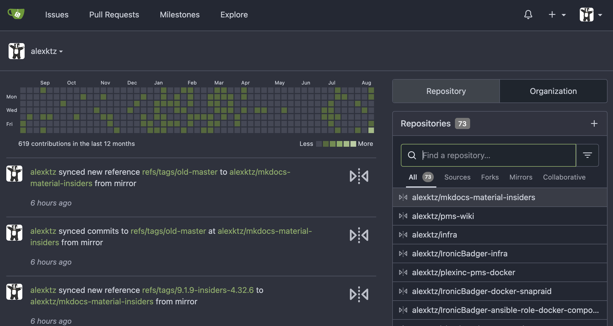

# My Top 10 Self-Hosted apps

Once you have a server running 24/7 in your life, you'll quickly start wondering if there is more you can do with it. Replace video streaming services, or Google Drive, or host your own Home Automation system. Here's a list of some of my favorite self-hosted app picks.

The [awesome-selfhosted](https://github.com/awesome-selfhosted/awesome-selfhosted) list details [Free](https://en.wikipedia.org/wiki/Free_software) Software network services and web applications which can be hosted locally. There is also a [Non-Free](https://github.com/awesome-selfhosted/awesome-selfhosted/blob/master/non-free.md) page.

<iframe src="https://fireside.fm/player/v2/dUlrHQih+c60wLQ-X?theme=dark" width="740" height="200" frameborder="0" scrolling="no"></iframe>

My YouTube channel - [KTZ Systems](https://www.youtube.com/@ktzsystems) - is still in its early days but I'm building a playlist of [self-hosted app spotlights](https://www.youtube.com/playlist?list=PLmaj94hXs3GG9yIc4nB5CdIBQ9nAays0I) you might enjoy.

## 1. Jellyfin

[Jellyfin](https://jellyfin.org/) is the volunteer-built media solution that puts you in control of your media. Stream to any device from your own server, with no strings attached. Your media, your server, your way.

Jellyfin has come a really long way in the last 12 months (list edited Jan 2023). No cloud connectivity required for authentication, no random streaming services and hugely snappy performance are all great reasons to try Jellyfin. Did I mention that it's completely open source too?

It really is worth a look if you haven't tried it in a while. Client updates are coming thick and fast and the server side of things has improved hugely as well. Jellyfin is the future of media servers, no doubt. Check out episode 87 of the podcast where we discuss our Jellyfin January challenge and invite the audience to take the challenge with us!

<iframe src="https://player.fireside.fm/v2/dUlrHQih+B62wpyjN?theme=dark" width="740" height="200" frameborder="0" scrolling="no"></iframe>

[Plex](https://plex.tv) is the reason you're even reading this page. It's what got me interested in Linux in the first place and is somewhat of a gateway drug for self-hosting and can be run as a [container](https://hub.docker.com/r/plexinc/pms-docker/). However, it is not open source and the general posture of Plex as a company gives me pause. They continue to add features and streaming services that [no-one asked for](https://www.reddit.com/r/PleX/comments/e62nbt/how_do_you_disable_the_new_plex_movies_feature/) - [or wants](https://old.reddit.com/r/selfhosted/comments/zw4k2h/what_has_plex_done_lately_that_you_didnt_like/).

**Similar or related projects:**

* [Plex](https://plex.tv)
* [Emby](https://emby.media/)
* [Kodi](https://kodi.tv/)

## 2. Nextcloud

[Nextcloud](https://nextcloud.com/) - The self-hosted productivity platform that keeps you in control.

Surely this pick needs no introduction. Think of Nextcloud somewhat like your own personal Dropbox replacement. Although, that is doing it a disservice because Nextcloud supports *many* more features than Dropbox. Nextcloud provide a [demo](https://try.nextcloud.com) if you'd like to try before you "buy" (Nextcloud is free).

The recently launched [Nextcloud Hub](https://nextcloud.com/hub) brings together several key areas of functionality:

* [Nextcloud Files](https://nextcloud.com/files) - offers universal file access on desktop, mobile and web. Find files with powerful search, share your thoughts in comments or lock files until you are done with them. 
* [Nextcloud Talk](https://nextcloud.com/talk) - delivers on-premises, private audio/video conferencing and text chat through browser and mobile interfaces with integrated screen sharing and SIP integration.
* [Nextcloud Groupware](https://nextcloud.com/groupware) - integrates Calendar, Contacts, Mail and other productivity features to help teams get their work done faster, easier and on your terms.

**Similar or related projects:**

* [Seafile](https://www.seafile.com/en/home/)
* [Filestash](https://github.com/mickael-kerjean/filestash)

## 3. Home Assistant

{: align=right width=200 }

Open source home automation that puts local control and privacy first. [Home Assistant](https://www.home-assistant.io/) is a truly remarkable project. At the time of writing it has over 2500 [integrations](https://www.home-assistant.io/integrations/) with all manner of devices, services and hardware supported. This is the true magic of Home Assistant.

A [demo](https://demo.home-assistant.io/#/lovelace/0) is available if you're curious to see it in action. But the real magic comes when you start automating your life to a point where when Home Assistant isn't there, you miss it. Automate the lights, climate control and yes, even your dog (via a bedtime routine) with Home Assistant!

A fantastic resource to learn more about the project is YouTube. [Everything Smart Home](https://www.youtube.com/@EverythingSmartHome), [The Hook Up](https://www.youtube.com/c/TheHookUp), [Intermit.tech](https://www.youtube.com/c/IntermitTech), [Smart Home Solver](https://www.youtube.com/@SmartHomeSolver) and [DigiblurDIY](https://www.youtube.com/c/digiblurDIY) are some of the most well-known channels. This isn’t an exhaustive list but should give you plenty of material to work with if you’re in need of inspiration or buying advice.

Home Assistant can be run as a standalone container, on a Raspberry Pi, as a VM and countless [other ways](https://www.home-assistant.io/getting-started/). The learning curve is real but this project really is worth your time to investigate.

## 4. Traefik

{: align=right width=200 }

Yes, I know. A reverse proxy isn't the most terribly exciting inclusion in this list but it is one of the most important. [Traefik](https://traefik.io/traefik/) (pronounced "traffic") is my go-to reverse proxy. It can be configured alongside the containers it is proxying in the same [docker-compose](../02-tech-stack/docker-compose.md) yaml file.

Traefik does what any good reverse proxy should in 2023, it integrates with certbot and Let's Encrypt for automated TLS certificate generation for your service. Setup can be a bit complex at first but there's a complete [Traefik 101 guide](../04-day-two/remote-access/traefik101.md) over in the "remote access" section.

The elegance of configuring the ingress rules for a service in the same place as you define the configuration for the service itself makes up for any of the shortcomings due to initial setup complexity in my opinion.

* [nginx](https://docs.nginx.com/nginx/admin-guide/web-server/reverse-proxy/)
* [caddy](https://caddyserver.com/docs/quick-starts/reverse-proxy)
* [PMS reverse proxy comparison](../04-day-two/remote-access/index.md)

## 5. Gitea

{: align=left width=240 }

A self-hosted, lightweight, yet highly feature rich git server, [Gitea](https://gitea.io) is much more powerful than it might seem at first. Sure, it has all the obivous trappings you'd expect from a code hosting solution such as multi-user support, organisations and a similar merge/fork model to a certain well-known online hub for Git activity. 

As of [v1.19](https://blog.gitea.com/release-of-1.19.0/#-gitea-actions-21937) in March 2023 Gitea added Actions, a built-in CI system like GitHub Actions. With Gitea Actions, you can reuse your familiar workflows and Github Actions in your self-hosted Gitea instance. While it is not currently fully compatible with GitHub Actions, we intend to become as compatible as possible in future versions.

One of my favourite features of Gitea is that it will automatically mirror remote git repositories locally when a commit is pushed. This makes it really easy to back up your code, and other people's code to your server - just in case. Because it's git the entire repo history is maintained and if for some reason a popular project became the target of a BS [DMCA claim](https://github.blog/2020-11-16-standing-up-for-developers-youtube-dl-is-back/), you're not up the creek without a paddle - so to speak.

Gitea doesn't have the kind of built-in CI features like the largest self-hosted and open source player in this space, Gitlab. But what it lacks in features it makes up for in small footprint and simplicity. These can instead be handled by external applications such as [drone](https://www.drone.io/). I wrote about deploying a site based on mkdocs (like this one) with drone CI [on my blog](https://blog.ktz.me/deploying-mkdocs-using-droneci/).

**Similar or related projects:**

* [Forgejo](https://forgejo.org/faq/) - a recent fork of Gitea
* [Gitlab](https://about.gitlab.com/)
* [Gogs](https://gogs.io/)

## 6. Smokeping

[Smokeping](https://oss.oetiker.ch/smokeping/) keeps track of your network latency. It pings things - both remote and local - and records how much latency there is between you and the target.

It isn't a terribly glamourous application to look at, but it enables you to see historical trends of network performance at a glance extremely easily for up to a year at a time.

<figure markdown>
<iframe width="740" height="415" src="https://www.youtube.com/embed/IDl_oVe_WwU" title="YouTube video player" frameborder="0" allow="accelerometer; autoplay; clipboard-write; encrypted-media; gyroscope; picture-in-picture; web-share" allowfullscreen></iframe>
<figcaption>In this self-hosted app spotlight we look at SmokePing, a network latency monitoring tool.</figcaption>
</figure>

## 7. Grafana

[Grafana](https://grafana.com/) itself is graphing tool to display data stored elsewhere. It excels at displaying time-series data like the kind gathered by monitoring tools like [Telegraf](https://blog.linuxserver.io/2017/11/25/how-to-monitor-your-server-using-grafana-influxdb-and-telegraf/) and [Prometheus](https://prometheus.io/). It takes a bit of work to get a dashboard configured just the way you like it but is well worth the effort - after all, who doesn't like a pretty graph?

I've written previously about [monitoring your UPS](https://blog.linuxserver.io/2018/11/15/monitoring-a-ups-with-grafana-on-linux/) with Grafana to better keep track of the energy costs of your server setup.

## 8. Librespeed

A speed test tool that can be run on your LAN or hosted in the cloud. This is available as a Self-Hosted [container](https://hub.docker.com/r/linuxserver/librespeed) as well as at [librespeed.org](https://librespeed.org/).

<figure markdown>
<iframe width="740" height="415" src="https://www.youtube.com/embed/zyBT_nOnsKA" title="YouTube video player" frameborder="0" allow="accelerometer; autoplay; clipboard-write; encrypted-media; gyroscope; picture-in-picture; web-share" allowfullscreen></iframe>
<figcaption>In this self-hosted app spotlight we look at Librespeed, a self-hosted speed test tool.</figcaption>
</figure>

This is really useful when you want to test the speed between your current system and wherever you are running this container. Want to test the speed between you and your cloud based VPS? Or check that your wifi is performing well?

By running this container on your LAN you're able to remove the internet from the equation and get a better idea about what's going on your LAN.

## 9. Lychee

[Lychee](https://lychee.electerious.com/) proclaims to be "self-hosted photo-management done right". It does certainly do a very good job at presenting images with a clean interface and makes dividing them up into albums relatively straightforward.

I have a demo instance running at [gallery.selfhosted.show](https://gallery.selfhosted.show) if you'd like to take it for a quick test drive yourself. Lychee isn't necessarily the best in this space but it's a pretty good all-round option with no frills (no face scanning or machine learning type features).

<figure>
    <iframe src="https://player.fireside.fm/v2/dUlrHQih+OssEQUFF?theme=dark" width="740" height="200" frameborder="0" scrolling="no"></iframe>
    <figcaption><i>Lychee discussion begins at 7 minutes</i></figcaption>
</figure>

There are a *lot* of options in this space - just take a look at [awesome-selfhosted](https://github.com/awesome-selfhosted/awesome-selfhosted#photo-and-video-galleries).

**Similar or related projects:**

* [Photoprism](https://github.com/photoprism/photoprism)
* [Librephotos](https://github.com/LibrePhotos/librephotos)
* [Piwigo](http://piwigo.org/)

## 10. Tiddlywiki

A personal wiki is a personal choice. My personal favourite is Tiddlywiki - we covered it in episode 12 of Self-Hosted. [Tiddlywiki v5](https://github.com/Jermolene/TiddlyWiki5) is the latest version but it has a long heritage with the first release dating back to September 2004!

<iframe src="https://player.fireside.fm/v2/dUlrHQih+E9_oEK6o?theme=dark" width="740" height="200" frameborder="0" scrolling="no"></iframe>

The workflow of using the wiki takes a little getting used to but there are a few key features which have meant that it has stood the test during 2020 in my household.

My absolute favourite thing about Tiddlywiki is just how fast it is to find what you're looking for. The search is fuzzy style (meaning that as you type, the results are instantly filtered) and it searches the entire text of an article - not just the titles or tags. It's written entirely in Javascript and requires very little in the way of server-side processing. No database, no encrypted files, just plain old text files (markdown is supported - yay!). I also love that information can belong to multiple categories at the same time via a simple tag - Tiddlywiki works the way my brain does and I *love* it.

The largest quirk comes when trying to add images, it's just not well suited to this. But you can make it work with a little learning curve. If I had a feature request for v6, it would be to improve the image handling.

I run Tiddlywiki out of a container authored by [mazzolino](https://hub.docker.com/r/mazzolino/tiddlywiki) which works well with Traefik.

**Similar or related projects:**

* [Bookstack](https://www.bookstackapp.com/)
* [Mediawiki](https://www.mediawiki.org/wiki/MediaWiki)
* [mkdocs](https://mkdocs.org)
* [wiki.js](https://wiki.js)
* [Zim](https://zim-wiki.org/)

## 11. Surprise me...

`<insert Spinal Tap reference>`

What are your favourites? Let me know @IronicBadger on Twitter.
