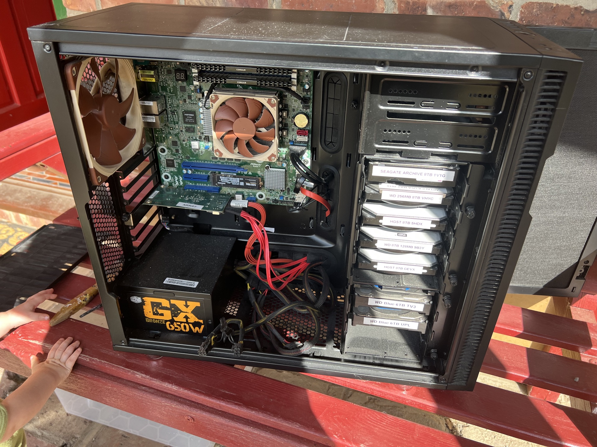
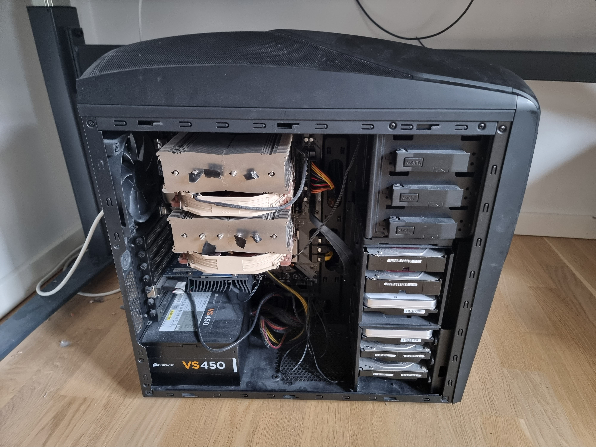
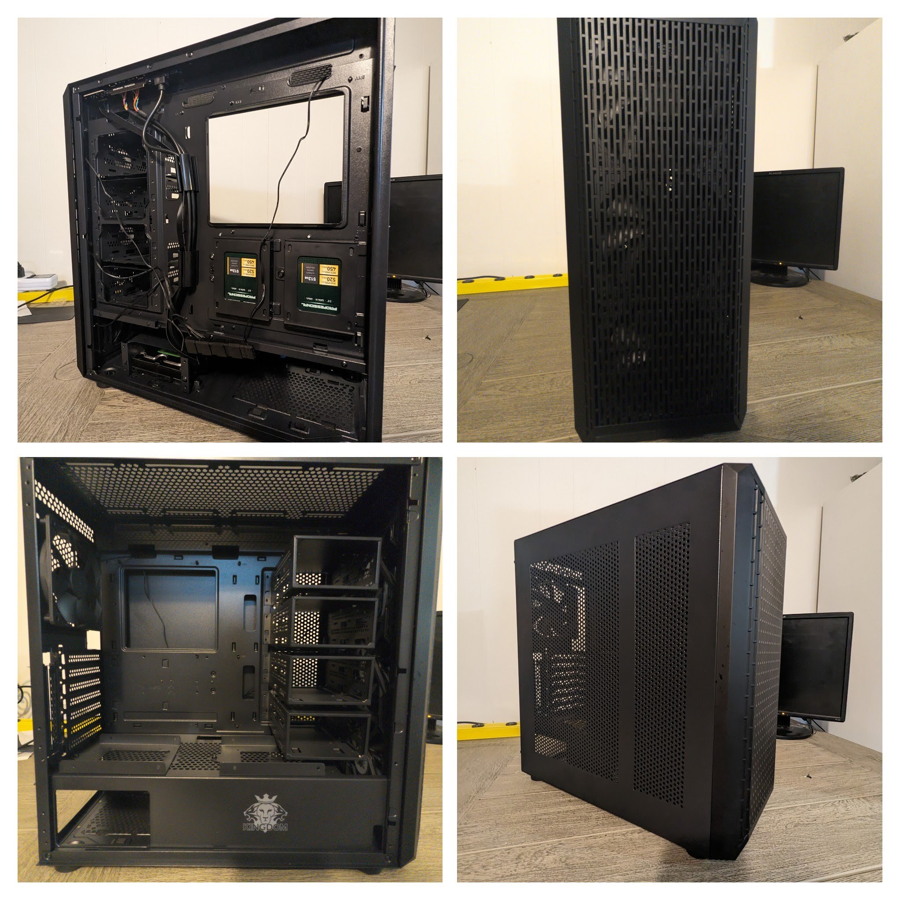
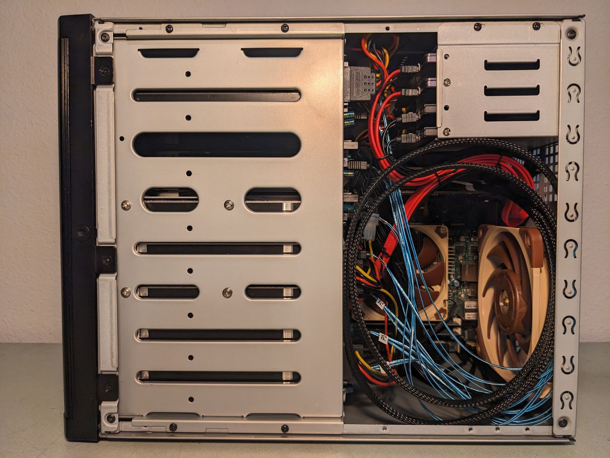
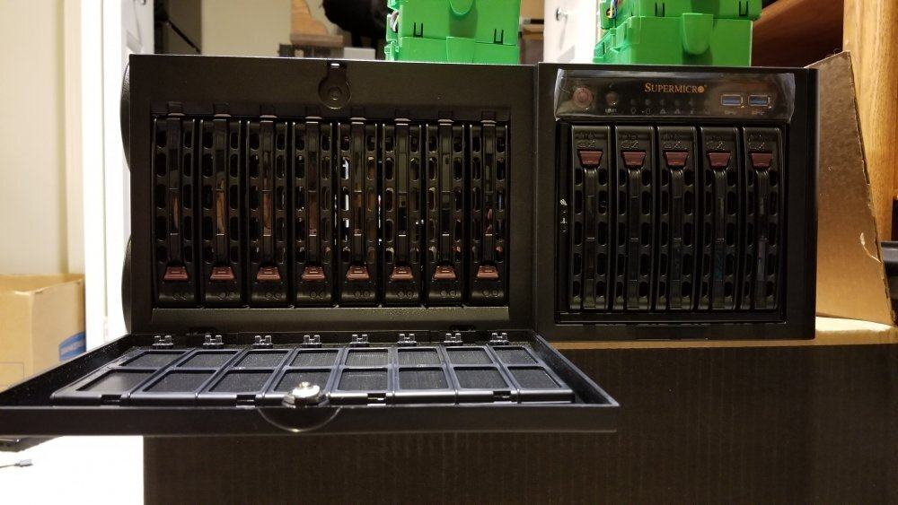

[//]: # 

# Cases

The perfect case doesn't exist. But here are some options that might do the trick (there are affiliate links to some of them) in your next server build.

!!! success "Contribute your mini case review!"
    Help us make this page into the best case review page for media server enthusiasts around. 
    
    Submit a PR with your mini case review (250 word max), even link to your own personal blog if you like for the full review. Include at least one picture of the case and follow the format defined in the [Lian-Li PC-Q25B](#lian-li-pc-q25b) section.

    Please use the following code snippet for your image when submitting case reviews!

    ```
    <figure markdown>
    {: width=700 }
    <figcaption>Example caption.</figcaption>
    </figure>
    ```

## Lian-Li PC-Q25B

> Review contributed by [ironicbadger](https://github.com/ironicbadger)

The Lian-Li PC-Q25B was released in 2011 and is unfortunately no longer in production so far as I can tell. You can find the odd used model popping up on eBay. It supports 5 hot swap 3.5" drives and has space for 2 more non hot swap 3.5" drives in the bottom.

<figure markdown>
{: width=700 }
<figcaption>The diminuitive size of this case, along with 5 hot swap bays, made it perfect for apartment living.</figcaption>
</figure>

* Motherboard Form Factor - Mini-ITX
* PSU Form Factor - SFX
* Number of 3.5" drive bays - 7 (5 hot swap)
* Dimensions - 7.8 x 11 x 14.4" / 199 x 280 x 366 mm
* Pricing - Avg used sale price on [eBay](https://www.ebay.com/sch/i.html?_from=R40&_nkw=lian+li+pc-q25b&_sacat=0&rt=nc&LH_Sold=1&LH_Complete=1) $55-100

This case was popular in the [unRAID compulsive design](https://www.google.com/search?q=lian+li+pc+q25b+site:forums.unraid.net&sxsrf=ALeKk010EUCoKTRzD-kvP21muTqzIAtB5w:1609223374686&sa=X&ved=2ahUKEwjc0fKcyPLtAhWIq1kKHSnfCPEQrQIoBHoECAcQBQ&biw=1532&bih=1158) forum and several users posted successful builds if you're after an idea of how the finished product will look.

The above picture is my own personal build from when I lived in a tiny apartment in London and space was at a premium. The diminuitive size of this case made it perfect for apartment living. Sporting only 2 fans (1 120mm and 120/140mm) it was quiet and had a small, but sufficient, amount of airflow meaning that temps were never an issue. 

The build pictured made use of an [ASrock Rack C2750D4I](https://www.asrockrack.com/general/productdetail.asp?Model=C2750D4I#Specifications) board which sadly fell victim to the [C2000 Intel bug](http://forum.asrock.com/forum_posts.asp?TID=4376&title=intels-atom-c2000-chips-are-bricking-products) (of death). A shame really because that motherboard was a fantastic level of price to performance for a media server in those days (2016-2018).

---

## Rosewill LSV4500

...

---

## Fractal Define Series

---

### Fractal Define R5

> Review contributed by [ironicbadger](https://github.com/ironicbadger)

The Fractal Define R5 is a classic example of "if it ain't broke, don't fix it". If you've ever seen one of these Define series cases before, then you've already got a fairly good idea of what this case is. A competent, sleek, and understated design, capable of holding 8x 3.5" hard drives and 2x 5.25" drives very comfortably.

<figure markdown>
{: width=700 }
<figcaption>This is Alex's old server from before he emigrated to the USA. It lives in the UK as his primary off-site <a href="../../04-day-two/backups/">backup</a> system.</figcaption>
</figure>

* Motherboard Form Factor - Mini-ITX, mATX, ATX
* PSU Form Factor - ATX
* Number of 3.5" drive bays - 8
* Dimensions - 23"D x 21.5"W x 13"H
* Pricing - [$125-150](https://amzn.to/47FW8vd)

The case supports motherboards ranging from ITX to ATX in size. There's ample room for cable management with the high quality fit and finish that is a Fractal trademark at this point. The most remarkable thing about this case is how unremarkable it is, and I mean that in a good way. There's almost nothing not to like. It's a thoughtfully laid out and extremely well-built thing.

The drive cages can be reconfigured by adding [additional cages](https://www.reddit.com/r/DataHoarder/comments/kbrjp7/10x8tb_snapraidmergerfs_in_a_fractal_define_r5/) to add more drives in the space in the area directly in front of the PSU. All sorts of 3d printed [mods](https://www.thingiverse.com/thing:2763188) exist for this case due to its long standing popularity.

Fan noise and vibration noise is about as quiet as it gets for a box containing half a dozen hard drives. Rubber grommets on the white drive sleds absorb much of the vibration frequencies and the sound deadened side panels take care of most of the rest.

This is an extreme nitpick but I've always wished Fractal made a backplane for their drive cages. Wiring up 8 individual drives can be a bit of a chore.

Overall, it's an extremely solid option for anyone looking to build a PMS system and will give you space to grow if you're just starting with a couple of drives today.

---

## Fractal Node Series

> Review contributed by [Hogcycle](https://github.com/hogcycle)

The Fractal Design Node 804 was released in 2014 and is a solid contender for a Perfect Media Server. A major distinction and benefit is how this case is split down the middle into two chambers. 

Beneath an acrylic window lies a shallow, yet adequate space for a micro-ATX based computer. Cooler clearance should not be an issue for flat-face style heatsinks like the Noctua L9 series. Beneath the other side panel is a spacious area with two "rails" that hold cages that hold 4x 3.5" drives each. Two more 3.5 in. drives can be mounted in the floor of the case, for a total of 10 with two 2.5" slots remaining. Vibration is mostly mitigated with rubber dampers on each included screw. Access is easy with large knurled thumbscrews holding the exterior together.

<figure markdown>
{: width=700 }
<figcaption>Lots of space for drives, despite the case having overall poor cable management.</figcaption>
</figure>

* Motherboard Form Factor - Micro-ATX
* PSU Form Factor - ATX
* Number of 3.5" drive bays - 10 (0 hot swap)
* Dimensions - 15.3 x 13.5 x 11.8 " /  388 x 342 x 300  mm (LWH
* Pricing - I purchased mine on promotion for about $80 years back, but they seem to have nearly doubled in price and sit at around $140 new.

While this chassis is larger than other offerings, I chose it for its generous number of 3.5" bays, included quality fans and support for ATX power supplies. Front I/O is adequate, and the blue power LED can simply be unplugged should it cause a disturbance. Included are two fans that are controlled by a built-in 3 position switch. I've always kept it at its lowest and temperature has never been a concern.

---

## Silverstone CS380

> Review contributed by [glennbrown](http://github.com/glennbrown)

The Silverstone CS380 was released in 2016 and is a great option for a Perfect Media Server. The case offers eight 3.5" hot swap bays plus two additional 5.25" bays.

Inside the case there is ample room for cable management and an included SATA Backplane that uses standard sata connectors and molex plugs. There is room for longer ATX power supplies. There are three included fans however they are loud, I replaced them with Artic P12's. It has clarence for larger tower coolers, pictured is a Arctic Freezer i35. The additional 5.25" bays can provide more drive expansion options.

<figure markdown>
{: width=700 }
<figcaption>Lots of space and very solidly built case.</figcaption>
</figure>

* Motherboard - mITX, mATX & ATX
* PSU Form Factor - ATX
* Number of 3.5" drive bays - 8 Hot Swap with an option for two more with two [Icy Dock Enclosures](https://www.amazon.com/ICY-DOCK-Tray-Less-Enclosure-MB171SP-1B/dp/B0992RQNPB?th=1)
* Dimensions - 8.46"W x 16.77"H x 19.17"D
* Pricing - I purchased mine in 2021 for $164, they are currently selling $230.

I choose this case since it provided me with hot swap bays in a reasonble tower form factor. Overall besides the fan issues I have been extremely happy with this case.

---

## NZXT Phantom 240

> Review contributed by [Vogete](https://github.com/vogete)

The NZXT Phantom 240 might not stand out from the crowd in any of the features of aesthetics it offers (though subjectively it looks amazing in white with its stormtrooper style), but it will definitely impress you with its price. At just $69.99 (release price), it's hard to beat the value of the materials you get with it. Unfortunately as far as I can tell it's not being sold much at most places, so it might be hard, or impossible to come by.

<figure markdown>
{: width=700 }
<figcaption>Plenty of space and airflow, but the dust can find its way in as well.</figcaption>
</figure>

* Motherboard Form Factor - Mini-ITX, mATX, ATX
* PSU Form Factor - ATX
* Number of 3.5" drive bays - 6 (0 hotswap)
* Dimensions - 7.6 x 20.8 x 20.8" / 195 x 530 x 529 mm
* Pricing - It was released for $69.99 (I purchased it for $50 in 2018), but haven't found any recent prices as nobody really sells them anymore.

The case comes with 6x 3.5" drive bays, sadly none of them are hot swap, and another 3x 5.25" bays which you can technically repurpose for even more drives. The 3.5" bays are removable, so if you prefer to fit a longer graphics card, you have the option to reevaluate your priorities.

Fitting a full sized ATX board with an ATX power supply, you can use pretty much any consumer hardware you get your hands on. The width of the case however might get you in trouble with larger tower coolers inside, like the Noctua NH-D15, which unfortunately pushes against the plastic side panel window, creating a little dent as you close it. To make sure it doesn't damage the window too much, I put some electrical tape on the Noctua's cooling "tips".

The Phantom's worst side is the poor fittings all around the case. The lower quality build makes the entire chassis vibrate rather loudly with just a few spinning drives in it (surprisingly increasing my drive count from 4 to 6 actually made it quieter). If you plan on using it next to you (like me), you might want to reconsider getting the Phantom, because it might just haunt you with its noise (I guess the name does actually fit the product).

When I was shopping for a case, I chose the Phantom 240 for the maximum amount of drive bays, for the least amount of money, while still supporting ATX components. It certainly has flaws, like the tight cable management space in behind the back panel, or the lack of filters around the case (see the dust on the picture?), it's hard to find a cheaper (new) case that offers a better value. If you you ever get your hands on one, it will serve you well enough for its price.

---

## Classico Storage Case
> Review contributed by [CoffeeAndCynicism](https://github.com/CoffeeAndCynicism)

<figure markdown>
{: width=700 }
<figcaption>The Classico case is a cheap and cheerful one, which provides significant value for its price point.</figcaption>
</figure>

- **Motherboard Form Factor:** ATX, Micro-ATX, Mini-ITX
- **PSU Form Factor:** ATX
- **Number of 3.5" Drive Bays:** 12
- **Dimensions:** 18.5" x 16.92" x 8.07"
- **Pricing:** Approximately $60 USD on [Newegg](https://www.newegg.com/p/2AM-02CE-000H9) / [eBay](https://www.ebay.com/sch/i.html?_&_nkw=Classico+Storage+Case)

This case, originally designed for Chia mining, proves to be an excellent option for storage and home server enthusiasts. Notably, it offers remarkable support for a substantial number of 3.5" HDDs, all at an affordable price point.

The case comes equipped with four 12V molex fans (non-PWM) - 3x140MM front intake fans and 4x20MM rear exhaust fan. What sets this case apart is its mesh front and side panels, which facilitate excellent airflow. This feature is particularly valuable for those using passively cooled NICs/HBAs.

With a dedicated shrouded PSU compartment, there's ample space for effective cable management in the basement and behind the motherboard tray. This design allows for organized cable routing for all the SATA drives, ensuring a neat and clutter-free interior.

The case features four removable HDD cages that can accommodate a total of eight drives. Additionally, there are two 3.5" HDD sleds on top of the PSU shroud and another drive cage in the basement, capable of holding two more 3.5" HDDs. In total, this case can house an impressive twelve 3.5" HDDs. Furthermore, it offers space for two 2.5" SSDs on the backside of the motherboard tray, useful for OS drives.

Whilst the drives aren't hot swappable, this case is an exceptional choice for those seeking a cost-effective solution for their storage and home server needs.

---

## Silverstone DS380B Mini ITX Tower Case

> Review contributed by [stochasticpenguin](https://github.com/stochasticpenguin)

The Silverstone DS380B is available from the usual suspects and pops up on the second-hand market at a 30% discount from time to time. It supports 8 hot-swap 3.5" drives and has space for 4 more non-hot-swap 2.5" drives internally.

<figure markdown>
{: width=700 }
<figcaption>The DS380 provides 8 hot-swap bays in a small compact form factor.</figcaption>
</figure>

- Motherboard Form Factor - Mini-ITX
- PSU Form Factor - SFX
- Number of 3.5" drive bays - 8 (8 hot swap caddies)
- Number of 2.5" drive bays - 4 (internally mounted)
- Dimensions - 14 x 8.24 x 11.25" / 356 x 210 x 286 mm
- Pricing: 
	- Average used sale price on [eBay](https://www.ebay.com/sch/i.html?_from=R40&_trksid=p4432023.m570.l1313&_nkw=silverstone+DS380&_sacat=0) $180
	- Typical new price on [Amazon](https://www.amazon.com/SilverStone-Technology-Mini-ITX-Computer-DS380B/dp/B00IAELTAI) or [Newegg](https://www.newegg.com/p/N82E16811163255) $215

The DS380 offers a large number of easily interchangeable drives and a hot-swap backplane. This makes it compatible with a cold backup strategy or easy site-to-site transfer. Just ensure that you include a hot-swap-capable HBA in your build. 

Many completed builds are available with pictures of different configurations on [pcpartpicker.](https://pcpartpicker.com/builds/#e=2504,1825) You can opt for one fewer drive and include a full-length GPU, or with very slight modification using a Dremel you can fit a full-length SAS HBA without sacrificing a drive bay.

With the 2x supplied 120mm fans pushing flow across the drive cage and one exhaust fan (120mm) pushing flow out the rear, there is more than adequate cooling for all 8 drives. Even in an overheated (29 C) laundry closet, drive temperatures peak around 40 C. The fine mesh screens on the inlet and PSU vents prevent any notable internal buildup of dust after 9 months of operation.

The above build features a [Supermicro X11SCL-IF](https://www.supermicro.com/en/products/motherboard/x11scl-if), [Intel Core i3-9100T](https://ark.intel.com/content/www/us/en/ark/products/134871/intel-core-i39100t-processor-6m-cache-up-to-3-70-ghz.html), and an [LSI SAS 9211-8i](https://docs.broadcom.com/doc/12353333) HBA using SATA breakout cables; powered by a [Corsair SF450](https://www.corsair.com/us/en/p/psu/cp-9020104-na/sf-series-sf450-450-watt-80-plus-gold-certified-high-performance-sfx-psu-cp-9020104-na). The location of the PSU (behind the 2.5" drive cage) makes for an adventure in cable management but is an otherwise great home office server.

---

## Supermicro CSE-743AC-1200B-SQ

> Review contributed by [TeamBVD](https://github.com/teambvd)

The Supermicro CSE-74x series chassis have been around for at least the last 15 years, with many/most parts being interoperable between generations. I've had a 747 2009, modularly upgrading it over time as needed, so when it came time to buy another chassis, Supermicro was an easy choice, and I went with the CSE-743AC-1200B-SQ:

<figure markdown>
{: width=700 }
<figcaption>The 'SQ' (Super Quiet) variant of the 743 chassis promises an operational 27dBA</figcaption>
</figure>

* Motherboard Form Factor - Micro ATX / ATX / E-ATX (12"x13") / 7 PCIe slots
* PSU Form Factor - ATX, 1200W Platinum (Included)
* Num. 3.5" drive bays - 8 x hotswap SAS3 / SATA
* Num. 5.25" bays - 3
* Dimensions - 17.8 x 7 x 25.5" / 452 x 178 x 647 mm (4U rack mount)
* Pricing - New [$720](https://www.shopblt.com/item/supermicro-cse-743ac-1200b-sq-black-4u-tower-sc743ac/supmic_cse743ac1200bsq.html) -> [$590](https://www.connection.com/product/supermicro-chassis-4u-tower-eatx-8-3.5-sas-sata-hs-bays-865w-ps-black/cse-743tq-865b/8145984?cac=Result) depending on configuration as of Sept. 2023 - Used $350-650 (eBay) again, depending on configuration)

Supermicro has been of some renown in the homelab space for many years, though often this is for their 24-48 bay shelves which commonly require modification in order to bring noise levels down to acceptable levels. In addition, many may mistakenly feel their only option for purchasing SMC's chassis are on the used market, however there are actually a number of suitable vendors. As one can tell from the pricing, there's potentially limited savings from buying at least this specific model used. SMC's chassis model decoder can be found [here](https://www.supermicro.com/products/Product_Naming_Convention/Naming_CSE.cfm).

As alluded to above, these chassis are extremely long-lived, infinitely customizable (with drop-in components from the manufacturer), and should typically be considered an investment. They can be used in either a tower or rackmounted configuration, and with SMC's '[Mobile Rack](https://www.supermicro.com/en/products/chassis?pro=filter%3Dfeature%26feature%3DMobile%20Rack)' units (also [easily available](https://www.shopblt.com/search/order_id=150936720&s_lastpos=0&t_all=1&s_all=%22MOBILE+RACK%22&s_mfg=SUPMIC&s_cat=&s_costcomp=&s_cost=&s_max=100)), take advantage of the 5.25" bays for up to 5 additional 3.5" drive bays (total of 13), or 12 x 2.5" bays. A more extensive detailing of my work with this specific chassis can be found on the [UnRAID forums](https://forums.unraid.net/topic/113032-the-next-generation-m12swa-threadripper-pro/).
