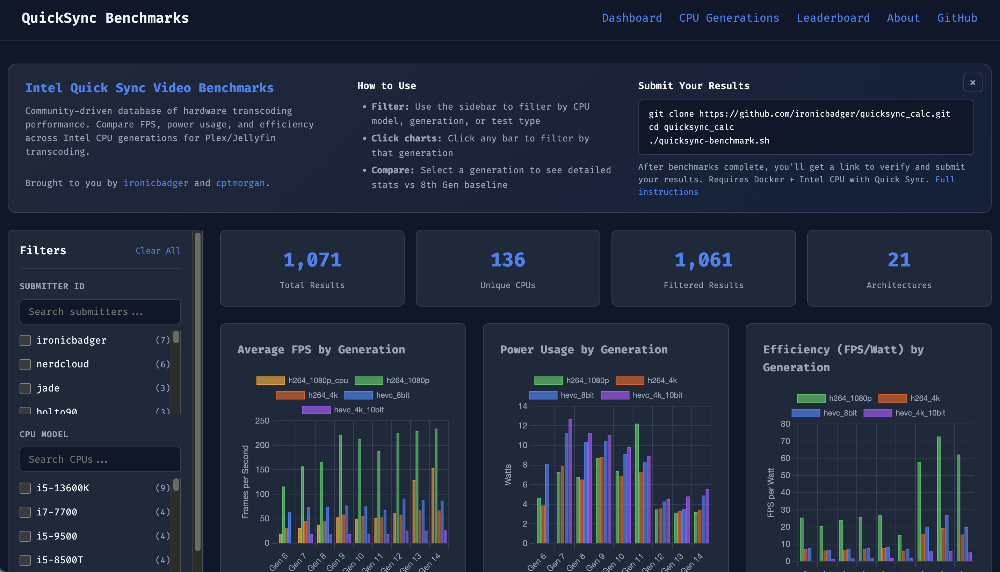

I finally built the thing I wish had existed back when I started hunting for QuickSync-friendly hardware. A lightweight benchmarking site at [quicksync.ktz.me](https://quicksync.ktz.me/).

It’s a community fed, living catalog of Intel QuickSync performance across generations and motherboards, complete with real-world transcode timings and hardware details.

## What’s inside

- A simple browser for CPU/iGPU combos with quick filters.
- Standardized transcode runs so you can compare apples to apples.
- Notes on drivers, firmware, and BIOS quirks that affect encode paths.
- A submission flow so the community can share their own results.

## Why I built it

Plex, Jellyfin, and Emby all benefit massively from QuickSync, but practical, comparable data has been scattered for years. This project is meant to be the single page you open when deciding on a new low-power media server build—or when validating that your current box is tuned correctly.

## Walkthrough

Here’s a quick tour of the site, data entry flow, and the reporting views:

<iframe width="740" height="416" src="https://www.youtube.com/embed/NSpw-H2wwa0" title="QuickSync Benchmark walkthrough" frameborder="0" allowfullscreen></iframe>

## How to help

- Browse the catalog and sanity-check the numbers against your own rigs.
- Submit your benchmarks—especially if you have newer 14th/15th-gen chips or older UHD 630-era parts.
- File issues or ideas on the repo (linked from the site footer) for tests you want to see included.

Thanks for checking it out.
