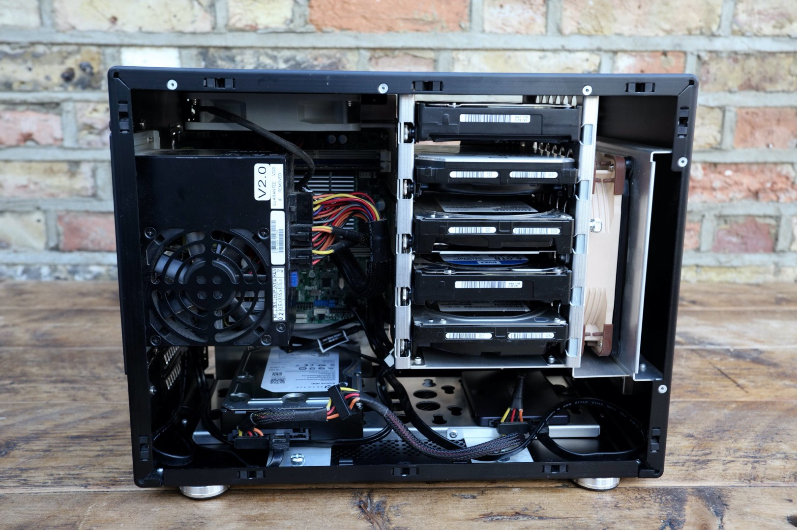

# Cases

The perfect case doesn't exist. But here are some options that might do the trick (there are affiliate links to some of them) in your next server build.

!!! success
    Help us make this page into the best case review page for media server enthusiasts around. 
    
    Submit a PR with your mini case review (250 word max), even link to your own personal blog if you like for the full review. Include at least one picture of the case and follow the format defined in the [Lian-Li PC-Q25B](#lian-li-pc-q25b) section.

## Lian-Li PC-Q25B

The Lian-Li PC-Q25B was released several years ago (not totally sure but it looks like 2013) and is unfortunately no longer in production so far as I can tell. You can find the odd used model popping up on eBay. It supports 5 hot swap 3.5" drives and has space for 2 more non hot swap 3.5" drives in the bottom.

* Motherboard Form Factor - Mini-ITX
* PSU Form Factor - SFX
* Number of 3.5" drive bays - 7 (5 hot swap)
* Dimensions - 7.8 x 11 x 14.4" / 199 x 280 x 366 mm
* Pricing - Avg used sale price on [eBay](https://www.ebay.com/sch/i.html?_from=R40&_nkw=lian+li+pc-q25b&_sacat=0&rt=nc&LH_Sold=1&LH_Complete=1) $55-100

This case was popular in the [unRAID compulsive design](https://www.google.com/search?q=lian+li+pc+q25b+site:forums.unraid.net&sxsrf=ALeKk010EUCoKTRzD-kvP21muTqzIAtB5w:1609223374686&sa=X&ved=2ahUKEwjc0fKcyPLtAhWIq1kKHSnfCPEQrQIoBHoECAcQBQ&biw=1532&bih=1158) forum and several users posted successful builds if you're after an idea of how the finished product will look.

The above picture is my own personal build from when I lived in a tiny apartment in London and space was at a premium. The diminuitive size of this case made it perfect for apartment living. Sporting only 2 fans (1 120mm and 120/140mm) it was quiet and had a small, but sufficient, amount of airflow meaning that temps were never an issue. 

The build pictured made use of an [ASrock Rack C2750D4I](https://www.asrockrack.com/general/productdetail.asp?Model=C2750D4I#Specifications) board which sadly fell victim to the [C2000 Intel bug](http://forum.asrock.com/forum_posts.asp?TID=4376&title=intels-atom-c2000-chips-are-bricking-products) (of death). A shame really because that motherboard was a fantastic level of price to performance for a media server in those days (2016-2018).

## Rosewill LSV4500

## Fractal Define Series