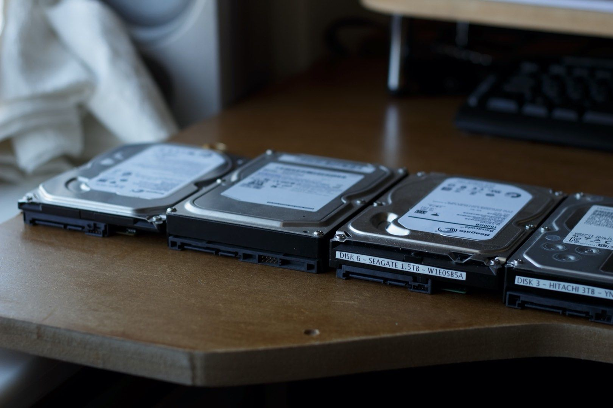
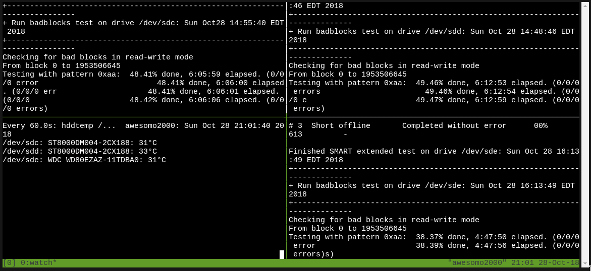

That new hard drive. Should you trust it? Maybe.

> Edit: This content was originally published on [https://blog.linuxserver.io](https://blog.linuxserver.io/2018/10/29/new-hard-drive-rituals/).

## Introduction

Over the last 10 years that I've been messing around with Linux servers (hence the name of the site by the way there's been one thing above all else that's always required special care - hard drives. They are mechanical beasts just waiting to eat your data at any time. Entire businesses are built around their inherent (un)reliability. Backblaze make a point every quarter of [publishing their hard drive reliability statistics](https://www.backblaze.com/blog/backblaze-hard-drive-stats-q2-2020/) because people (myself included) care about this stuff.

I have personally purchased around 20-25 hard drives in the last 10 years ranging from 1.5TB Seagate drives to the 8TB drives that currently grace my systems. That 1.5TB Seagate drive failed and I lost it's entire contents sometime in 2009 and whilst I was not alone it was a hard, but useful lesson I learned that day.

> Two is one. One is none.

If you treat every drive (new or not) like it's about to die, I've found that is a pretty safe strategy to ensuring no data loss. That is especially true of brand new drives which are still within their retailer exchange periods. On the whole I've had 4 drives fail including that Seagate and 2 which were seemingly fine before my 'new drive testing ritual' found them to be faulty, one had bad sectors the other died after 19 hours powered up.

Therefore running a test which will read and write every sector of the drive for verification and take at least 24 hours to complete seems logical.

Back in the day, I ran unRAID before switching out to Debian + SnapRAID + MergerFS 2-3 years ago. unRAID had this concept of 'pre-clearing' a drive before use which served two purposes. 1) Prepare the drive for use by unRAID 2) A stress test. This became somewhat a force of habit over time.

It is for these reasons that I now religiously do not commit any data to a drive until it has undergone at least one full cycle using a tool called badblocks. A link to the Arch wiki is here for more information.

It's stressful for a drive? Yes. But it is much better to have the drive fail within the first 14 days during which time I don't have to go through a manufacturer RMA or worse, lose data and have to go through a PITA RMA. Weed out the weaklings early and then relax(ish). Manufacturers will often replace drives during an RMA with a refurbished model in case you needed

## Badblocks

As the name suggests `badblocks` is a program to test storage devices for bad blocks. It takes a really long time (you can expect an 8TB drive to take a full week to complete a badblocks run) and is extremely stressful for a disk to perform. Perfect. It is available to any Linux platform and I have taken to using a 'burnin' script to wrap smartctl tests before and after in order to have relatively high confidence that the drive will not fail soon.

!!! danger
    You will completely overwrite any and all data with badblocks if you're not careful. YOU HAVE BEEN WARNED! 

The basic invocation of badblocks is very simple. USE `-w` WITH EXTREME CAUTION - it will overwrite all disk contents in an unrecoverable fashion (yes, even forensically). Here's an example of how you might run badblocks manually.

    badblocks -b 4096 -wsv /dev/sdX

With this command, badblocks will perform 4 complete write and read cycles across the entire drive, the last of which zeroes the drive.

!!! hint
    The scripts used can be found on Github [here](https://github.com/Spearfoot/disk-burnin-and-testing).

## Burn-in script

I use a script to wrap the execution from github user [spearfoot](https://github.com/Spearfoot/disk-burnin-and-testing). Make sure to read the readme before execution otherwise nothing will happen.

When you are ready to do a destructive burn in (recommended for new drives) you will need to modify the script as per his instructions to a non zero value to commence writes.

<figure>
    <figcaption><i>Using tmux to run 4 burn-ins at once</i></figcaption>
</figure>

I highly recommend using tmux for long term processes such as this. Launch a new tmux session with tmux. Default is that Ctrl-B is your 'modifier', similar to VIM. Once you press 'Ctrl-B' and then let go you can then perform commands to split your window into multiple panes or exit the session (leaving it running the background). Reattach with tmux a. A tmux cheatsheet is linked [here](https://gist.github.com/MohamedAlaa/2961058).

For bonus points you can monitor drive temps with `watch -n 60 hddtemp /dev/sd[c,d,e]`.
