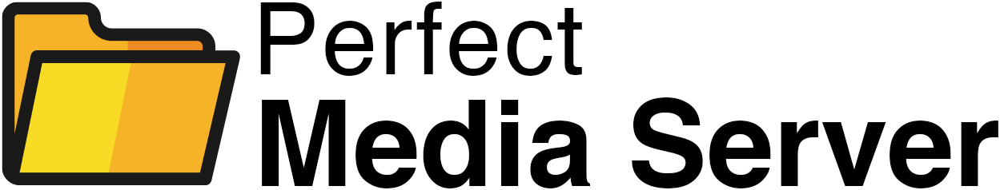

---
title:
---
# Welcome to Perfect Media Server!

If you're looking to build a media server, then you've come to the right place. This site documents the many aspects of building a media server using Free and Open Source Software, wherever possible.

 

-   :material-folder-open:{ .lg .middle } - __An Overview of PMS__

    ---

    Learn what "a PMS" is and see [Alex's example PMS build](01-overview/alexs-example-builds.md). Discover how you can dive in and why you might want to build yourself a freedom-respecting NAS.

    [:octicons-arrow-right-24: Getting started](01-overview/index.md)

-   :octicons-mortar-board-24:{ .lg .middle } - __Tech Stack Explained__

    ---

    Explore the underlying open-source technologies PMS recommends such as [mergerfs](02-tech-stack/mergerfs.md), [SnapRAID](02-tech-stack/snapraid.md), [ZFS](02-tech-stack/zfs.md), [Proxmox](02-tech-stack/proxmox.md), [docker](02-tech-stack/docker.md), and [docker-compose](02-tech-stack/docker-compose.md).

    [:octicons-arrow-right-24: Explore the Tech Stack](02-tech-stack/os/index.md)

-   :fontawesome-solid-server:{ .lg .middle } - __Hardware Considerations__

    ---

    You won't get far without some hardware! Read reviews on [cases](06-hardware/cases.md), dial-in [remote access](04-day-two/remote-access/index.md), or how to burn in a new hard drive.

    [:octicons-arrow-right-24: Learn More](06-hardware/intel-quicksync.md)
  
-   :material-floppy:{ .lg .middle } - __Installation Guides__

    ---

    Guides for installations on top of Ubuntu, Proxmox, and NixOS. After installation is finished, deploy our [top 10](04-day-two/top10apps.md) self-hosted app picks.

    [:octicons-arrow-right-24: Begin Installation](03-installation/index.md)

 

!!! info "Perfect Media Server - A History"
    Perfect Media Server began life as a series of blog posts over at [blog.linuxserver.io](https://www.linuxserver.io/blog/tag:perfectmediaserver#blog_list):

    - [Perfect Media Server (2016 Edition) - The Original Article](https://blog.linuxserver.io/2016/02/02/the-perfect-media-server-2016/)
    - [Perfect Media Server (2017 Edition) - Extensive video guides](https://blog.linuxserver.io/2017/06/24/the-perfect-media-server-2017/)
    - [Perfect Media Server (2019 Edition) - Boring is reliable + adding ZFS](https://blog.linuxserver.io/2019/07/16/perfect-media-server-2019/)
    - [Perfect Media Server (2020 Edition) - Launching perfectmediaserver.com](https://blog.ktz.me/the-perfect-media-server-2020-edition/)
    - [Perfect Media Server (2023 Edition) - I run NixOS, btw?]()

## What is PMS? And what is this site for?

PMS isn't so much a "you must do things this way" type of deal, it's more like a set of principles and guidelines to help you build a similar solution. The software discussed here has worked very well for many years now and can completely replace Unraid, TrueNAS, or a Synology based setup. 

By sharing the knowledge and thought patterns used to drive the decisions made here, you will leave armed with the ability to build your own DIY NAS, or as I like to call it, the Perfect Media Server (PMS).

!!! help "How to get help"

    If you need any assistance with the content on this site then please head over to the Self-Hosted podcast [Discord server](https://discord.gg/Z5NfMB5jU8) where you can find me `@alexktz` and there is a dedicated `#perfectmediaserver` channel.

    Self-Hosted podcast Discord server invite URL - [https://discord.gg/Z5NfMB5jU8](https://discord.gg/Z5NfMB5jU8)

## Community Contributions

This site is a unique type of documentation resource. It's an open-source, collaborative repository of information, and having a wide and diverse pool of contributors is vital to making the site as useful to as many folks as possible. 

If you see a mistake, or think there's a hole in the content (why didn't you do it *this way*?), pull requests will be considered via GitHub. Use the icon in the top right if you'd like to correct something here or help improve the site.

In particular, the case reviews section relies on contributors **like you**! Please submit your media server case mini-review of 1 picture and 250 words or less.

## About the Author

{: align=right width=230 }

perfectmediaserver.com is written and maintained by [Alex Kretzschmar](https://www.linkedin.com/in/alex-kretzschmar/) (aka [@IronicBadger](https://twitter.com/ironicbadger)) plus some awesome [contributors](https://github.com/IronicBadger/pms-wiki/graphs/contributors)](https://github.com/IronicBadger/pms-wiki/graphs/contributors). 

Alex is a Developer Advocate at Tailscale. Has a YouTube channel - [KTZ Systems](https://www.youtube.com/@ktzsystems). Alex writes technical posts over at [blog.ktz.me](https://blog.ktz.me) covering topics from Homelab to Infrastructure as Code to electronics to Home Automation.

You can find a full list of his various online presences over at [alex.ktz.me](https://alex.ktz.me). 

## Self-Hosted podcast

Lastly, if you like this kind of thing, check out the [Self-Hosted](https://selfhosted.show) podcast over at [Jupiter Broadcasting](https://jupiterbroadcasting.com) hosted by Alex and [Chris Fisher](https://twitter.com/ChrisLAS).

<iframe src="https://player.fireside.fm/v2/dUlrHQih+aGtGAbih?theme=dark" width="740" height="200" frameborder="0" scrolling="no"></iframe>

