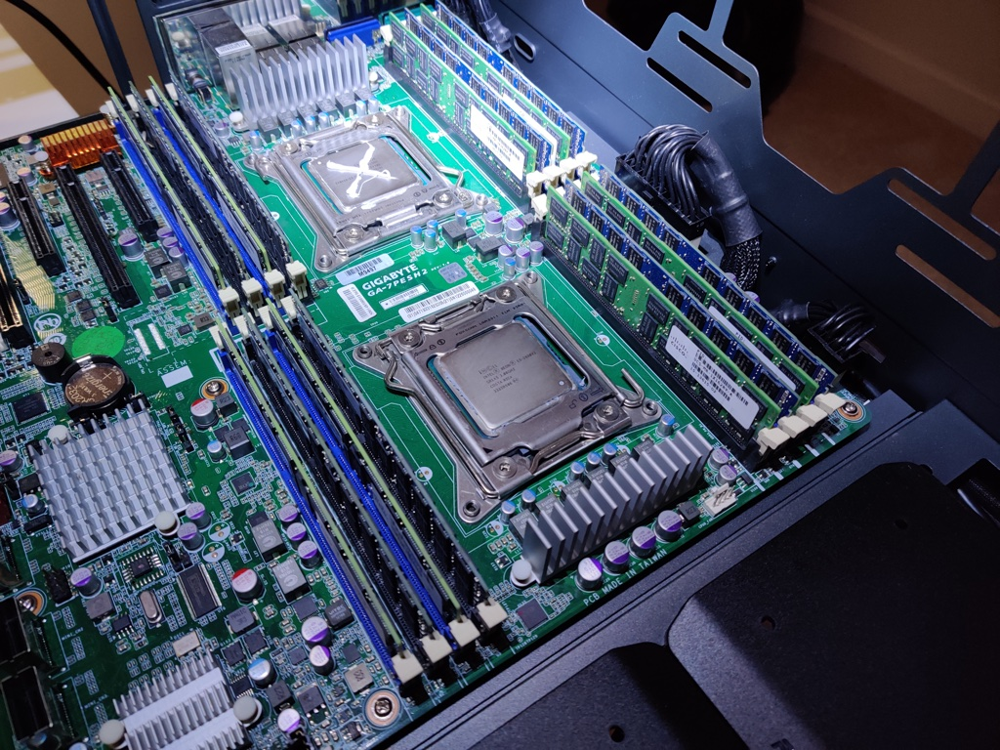

# Bare Metal Manual Install

This section covers manual installation of a Perfect Media Server.



## Base OS installation

Installation of Ubuntu 20.04 LTS itself is documented by [Canonical](https://canonical.com/) (the company behind Ubuntu) on their [website](https://ubuntu.com/tutorials/install-ubuntu-desktop#1-overview).

!!! danger
    To prevent accidentally installing Ubuntu on the wrong drive and overwriting data it is recommended to disconnect data drives during installation.

Creating a bootable USB stick to install Linux from used to be a tricky thing. There is a [guide](https://ubuntu.com/tutorials/create-a-usb-stick-on-windows#1-overview) on the Ubuntu website for the official method but recently the [Ventoy](https://www.ventoy.net/en/index.html) project has made this process even easier. It's not perfect and some users have reported issues but it should work for 95+% of you.

[Ventoy](https://www.ventoy.net/en/index.html) is magic. It turns a single USB drive into a 'universal' USB boot drive. Simply drop ISOs into the predetermined folder and you can boot them immediately. No messing with partition tables or `dd` or etcher, etc.

!!! info 
    As of Ubuntu Server 22.04 or later, drives are presented correctly once more under `/dev/disk/by-id`. For a long time Ubuntu Server was not recommended (see [FAQ - Why not Ubuntu Server?](../01-overview/faq.md#why-ubuntu-desktop-instead-of-ubuntu-server)) however Ubuntu Server is now the recommended choice for a simple PMS deployment.

There are a few options you have with regards to boot drive. The simplest option is buy a dedicated SSD for this purpose. Use this drive for the OS and temporary files (like in-progress file transfers) before moving them to your array. You might find putting your Plex metadata on an SSD such as this will help performance of library loading.

Running the Gnome desktop on a server is a bit unnecessary as we'll manage this server 99% of the time via SSH. If you'd like to remove the desktop altogether, [here](https://askubuntu.com/questions/1233025/how-to-remove-gnome-shell-from-ubuntu-20-04-lts-to-install-other-desktop-environ) are some instructions on doing so from AskUbuntu. This step is *completely optional*.

!!! danger 
    Experimental ZFS on root support was added to 20.04 LTS. Need I say more about installing your server on an option marked as 'experimental' in the installer? OK, for clarity, don't!.

Create a user as prompted by the installer and set a secure password. Once rebooted into the OS, it's time to start configuring the system ready to be the Perfect Media Server.

## Docker

For our container runtime, we'll be using docker. There are other options in this space but for now, docker is the most mature.

We are using Ubuntu which means docker installation is simple and well supported. See the [docker documentation](https://docs.docker.com/engine/install/ubuntu/) for full details.

### docker-compose

`docker-compose` is a tool for defining and running multiple containers at once using docker. Installing compose is optional but highly recommended as it drastically simplifies container lifecycle management. 

Defining, starting, stopped and upgrading dozens of containers all at once is reduced to a single command using bash aliases.

!!! info
    `docker-compose` installation instructions for Linux can be found [here](https://docs.docker.com/compose/install/#install-compose-on-linux-systems).

### Container file permissions

We need to find the user and group IDs for the user we plan to run our containers with. This is important because otherwise we will end up with file permissions errors.

The [LinuxServer.io](https://www.linuxserver.io/) team are one of the most popular containerisation projects on the web. They provide a whole [fleet](https://fleet.linuxserver.io/) of containers that cater to pretty much every need the average Media Server enthusiast has. They pioneered a system of defining `PUID` and `PGID` in container environment variables to ensure permissions issues became a thing of the past.

!!! success
    Ensure any volume directories on the host are owned by the same user you specify and any permissions issues will vanish like magic.

With containers, when using volumes (`-v` flags) permissions issues can arise between the host OS and the container. Avoid this issue by running containers which support the user `PUID` and group `PGID` flags. Not all containers support this but all containers from LSIO do.

In this instance `PUID=1000` and `PGID=1000`, to find yours use `id username` as below:

```
  $ id username
    uid=1000(dockeruser) gid=1000(dockergroup) groups=1000(dockergroup)
```

You can check the owner of a specific file or directory with `ls -la`.

## MergerFS

[MergerFS](https://github.com/trapexit/mergerfs) is the (not so) secret sauce that makes Perfect Media Server possible.

Installation in Ubuntu can be performed using `apt` but the version in the Ubuntu repository is usually a little behind upstream. For example, at the time of writing Ubuntu provides `2.28.1` which was released in June 2019. The latest upstream release was Dec 23rd 2020 with version `2.32.2`.

!!! Warning
    It is not recommended to install mergerfs from the Ubuntu repos - use the GitHub repo as detailed below.

Instead, navigate to the mergerfs GitHub [releases](https://github.com/trapexit/mergerfs/releases) page and find the correct `.deb` file for Ubuntu 20.04. For example:

```
## Download and install - ensure to update version number!
wget https://github.com/trapexit/mergerfs/releases/download/2.32.2/mergerfs_2.32.2.ubuntu-focal_amd64.deb
sudo dpkg -i mergerfs_2.32.2.ubuntu-focal_amd64.deb

## Verify installation
alex@cartman:~$ apt list mergerfs
Listing... Done
mergerfs/now 2.32.2~ubuntu-focal amd64 [installed,local]
```

## Hard Drive setup

The following section details the steps to identify, mount and partition the hard drives in your system.

### Mounting drives manually

In order to use these disks our OS needs to mount them. *Mounting* means that we are providing the OS with instructions on how to read or write data to a specific drive. The most common way of configuring drives for use with PMS is to create one large partition and format it with a single filesystem which spans the entire drive, often `ext4` or `xfs`, and then mounting it.

!!! success
    You may now connect your data disks.

The filesystem wars have raged for decades and there is no right or wrong one to pick. However, we recommended either `ext4` or `xfs` to keep things simple. `xfs` allegedly works slightly better with large files (like media files) but there is not much in it. Red Hat have a great article on choosing your filesystem [here](https://access.redhat.com/articles/3129891).

!!! info
    There are two version of Ubuntu mainline available - the [desktop](https://ubuntu.com/download/desktop) and [server](https://ubuntu.com/download/server) variants. 
    
    Due to some quirkiness in how Ubuntu server and desktop present drives under `/dev/disk/by-id` we recommend using the Ubuntu desktop variant. You can [disable the desktop services](https://linuxconfig.org/how-to-disable-enable-gui-on-boot-in-ubuntu-20-04-focal-fossa-linux-desktop) if system resources are at a premium.

Remember with MergerFS you are able to safely mix and match filesystems and drive sizes which is part of it's real magic. This means you don't have to stress too much about picking exactly the right filesystem up front because you aren't locked in.

### Identifying drives

List all drives in a system with:

    ls /dev/disk/by-id

The output will look something like this:

```
root@cartman:~# ls /dev/disk/by-id
ata-HGST_HDN728080ALE604_R6GPPDTY                     ata-WDC_WD100EMAZ-00WJTA0_2YJ373DD
ata-SPCC_Solid_State_Disk_BA1B0788165300033582        ata-WDC_WD100EMAZ-00WJTA0_2YJ373DD-part1
ata-SPCC_Solid_State_Disk_BA1B0788165300033582-part1  ata-WDC_WD100EMAZ-00WJTA0_2YJ373DD-part9
ata-WDC_WD100EMAZ-00WJTA0_2YJ2S3AD                    ata-WDC_WD100EMAZ-00WJTA0_2YJ7E2VD
ata-WDC_WD100EMAZ-00WJTA0_2YJ2S3AD-part1              wwn-0x5000cca263c9dc2c
```

We now need to create a map between ephemeral drive mappings such as `/dev/sdc` and `ata-HGST_HDN728080ALE604_R6GPPDTY`. We can do this using `ls -la /dev/disk/by-id/ata-HGST_HDN728080ALE604_R6GPPDTY`. The following output is generated:

```
root@cartman:~# ls -la /dev/disk/by-id/ata-HGST_HDN728080ALE604_R6GPPDTY
lrwxrwxrwx 1 root root 9 Sep  9 23:08 /dev/disk/by-id/ata-HGST_HDN728080ALE604_R6GPPDTY -> ../../sdc
```

Therefore, we can ascertain that `/dev/sdc` is mapped to this physical drive. Never use `/dev/sdX` as a long term solution for drive identification as these identifiers can and do change without warning due to other hardware changes, kernel upgrades, etc. The `/dev/disk/by-id` identifier is tied to that specific piece of hardware by drive model and serial number and will therefore never change.

### Brand new drives

Before we create a partition on a brand new disk, ensure you have 'burned it in' as we cover under *Hardware* -> [New Drive Burn-In Rituals](../hardware/new-drive-burnin.md).

!!! warning 
    **BE CAREFUL HERE** - We are about to perform destructive steps to the partition table of the drive. If there is *any* existing data on this drive - **IT WILL BE WIPED**. Make sure you proceed with caution! You have been warned!

The following steps will require root access, become the root user by typing `sudo su`. Using our example drive from the prior section we will use `gdisk` to create a new partition and filesystem. Run `gdisk /dev/sdX` (replacing `sdX` with your drive), for example:

    root@cartman:~# gdisk /dev/sdc
    GPT fdisk (gdisk) version 1.0.5

    Partition table scan:
        MBR: protective
        BSD: not present
        APM: not present
        GPT: not present

Once `gdisk` is loaded we are presented with an interactive prompt `Command (? for help):`. To see all options simply type `?`. In the initial output from gdisk we can see there is no partition table present on this drive - it's a good sanity check you have the right drive before erasing the partition and file allocation tables.

!!! danger
    The following sequence will erase everything on this disk. **MAKE SURE YOU HAVE A BACKUP AND USE CAUTION**

Use the following sequence to create one large partition spanning the entire drive. Note that the keys you need to press are at the start of each heading and the answers to the subsequent questions at the ends of the next few lines.

* **`o`** - creates a new **EMPTY** GPT partition table (GPT is good for large drives over 3TB)
    * Proceed? (Y/N) - **`Y`**
* **`n`** - creates a new partition
    * Partition number (1-128, default 1): **`1`**
    * First sector (34-15628053134, default = 2048) or {+-}size{KMGTP}: **`leave blank`**
    * Last sector (2048-15628053134, default = 15628053134) or {+-}size{KMGTP}: **`leave blank`**
    * Hex code or GUID (L to show codes, Enter = 8300): **`8300`**
* **`p`** - (optional) validate 1 large partition to be created
    * Model: HGST HDN728080AL
    * Number  Start (sector)    End (sector)  Size       Code  Name
    * 1       2048              15628053134   7.3 TiB    8300  Linux filesystem
* **`w`** - writes the changes made thus far
    * Until this point, gdisk has been non-destructive
    * Confirm that making these changes is OK and the changes queued so far will be executed

Next up, we'll create a filesystem on that newly created partition.

!!! info
    Rinse and repeat this step for each new drive as required.

#### Filesystem creation

Create an `ext4` filesystem thus (replace `X` with your drive letter):

    mkfs.ext4 /dev/sdX1

Congratulations! Your new drive is now formatted and ready to store data. 

Move onto the next section 'Existing drive' to learn how to mount it (make it available to the OS for use).

### Existing drives

[Identify](#identifying-drives) the existing drive and take note of the partition you wish to mount. This is usually displayed as `-part1` using `/dev/disk/by-id`.

!!! info
    Ensure you have the correct supporting libraries for your filesystem installed such as `xfsprogs` for XFS.

    With Ubuntu this is achieved via `sudo apt install xfsprogs`.
    
You should now be able to mount the drive manually like so:

    mkdir /mnt/manualdiskmounttest
    mount /dev/disk/by-id/ata-HGST_HDN728080ALE604_R6GPPDTY-part1 /mnt/manualdiskmounttest

Verify that the drive mounted and displays the correct size as expected:

    root@cartman:~# df -h
    Filesystem                        Size  Used Avail Use% Mounted on
    /dev/sdc1                         7.3T  2.8T  4.6T  38% /mnt/manualdiskmounttest

### Mountpoints

Mountpoints are where the OS mounts a specific disk partition. For example, you could have multiple partitions on the same disk mounted to different places for redundancy or performance reasons. For our purposes here we'll keep things simple by mounting each data disk partition one by one.

Assuming the previous test went well, it's time to come up with a mountpoint naming scheme. We recommended `/mnt/diskN` because it makes the `fstab` entry for MergerFS simpler thanks to wildcard support (more on this shortly). For example:

    mkdir /mnt/disk{1,2,3,4}
    mkdir /mnt/parity1 # adjust this command based on your parity setup
    mkdir /mnt/storage # this will be the main mergerfs mountpoint

We also just created `/mnt/storage` in addition to our data disk mountpoints of `/mnt/disk1`, `/mnt/disk2` and so on. `/mnt/storage` will be used by [MergerFS](../tech-stack/mergerfs.md) to 'pool' or 'merge' our data disks.

### fstab entries

Next we need to create an entry in `/etc/fstab`. 

This file tells your OS how, where and which disks to mount. It looks a bit complex but an fstab entry is actually quite simple and breaks down to `<device> <mountpoint> <filesystem> <options> <dump> <fsck>` - [fstab documentation](https://wiki.archlinux.org/index.php/fstab).

!!! note 
    Note that MergerFS does *not* mount the parity drive, it only mounts `/mnt/disk*`. MergerFS has *nothing to do* with parity, that is what we use SnapRAID for.

Here's what your `/etc/fstab` file might look like with 4 data disks and 1 SnapRAID parity drive. 

```
##/etc/fstab example
/dev/disk/by-id/ata-WDC_WD100EMAZ-00WJTA0_16G0Z7RZ-part1 /mnt/parity1 ext4 defaults 0 0
/dev/disk/by-id/ata-WDC_WD100EMAZ-00WJTA0_16G10VZZ-part1 /mnt/disk1   ext4 defaults 0 0
/dev/disk/by-id/ata-WDC_WD100EMAZ-00WJTA0_2YHV69AD-part1 /mnt/disk2   ext4 defaults 0 0
/dev/disk/by-id/ata-WDC_WD100EMAZ-00WJTA0_2YJ15VJD-part1 /mnt/disk3   ext4 defaults 0 0
/dev/disk/by-id/ata-HGST_HDN728080ALE604_R6GPPDTY-part1  /mnt/disk4   ext4 defaults 0 0

/mnt/disk* /mnt/storage fuse.mergerfs defaults,nonempty,allow_other,use_ino,cache.files=off,moveonenospc=true,dropcacheonclose=true,minfreespace=200G,fsname=mergerfs 0 0
```

In order to reload the new fstab entries you've created and check them before rebooting, use `mount -a`. Then verify the mount points with `df -h`.

```
root@cartman:~# df -h
Filesystem                        Size  Used Avail Use% Mounted on
/dev/sdo2                          59G   22G   34G  39% /
/dev/sdj1                         469G  118G  328G  27% /opt
/dev/sde1                         9.1T  7.1T  2.1T  78% /mnt/disk1
/dev/sdg1                         9.1T  547G  8.6T   6% /mnt/disk2
/dev/sdm1                         9.1T  5.6T  3.6T  62% /mnt/disk3
/dev/sdc1                         7.3T  2.8T  4.6T  38% /mnt/disk4
/dev/sdl1                         9.1T  7.2T  2.0T  79% /mnt/parity1
mergerfs                           34T   24T   10T  69% /mnt/storage
```

If you had any existing files on your data disks they will be visible under `/mnt/storage`.

## SnapRAID

[SnapRAID](https://www.snapraid.it/) is a backup program for disk arrays. It stores parity information of your data and it recovers from up to six disk failures. It is mainly targeted for a home media center, with a lot of big files that rarely change.

### Compile and Install

SnapRAID doesn't provide packages so we have to compile it from source ourselves. In the old days, before containers, this meant installing a bunch of build dependencies on your system. But this is inefficient and, whilst unlikely, can lead to conflicts with other packages on your system.

A few years ago I wrote a container that builds SnapRAID from source in a container and spits out a compiled `.deb` package that is compatible with Ubuntu (and other Debian distros).

[This](https://github.com/IronicBadger/docker-snapraid) git repository contains the script required, here's how to utilise it.

```
# these steps assume a valid, working docker installation
apt update && apt install git -y
mkdir ~/tmp && cd ~/tmp
git clone https://github.com/IronicBadger/docker-snapraid
cd docker-snapraid
chmod +x build.sh
./build.sh
sudo dpkg -i build/snapraid-from-source.deb
```

Verify successful installation with:

``` 
alex@cartman:~$ snapraid --version
snapraid v11.5 by Andrea Mazzoleni, http://www.snapraid.it
```

You may now safely delete the `docker-snapraid` folder from `~/tmp` and repeat this process whenever SnapRAID releases an update. This isn't a regular occurrence so don't get too excited.

If you see that there is a new release and I haven't updated this container, ping me on Twitter @IronicBadger and I'll take care of it.

### Configure

You should familiarise yourself with the documentation provided by [SnapRAID](https://www.snapraid.it/manual) with regards to all the configuration options available.

In it's most simple form, you must provide a configuration file to SnapRAID to tell it where to store parity, which disks are your data disks and what types of files to calculate parity for or not. Here's a very stripped down basic version of a config file:

```
# SnapRAID configuration file

# Parity location(s)
1-parity /mnt/parity1/snapraid.parity
2-parity /mnt/parity2/snapraid.parity

# Content file location(s)
content /var/snapraid.content
content /mnt/disk1/.snapraid.content
content /mnt/disk2/.snapraid.content

# Data disks
data d1 /mnt/disk1
data d2 /mnt/disk3
data d3 /mnt/disk4

# Excludes hidden files and directories
exclude *.unrecoverable
exclude /tmp/
exclude /lost+found/
exclude downloads/
exclude appdata/
exclude *.!sync
```

A full list of typical excludes can be found in GitHub [here](https://github.com/IronicBadger/infra/blob/master/group_vars/morpheus.yaml#L52).

### Automating Parity Calculation

As SnapRAID is designed to work by taking snapshots we must configure these to be calculated at regular intervals. We could just create a very simple cronjob and execute `snapraid sync` as part of that process, but there are a few situations we want a little more smarts than that.

[snapraid-runner](https://github.com/Chronial/snapraid-runner) is a reliable way to add some logic gates to execution of SnapRAID. 

To install, begin by cloning the git repo:

```
git clone https://github.com/Chronial/snapraid-runner.git /opt/snapraid-runner
```

Next, you will need to ensure you have set up your configuration file for SnapRAID as detailed above.

Edit the configuration file for snapraid-runner, a default is provided at `/opt/snapraid-runner/snapraid-runner.conf.example`. The following parameters are of the most interest when configuring this file:

* `config = /etc/snapraid.conf` - Ensure this points to where your `snapraid.conf` file is stored
* `deletethreshold = 250` - abort operation if there are more deletes than this, set to -1 to disable
* `touch = True` - This improves the SnapRAID capability to recognize moved and copied files as it makes the timestamp almost unique, removing possible duplicates.
* `[email]` - If you are using gmail you will need to generate an [app specific password](https://support.google.com/accounts/answer/185833?hl=en).
* `[scrub]` - Configure periodic data verification features
    * `enabled = True`
    * `percentage = 22` - The % of the array to scrub
    * `older-than = 8` - Only scrub data if older than this number of days


Finally, create a cronjob to automatically run `snapraid-runner`. You will want to ensure the file SnapRAID is checking parity for are not changing during this time. Ideally at something like 4 or 5am, it would be a good idea to also temporarily disable any services that write to your storage during this time - that is optional though.

```
root@cartman: crontab -e

00 01 * * * python3 /opt/snapraid-runner/snapraid-runner.py -c /opt/snapraid-runner/snapraid-runner.conf && curl -fsS --retry 3 https://hc-ping.com/123-1103-xyz-abc-123 > /dev/null
```

!!! info
    During a sync SnapRAID will write a `.content` file to `/var/` and will therefore require write access to the this directory. Running via `sudo` or as `root` is a simple, reliable solution here.

With cron, it is a good idea to be as explicit as possible when it comes to file paths. Never rely on relative paths or the `PATH` variable. Perhaps you also noticed that there is a healthcheck configured at `hc-ping.com`.

#### Healthchecks.io

[https://healthchecks.io/](https://healthchecks.io/) notifies you when your nightly backups, weekly reports, cron jobs and scheduled tasks don't run on time. 

It is self-hostable in a [container](https://hub.docker.com/r/linuxserver/healthchecks) but that depends on that local system being up - I like to use this free hosted service for this purpose. They provide up to 20 checks free for hobbyists.


## Network File Sharing

A NAS or file server is no good without being able to access the data remotely. We're not talking about remotely like over the internet remotely here though, instead we're talking about other computers on your LAN. Raspberry Pis, Media Players (Kodi, for example), etc. You can find more information on remote file access over the internet in the [remote access](../remote-access/index.md) and [Top 10 Self-Hosted apps list](../day-two/top10apps.md#nextcloud).

There are two primary methods for sharing files over the network. Samba for Windows / Mac / Linux and NFS for Linux.

### Samba

There are two parts to samba. The [client](#samba-client) and the [server](#samba-server).

!!! info
    This [guide](https://tldp.org/HOWTO/SMB-HOWTO-8.html) is an excellent, and more detailed, one on setting up samba.

Let's begin by configuring the server side of things.

#### Samba server

As is often the case the [Arch Wiki](https://wiki.archlinux.org/index.php/samba#Server) has a fantastically detailed entry on setting up and configuring a samba server. Despite the fact that PMS recommends Ubuntu, much of the configuration information provided by the Arch Wiki is valid for use by us.

If you just want the most brain dead simple way to get going with samba, here it is. 

* First, install samba:

```
apt install samba
```

* Next, create a file at `/etc/samba/smb.conf` with the following contents (adapt this for your needs, change home directory to your own):

```
[global]
    workgroup = KTZ
    server string = cartman
    security = user
    guest ok = yes
    map to guest = Bad Password
    log file = /var/log/samba/%m.log
    max log size = 50
    printcap name = /dev/null
    load printers = no

# Samba Shares
[home]
    comment = alex home folder
    path = /home/alex
    browseable = yes
    read only = no
    guest ok = no

[storage]
    comment = Primary Storage
    path = /mnt/storage
    browseable = yes
    read only = no
    guest ok = yes
```

* Samba requires setting a password separately from that used for login. You may use an existing user or create a new one for this purpose.

```
smbpasswd -a user
```

* Existing samba users can be listed with:

```
pdbedit -L -v
```

* Once you're happy, ensure the samba service is restarted with:

```
systemctl restart smbd
```

* Verify using a client: 
    * Linux - `sudo smbstatus`
    * Mac - Open finder, press Command+K and enter `smb://serverip/storage`
    * Windows - Open file explorer and enter into the address bar `\\serverip\share`

#### Samba client

Here's the relevant [Arch Wiki](https://wiki.archlinux.org/index.php/samba#Client) entry for configuring clients. This section assumes mounting is occuring on a Linux CLI based system (a Pi or something like that).

* First you'll need to install the samba client for your OS:

```
apt install smbclient
```

* Now we can verify the available shares thus:

```
alex@cartman:~$ smbclient -L cartman -U%

	Sharename       Type      Comment
	---------       ----      -------
	home            Disk      alex home folder
	opt             Disk      opt directory
	storage         Disk      Storage on cartman
	photos          Disk      Storage on cartman
	IPC$            IPC       IPC Service (cartman)
SMB1 disabled -- no workgroup available
```

#### Mounting Samba via fstab

On a remote system you might wish to mount your samba shares permanently using `/etc/fstab`. Ensure that client has its equivalent of `smbclient` installed (see above) and then put the following into the `/etc/fstab` file:

```
//SERVER/sharename /mnt/mountpoint cifs _netdev,username=myuser,password=mypass 0 0
```

Ensure the mountpoint exists. If it doesn't, create it with `mkdir /mnt/mountpoint`. Also make sure to set `smbpasswd` as described above.


### NFS

Once again, the [Arch Wiki](https://wiki.archlinux.org/index.php/NFS#Installation) is the best place to dive _deep_ on NFS, and there really is a lot of great information in that article. 

There isn't much call for NFS these days for home use and we've found most users can get by with only samba quite happily. If you need NFS, you'll know it.

* Install the required server package with:

```
apt install nfs-kernel-server
```

* Create a list of exports in `/etc/exports` that looks something like this:

```
/mnt/storage        192.168.1.0/24(rw,sync,crossmnt,fsid=0)
```

* If the NFS server is running you will need to re-export for changes to take effect. Do that with:

```
exportfs -arv
```

* View the current exports with:

```
exportfs -v
```

*[LTS]: Long Term Support release (5 years with Ubuntu)
*[LSIO]: LinuxServer.io
