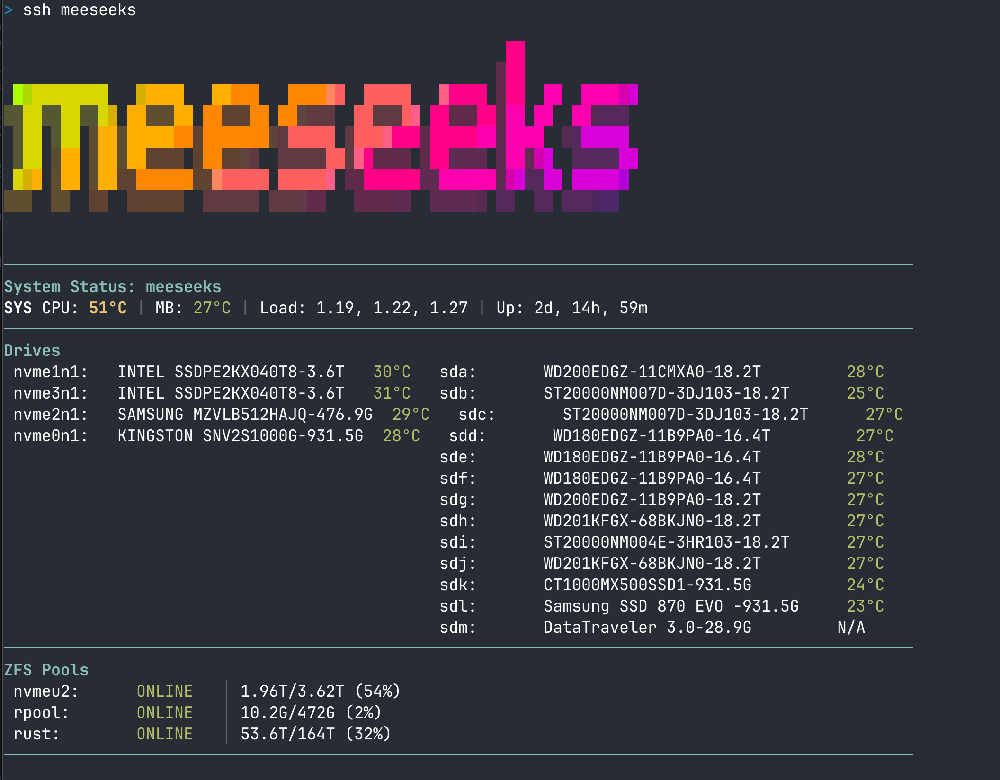

# Goodbye Plex, Hello Jellyfin

<div class="video-embed">
<iframe src="https://www.youtube.com/embed/bYVyBfvOGaI" title="Goodbye Plex, Hello Jellyfin | JellyfinJune Episode 1" frameborder="0" allow="accelerometer; autoplay; clipboard-write; encrypted-media; gyroscope; picture-in-picture; web-share" allowfullscreen></iframe>
</div>

These are the companion notes for JellyfinJune Episode 1 on the KTZ Systems YouTube channel.

## Compose snippet

Here is the Docker Compose service shown in the episode. Treat the paths, hostname, domain, timezone, and published URL as examples to adapt to your own server.

```yaml
services:
  jellyfin:
    image: jellyfin/jellyfin
    container_name: jellyfin
    hostname: jellyfin
    devices:
      - /dev/dri:/dev/dri
    volumes:
      - "/mnt/nvmeu2/appdata/mediaservers/jellyfin:/config"
      - "/mnt/rust/media:/mnt/rust/media:ro"
      - /mnt/downloads:/downloads:ro
    labels:
      - traefik.enable=true
      - "traefik.http.routers.jellyfin.rule=Host(`jf.wd.ktz.me`)"
      - traefik.http.services.jellyfin.loadbalancer.server.port=8096
    ports:
      - 2285:8096
      - 8096:8096
    environment:
      - "PUID=1000"
      - "PGID=1000"
      - "TZ=US/Eastern"
      - "JELLYFIN_PublishedServerUrl=https://jf.wd.ktz.me"
    restart: unless-stopped
```

## Login banner

Several folks asked what the Meeseeks server in the video showed on SSH login.



The first part uses [`arsham/figurine`](https://github.com/arsham/figurine), which Alex covered in [this YouTube video](https://www.youtube.com/watch?v=GPQ6k2GR17I). The drive temperature section is a custom script from the `ktz-server-welcome` role in the [IronicBadger infra repo](https://github.com/ironicbadger/infra/tree/main/roles/ktz-server-welcome).
