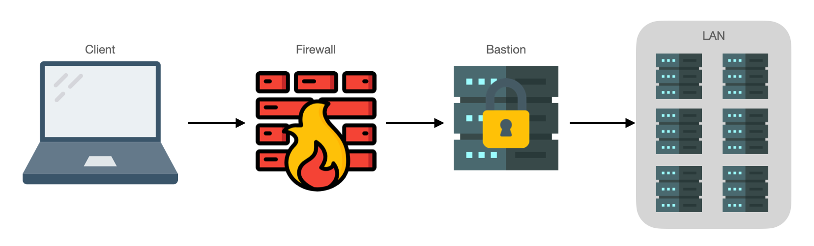

# SSH

SSH has to be one of the great unsung heros of the average sysadmins toolkit.

!!! info
    Much of this information was originally published at [blog.ktz.me - SSH Tips and why ProxyJump is awesome](https://blog.ktz.me/ssh-tips-and-tricks/).

## What is SSH?

The SSH protocol (also referred to as Secure Shell) is a method for secure remote login from one computer to another. It provides several alternative options for strong authentication, and it protects the communications security and integrity with strong encryption. It is a secure alternative to the non-protected login protocols (such as telnet, rlogin) and insecure file transfer methods (such as FTP) [^1].

## SSH Keys

Keys are an absolute fundamental for using SSH. They mean you don't need to use passwords to login to your remote systems and are much more secure. The gold standard for many years has been the rsa key type but more recently I've started using the ed25519 format instead. Here are two public keys:

```bash
# id_rsa.pub
ssh-rsa AAAAB3NzaC1yc2EAAAADAQABAAABgQDJkjxs7qlCUL8TSA5DrZ6+RWIWPTc2N3kpFZeWMVo3WwIiyv/8q4O40/HgmvOwwPOfJpvZe2KKphNbaMik5QzOLneZW4cZlwDuXmyFKoCkwHPfANBOOY6v8NCiN/obRc2Kb22hVs0NB2qeosew7VunkLemwrdNJd8/UCFH0ZVLE3ygflQeM/Spnlbm1JRWQaRg2FgiZ3Cs4WvEwKsSdg4mDbA5U45abksR3P0QlTkpOXQnhMf9sKHvT7pSlyUub14wYPjBxhJ6qz0wrq7xvtBgce31tzRtcC2MziVeTLSWcsP7A+bM5mQGX3VnDTliAOTxdM5/qjX1Yl3H4Zm6CPN6pxLdl+zRFNwjAbgxOjoNWr8IsOnOZ0Nj7R3/wxEW16T7UF4FTPwbzShVrmSH1lhEGh4ntpqq2GGNSiJwnQI3vQKBH55I4ppND6cqJ9rDvR2CqwSEUcHiHCtUfFrMgovy7MsPLurHN9n9Q4hET8HzHZupEwtZCeYvQ4IyL8wgrVs= alex@dev

# id_ed25519.pub
ssh-ed25519 AAAAC3NzaC1lZDI1NTE5AAAAIK4oWAP5LyXJsqOdu0X0m1BOYqQrBIDzj/63yAdC5vP8 alex@dev
```

The `ed25519` public key makes the `rsa` key look a bit gross doesnt it? The caveat here is that older versions of SSH don't support ed25519 but you probably shouldn't be exposing those old versions to the internet anyways. There's a great stackoverflow thread[^2] discussing the various merits of key types, enjoy that rabbit hole.

Generating a key is simple enough:

    ssh-keygen -t ed25519

Add a passphrase if you like. Tips on passphrases can be found [here](https://docs.github.com/en/github/authenticating-to-github/working-with-ssh-key-passphrases).

You can view the generate keys in `~/.ssh/` as `id_ed25519` for the private key and `id_ed25519.pub` for the public key. Guard the **private** key as you would a password. Do not share it, do not copy it anywhere else as it is your key to the kingdom. The public key is safe to share however, if you're interested as to why then check this video out:

<p align="center">
<iframe width="560" height="315" src="https://www.youtube.com/embed/YEBfamv-_do" frameborder="0" allow="accelerometer; autoplay; clipboard-write; encrypted-media; gyroscope; picture-in-picture" allowfullscreen></iframe></p>

It's also worth understanding `AgentForwarding` too. GitHub have some nice documentation on this topic. It allows you to use your local SSH keys instead of leaving keys (without passphrases!) sitting on your server. In their documentation pay attention to the ssh-agent section, it's important for all this to work.

## SSH Key Management

Copying keys to the remote host can be done in a few ways. 

### ssh-copy-id

The first requires that you already have SSH connectivity to the host (perhaps with temporary password authentication). `ssh-copy-id user@host:port` will copy the keys over and subsequent SSH sessions will automatically try the key first. If you temporarily enabled password authentication for SSH, disable it now.

### authorized_keys file

The second method requires console access to the host itself and hand editing the file `~/.ssh/authorized_keys`. Simply copy the public key from your client to a new line in this file. Watch that you don't add extra spaces or clip characters. A successful file should look something like this (this example has two public keys in it of differening types):

    [alex@dev .ssh]$ cat authorized_keys
    ssh-rsa AAAAB3NzaC1yc2EAAAADAQABAAABgQDJI+pcKMSI48VPa/Hmfn6CWIIHas7KjNI+nRU3hnBYxt4s81Ay1zYlHV7AmkcA1Vuucn7VzjrBXiDmv6QJDJu3oc27OcnCe1UUP/qyC+I9tATx4uf7/j90q4GnFiTNeVI7W3V+qIad07Fj2+XmzWIYFaUbKxEte3X9P40pecEjVsWq5P0/jTYGF+FSD/WjsRYu2384Is+7JMrPMWHgmjRH6ZYEI4O4mp9TfnxL5uQrE7qGU+zreFaT1DxwdCxxQnjGDPGNAOfOW0i+HgYxJqR2LIaEshOhJ4WgiCPWDsFbNtO1Ew/BOna/p/FYi8UHZ3idnB85GdhUzpj9MQ3qFm8ZckY7mq7WeNTN5hRrYBdbhfPjqqtZJxcuXQTnAy+i62gBoFhCt+hkdTgQuWVCrzrVabG4QGtkQgVPttlHTkReVLLov3A3qsElbOQ9wXagqCuDjwN27aWJOXhhMI4LqlHu6b9XUWoNzy0yXyqEcY+qKdwmN+oY8BaJMkQQTl8sWuU=
    ssh-ed25519 AAAAC3NzaC1lZDI1NTE5AAAAIBGdkkT4XX52jLLcRPaOvuU719iFRfk43V0TnNJhW0W2

### ssh-import-id

The third way is to use `ssh-import-id gh:ironicbadger` to import all SSH keys stored on GitHub under a specific users account. Unfortunately this is limited to Ubuntu / Deb systems only. It makes use of the SSH keys you store on Github. 

!!! info
    Remember public keys are safe to expose.

Every user exposes their keys publicly at [github.com/ironicbadger.keys](https://github.com/ironicbadger.keys). 

### Using Ansible

Finally, you could use Ansible but again that requires SSH in the first place so it can be somewhat of a chicken and egg problem. This method is useful if you have rotated keys elsewhere in your infrastructure and your Ansible host remains able to access the remote host. Here's an example task:

```
- name: Set authorized keys taken from url
  authorized_key:
    user: alex
    state: present
    key: https://github.com/ironicbadger.keys
```

## The Bastion Host

Given that SSH is so powerful, many bad actors target port 22 with scripts and other nastiness. For this reason it is good practice to only expose as little to the internet as possible rather than forwarding dozens of ports in your firewall to dozens of individual hosts.

This is common in enterprise environments but makes sense in most small networks where you have multiple hosts. The bastion server is your single exposed entrypoint so focus on making it as secure as possible.



Common things to look for when securing SSH are running on a non-standard port (i.e. not 22), disallow Root login, disallow password-authentication and so on. I use the Geerlingguy [security](https://github.com/geerlingguy/ansible-role-security) Ansible role in my [ironicbadger/infra](https://github.com/IronicBadger/infra/blob/master/run.yaml#L7) repo to change dozens of parameters.

Once on the bastion, you can probably reach most hosts in the rest of your LAN. This is sometimes known therefore as a jump host or island hopping. Whatever you call it, it means that now to get to a server that used to involve a single hop now requires two or more hops. We'll come onto `ProxyJump` in a moment but first we need to understand the SSH config file.

## SSH Config

We haven't talked much about the `~/.ssh/config` file yet but it is extremely useful. Define multiple hosts by pet names, specify custom ports, hostnames, users, etc. Take the following command:

    ssh alex@public.domain.com:50482 -i ~/.ssh/id_ed25519 

By using an SSH config file we can reduce this to:

    ssh bastion

Here's the SSH config snippet needed for that:

    # ~/.ssh/config
    Host bastion
        Hostname public.domain.com
        User alex
        Port 50482
        IdentityFile ~/.ssh/id_ed25519

We can also glob hosts together so that rules and paramaters defined apply to multiple hosts at once:

    Host *
        ForwardAgent yes

    Host 192.168.1.*
        User alex

## ProxyJump

And finally, it's time for the coolest thing here. `ProxyJump` makes it super simple to jump from one host to another totally transparently. For example:

    # ~/.ssh/config
    Host *
        ForwardAgent yes
    
    Host bastion
        Hostname public.domain.com
        User alex
        Port 50482
        IdentityFile ~/.ssh/id_ed25519
    
    Host lanserver
        Hostname 192.168.1.1
        User alex
        ProxyJump bastion

In the above example when we execute `ssh lanserver` we first connect to `bastion` before connecting to our final destination of `192.168.1.1`.

In the old days we had to use `netcat` and `ProxyCommand` with a bunch of crap to make this happen but now it's very elegant using `ProxyJump`.

[^1]: [ssh.com protocol](https://www.ssh.com/ssh/protocol/)
[^2]: [SSH Key: Ed25519 vs RSA - Stack Overflow](https://security.stackexchange.com/questions/90077/ssh-key-ed25519-vs-rsa)
