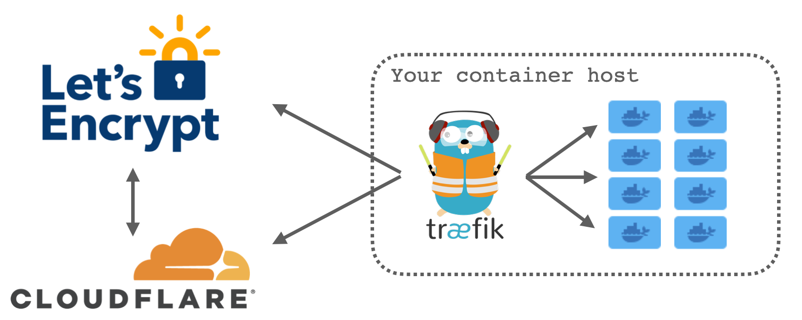
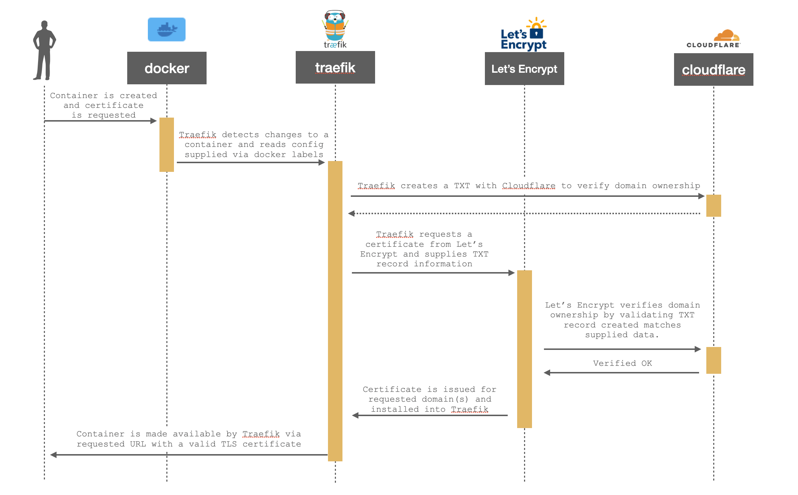
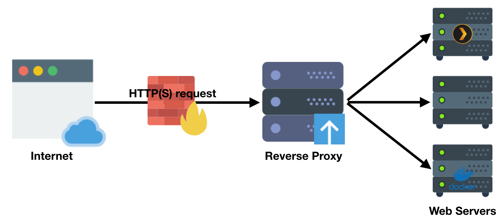

# Automatic TLS 101 for Docker in 2021 - Using Traefik, Cloudflare, Let’s Encrypt and Namecheap

In this article we will be discussing reverse proxies, how they will enable you to securely expose webapps running on your LAN to the outside world, and how to automate issuing TLS (SSL) certificates using Let's Encrypt, Traefik, Cloudflare and Namecheap.

!!!info
    This guide was written for Traefik v2 (last modified date at the bottom of the page).

## Overview



Traefik is the brains of the operation here acting as a middle man between multiple parties - your container(s), Let's Encrypt and Cloudflare. It is responsible for detecting when new containers have been created, communicating with Let's Encrypt to request a certificate to be issued and talking with Cloudflare by creating domain ownership verification records.   

There are quite a few moving parts to this operation but in essence, it's a simple transaction - albeit one with quite a few steps.

<figure>
  
  <figcaption><a href="../images/traefik101/tls-cert-issuing-sequence.png" target="_blank">Click here for full resolution</a> - This diagram shows the sequence of issuing a TLS certificate automatically.</figcaption>
</figure>

I know the diagram above is a little small so please use the full resolution link if you need it - there's a lot going on when we request a certificate as you can see. 

One of the nice things about Traefik is that this process is largely transparent to the end user and configured by adding a few labels to each container like this:

``` yaml
nginx:
  image: nginx
  container_name: nginx-test
  labels:
    - traefik.enable=true
    - traefik.http.routers.nginx.rule=(Host(`nginx.perfectmediaserver.com`)
    - traefik.http.routers.nginx.entrypoints=websecure
    - traefik.http.routers.nginx.tls.certresolver=cloudflare
```

We'll come onto configuring Traefik itself a bit later on but the above snippet shows the configuration required for an nginx container to be exposed at `nginx.perfectmediaserver.com` with an automatically provided TLS certificate from Cloudflare.

This approach of placing the configuration for the proxy in the compose file right alongside each container is one of the best things, in my opinion, about Traefik. With other reverse proxies, like nginx, config files live all your system and it can be hard to keep track. With this method, everything is in one place. Simple.

### Pre-requisites

This guide assumes a few things are in place:

* You own your own domain such as "perfectmediaserver.com", purchasing a .com domain costs as little as $10 per year.
* You have a Cloudflare account to use as your DNS provider
* You have a single host running docker and a few containers

Traefik works best with a single primary container host. Those containers should be running on the same host you intend to run Traefik on. Not in a VM, not on a remote host, but the same OS. This is because Traefik watches the docker socket (the main entrypoint for the docker API) for changes so it knows when a container has been created, modified or destroyed. 

!!!warning
    There are some security concerns to mounting the docker socket this way, so make sure you [understand the risks](https://raesene.github.io/blog/2016/03/06/The-Dangers-Of-Docker.sock/) and are aware of the [workarounds](https://chriswiegman.com/2019/11/protecting-your-docker-socket-with-traefik-2/) before proceeding.

### Traefik

The first component of this architecture is [Traefik], a reverse proxy. The job of a reverse proxy is to listen for incoming requests, match that request to a rule, go get the requested content and finally serve it back to the user. This process is entirely transparent to the user and appears as if the target service is responding directly to you.



!!! info
    Traefik supports numerous [providers](https://doc.traefik.io/traefik/https/acme/#providers) for DNS challenge verification, but we will only be discussing Cloudflare in the scope of this article. Using Cloudflare for DNS is free. You are free to use others, but will need to adjust these steps according to Traefik's provider documentation.


Next let's examine the lifecycle of a container exposed via Traefik with a certificate issued by Let's Encrypt.


https://doc.traefik.io/traefik/providers/docker/#provider-configuration
providers.docker.endpoint=unix:///var/run/docker.sock