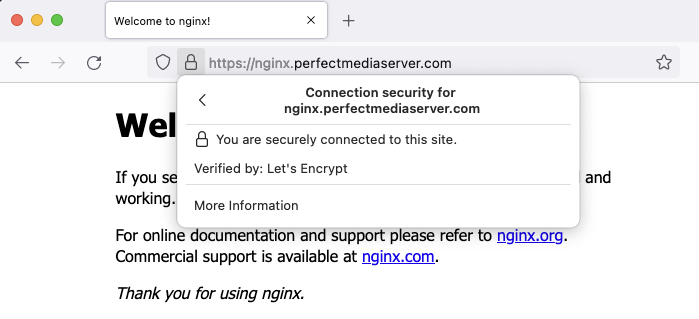
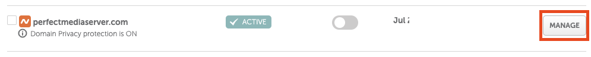
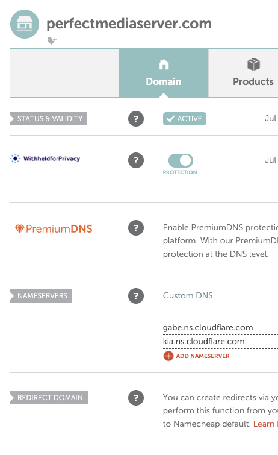
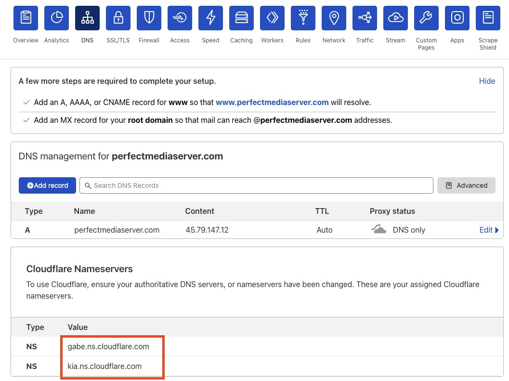

# Automatic TLS 101 for Docker in 2021 - Using Traefik, Cloudflare, Let’s Encrypt and Namecheap

In this article we will be discussing reverse proxies, how they will enable you to securely expose webapps running on your LAN to the outside world, and how to automate issuing TLS (the artist formerly known as SSL) certificates using Let's Encrypt, Traefik, Cloudflare and Namecheap.

!!!info
    This guide was written for Traefik v2 (last modified date at the bottom of the page).

## Overview


Traefik is the brains of the operation here acting as a middle man between multiple parties - your container(s), Let's Encrypt and Cloudflare. It is responsible for detecting when new containers have been created, communicating with Let's Encrypt to request a certificate to be issued and talking with Cloudflare by creating domain ownership verification records.   

There are quite a few moving parts to this operation but in essence, it's a simple transaction - albeit one with quite a few steps.

<figure>
  
  <figcaption><a href="../images/traefik101/tls-cert-issuing-sequence.png" target="_blank">Click here for full resolution</a> - This diagram shows the sequence of issuing a TLS certificate automatically.</figcaption>
</figure>

I know the diagram above is a little small so please use the full resolution link if you need it. 

One of the nice things about Traefik is that this process is largely transparent to the end user and configured by adding a few labels to each container like this:

``` yaml
nginx:
  image: nginx
  container_name: nginx-test
  labels:
    - traefik.enable=true
    - traefik.http.routers.nginx.rule=(Host(`nginx.perfectmediaserver.com`)
    - traefik.http.routers.nginx.entrypoints=websecure
    - traefik.http.routers.nginx.tls.certresolver=cloudflare
```

We'll come onto configuring Traefik itself a bit later on but the above snippet shows the configuration required for an nginx container to be exposed at `nginx.perfectmediaserver.com` with an automatically generated TLS certificate from Cloudflare.

This approach of placing the configuration for the proxy in the compose file right alongside each container is one of the best things, in my opinion, about Traefik. With other reverse proxies, like nginx, there are multiple config files required which can be quite complicated to read. With this method, everything is in one place. Simple.

### Pre-requisites

This guide assumes a few things are in place:

* You own your own domain such as "perfectmediaserver.com", purchasing a .com domain costs as little as $10 per year
* You have a Cloudflare account to use as your DNS provider (this is free)
* You have a single host running docker and a few containers

Traefik works best with a single primary container host. Those containers should be running on the same host you intend to run Traefik on. Not in a VM, not on a remote host, but the same OS. This is because Traefik watches the docker socket (the main entrypoint for the docker API) for changes so it knows when a container has been created, modified or destroyed. 

!!!warning
    There are some security concerns to mounting the docker socket this way, so make sure you [understand the risks](https://raesene.github.io/blog/2016/03/06/The-Dangers-Of-Docker.sock/) and are aware of the [workarounds](https://chriswiegman.com/2019/11/protecting-your-docker-socket-with-traefik-2/) before proceeding.

### Traefik

The first component of this architecture is [Traefik](https://traefik.io/), a reverse proxy. The job of a reverse proxy is to listen for incoming requests, match that request to a rule, go get the requested content and finally serve it back to the user. This process is entirely transparent to the user and appears as if the target service is responding directly to you.


!!! info
    Traefik supports numerous [providers](https://doc.traefik.io/traefik/https/acme/#providers) for DNS challenge verification, but we will only be discussing Cloudflare in the scope of this article. Using Cloudflare for DNS [is free](https://www.cloudflare.com/plans/). You are welcome to use other DNS providers, but will need to adjust these steps according to Traefik's provider documentation if you do.

## A simple start

Let's use nginx as a simple example for the bare minimum code required for a working configuration:

```
---
version: "2"
services:
  traefik:
    image: traefik
    container_name: tr
    volumes:
      - /home/alex/appdata/traefik/letsencrypt:/letsencrypt
      - /var/run/docker.sock:/var/run/docker.sock:ro
    ports:
      - 80:80
      - 443:443
    environment:
      - CLOUDFLARE_EMAIL=email@example.com
      - CLOUDFLARE_API_KEY=CFglobalAPIkey
    command:
      - --providers.docker=true
      - --entrypoints.web.address=:80
      - --entrypoints.web.http.redirections.entryPoint.to=websecure
      - --entrypoints.web.http.redirections.entryPoint.scheme=https
      - --entrypoints.websecure.address=:443
      - --certificatesresolvers.cloudflare.acme.dnschallenge=true
      - --certificatesresolvers.cloudflare.acme.dnschallenge.provider=cloudflare
      - --certificatesresolvers.cloudflare.acme.email=email@example.com
      - --certificatesresolvers.cloudflare.acme.storage=/letsencrypt/acme.json
  nginx:
    image: nginx
    container_name: nginx-test
    labels:
      - traefik.http.routers.nginx.rule=Host(`nginx.perfectmediaserver.com`)
      - traefik.http.routers.nginx.tls.certresolver=cloudflare
```

Using this configuration we'll end up with an nginx container running at `nginx.perfectmediaserver.com` with a valid TLS certificate, like this:



In this example I used Cloudflare but you can use any other DNS provider from this [list](https://doc.traefik.io/traefik/https/acme/#providers) provided by Traefik. If using another provider replace `CLOUDFLARE_*` environment variables with those suitable for your provider.

## Domain Setup - Namecheap

There are many options out there for domain registrars but I have used [namecheap](https://www.namecheap.com/) for over a decade now. It's considered good practice (though not required) to register your domain in a different place from where the DNS nameservers resides. To configure a namecheap domain to work with Cloudflare first we need to login to our namecheap dashboard and click `MANAGE`.



Next under `NAMESERVERS` clear out all existing values and select `Custom DNS`. 



The values you will need to enter into this section can be found over at your Cloudflare account as shown here.



These will most likely be different from the ones shown below, that is normal. Just input them into namecheap and wait for DNS propagation to work.

To test the nameservers we can use `dig perfectmediaserver.com NS`:

```
$ dig perfectmediaserver.com NS

; <<>> DiG 9.16.1-Ubuntu <<>> perfectmediaserver.com NS
;; global options: +cmd
;; Got answer:
;; ->>HEADER<<- opcode: QUERY, status: NOERROR, id: 22411
;; flags: qr rd ra; QUERY: 1, ANSWER: 2, AUTHORITY: 0, ADDITIONAL: 1

;; OPT PSEUDOSECTION:
; EDNS: version: 0, flags:; udp: 65494
;; QUESTION SECTION:
;perfectmediaserver.com.		IN	NS

;; ANSWER SECTION:
perfectmediaserver.com.	41321	IN	NS	gabe.ns.cloudflare.com.
perfectmediaserver.com.	41321	IN	NS	kia.ns.cloudflare.com.

;; Query time: 0 msec
;; SERVER: 127.0.0.53#53(127.0.0.53)
;; WHEN: Tue Sep 07 00:58:46 UTC 2021
;; MSG SIZE  rcvd: 102
```

!!!warning This can take up to 24h so be patient and be sure not to spam Let's Encrypt with requests from Traefik in the meantime else you may get locked out for up to a week by [rate limiting](https://letsencrypt.org/docs/rate-limits/).

## Let's Encrypt Staging API

Whilst you are first trying all this stuff out it might be a good idea to use the Let's Encrypt staging API so that you don't fall victim of [rate limiting](https://letsencrypt.org/docs/rate-limits/) lock outs. With Traefik, add this line into the list of `command` options:

  `- "--certificatesresolvers.cloudflare.acme.caserver=https://acme-staging-v02.api.letsencrypt.org/directory"`

## Traefik and the Docker provider

Traefik creates a corresponding service and router for each container. This is a long and potentially complex topic to *understand* but comprehension is not a pre-requisite for usage to begin with.

Full documentation on the provider can be found [here](https://doc.traefik.io/traefik/routing/providers/docker/).

## Traefik and TLS apps (like Unifi)

Apps like Ubiquiti's Unifi software can be run as a container and do so over TLS locally almost always using a self-signed TLS certificate. This breaks the default model used by Traefik which expects plain http traffic. We can set `insecureSkipVerify=true` as a `command` parameter to tell Traefik to ignore the self-signed certs. The full configuration line looks like this:

  `- --serversTransport.insecureSkipVerify=true`
  
## Traefik and declaring ports

Traefik relies on apps to have the correct ports exposed in its Dockerfile. We can override this or expose multiple ports using this label applied to the container itself:

  `- traefik.http.services.myservice.loadbalancer.server.port=8080`

## A more complete example

You can find a more complex docker-compose example in my infra repo [here](https://github.com/IronicBadger/infra/blob/master/dev/traefik/docker-compose.yaml).