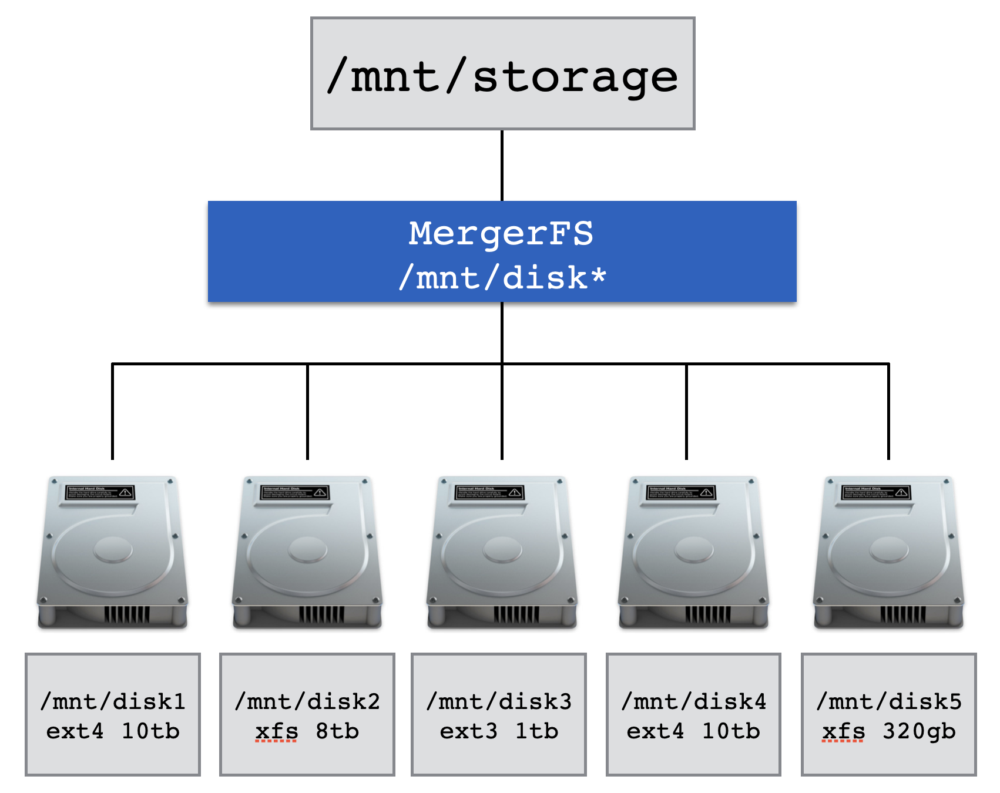

# MergerFS

The GitHub page describes it as "a featureful union filesystem". "Geared towards simplifying storage and management of files across numerous commodity storage devices. It is similar to mhddfs, unionfs, and aufs".

This amazing project is developed and maintained by Antonio SJ Musumeci (aka [@_trapexit](https://twitter.com/_trapexit)). Back in 2019 I got the chance to speak with Antonio for an episode of *Extras* by [Jupiter Broadcasting](https://www.jupiterbroadcasting.com/) - if you're interested in this technology who better to hear about it from than the developer himself?!

<iframe src="https://player.fireside.fm/v2/WTrMvATU+NSbz5Jst?theme=dark" width="740" height="200" frameborder="0" scrolling="no"></iframe>

## What is MergerFS?

MergerFS takes JBOD and turns them into what appears like a single drive. It's sort of like RAID in that sense but is actually nothing *at all* like RAID - there are some major differences - see ["is this RAID?"](#is-this-raid)

Here are the key features of MergerFS that make it perfect for PMS:

* Pools multiple drives into one mountable volume
* Supports addition *and* removal of devices with no rebuild times
* Permits drives with mismatched sizes with no penalties
* Each drive has an individually readable filesystem (ext4, xfs, zfs, etc)
    * Drives may contain data when mounted via Mergerfs
* Simple configuration with one line in `/etc/fstab`

## Drive Pooling

In the following diagram there are five separate disks. Each disk is a different size, is formatted with differing filesystems and they may already contain data - all of this is fine for MergerFS.



Configuration is performed via a single line of configuration in `/etc/fstab`[^1]. MergerFS has a lot knobs and dials to turn should you wish, they are all detailed in the [README](https://github.com/trapexit/mergerfs/blob/master/README.md) on the projects GitHub page.

!!! example
    ```
    /mnt/disk* /mnt/storage fuse.mergerfs defaults,nonempty,allow_other,use_ino,cache.files=off,moveonenospc=true,category.create=mfs,dropcacheonclose=true,minfreespace=250G,fsname=mergerfs 0 0
    ```

The example above is the required configuration to take every drive which matches `/mnt/disk*` such as `/mnt/disk1` or `/mnt/disk95` and merge it together presenting it to the user at `/mnt/storage`.

!!! note
    The directories and names used (`disk1` or `/mnt/storage`) are completely arbitrary and can take any form you wish.

It's possible to string multiple drives together manually as well. The syntax for that is to place a single `:` between the path to each drive to be mounted like `/mnt/disk*:/mnt/tank/fuse:/mnt/usb`.

## Is this RAID?

No, MergerFS differs from RAID in a few key ways.

The first is that MergerFS has *nothing whatsoever* to do with parity[^2]. MergerFS **zero** fault tolerance - if the drive that data is stored on fails, that data is gone. To mitigate this MergerFS is often paired with [SnapRAID](snapraid.md). Whilst these two projects are complimentary to each other their relationship is coincidental.

Second is that MergerFS does not stripe data. RAID achieves a level of redundancy by placing enough data from each drive on each of the other drives such that it can compute what was on the drive that just failed. This is useful but with modern drives leads to long rebuild times which creates unnecessary wear and tear on the drives leading, ironically, to premature failure - often during the most critical time, a rebuild!

The third way is related to the second. Because data is not striped each disk remains individually readable. That means that you can pull any combination of drives and put them into *any other* system capable of reading that filesystem and it will just work. This is not possible without all the members of a RAID array.


[^1]: More information about `/etc/fstab` is detailed in the [manual installation](../installation/manual-install.md) section.
[^2]: [What is Parity?](https://en.wikipedia.org/wiki/Standard_RAID_levels#Simplified_parity_example)

*[JBOD]: Just a Bunch Of Disks
*[RAID]: Redundant Array of Inexpensive Disks
*[PMS]: Perfect Media Server