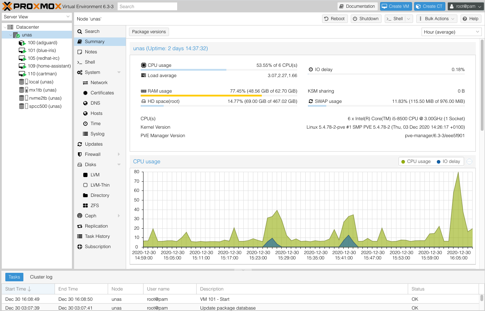

# Proxmox

Use of Proxmox as part of building PMS is *entirely optional*.

## What is Proxmox?

Proxmox Virtual Environment is an open-source server virtualization management platform. It is a Debian-based Linux distribution with a modified Ubuntu LTS kernel and allows deployment and management of virtual machines and containers.

It is provided as both a standalone distribution and as a package to be installed on top of an existing Debian installation. We write more about Proxmox under *Advanced Concepts -> [Hypervisors](../concepts/hypervisors.md)*.

## Why use Proxmox?

Proxmox is open-source. It provides almost all of the same features as the other options in the space and runs using KVM built right into the Linux kernel.

For the longest time I avoided Proxmox because of a nag screen that is displayed on new installations asking for subscriptions. I assumed, incorrectly, that Proxmox was demoware. That is not the case and I maintain an Ansible role to remove the nag screen completely [here](https://github.com/IronicBadger/ansible-role-proxmox-nag-removal).

Proxmox also natively supports running LXC (LinuX Containers) containers from the UI. These are similar to docker containers but behave more like a traditional VM would with a real init system, often systemd. I've been running AdGuard Home out of one for a while and it just works - makes me think I should do more this way but I'm quite attached to my docker-compose workflow for media apps.

## Do I need Proxmox?

It really depends on how you want to use this system. If you're just looking to store some files and run a few containers then a hypervisor might be a layer of added complexity that you just don't need. 

For most people, Proxmox is probably unnecessary.

I have found a lot value from virtualising my media server though. Snapshots, portability and separation being the key reasons. Virtualising the system that contains all my "stuff" allows the hypervisor to remain clean and operate reliably.

You might be the right fit for virtualising via Proxmox if you want to run more than one major service on the same hardware. AdGuard Home, Home Assistant, Blue Iris and PMS for example will all comfortably fit onto a single system with 64GB RAM. 

I know this because since discovering just how powerful Intel's Quick Sync was, I rebuilt my PMS around this technology and wrote about it on [blog.ktz.me](https://blog.ktz.me/passthrough-intel-igpu-with-gvt-g-to-a-vm-and-use-it-with-plex/) and under *Advanced Configuration -> [Quick Sync and Proxmox passthrough](../advanced/passthrough-igpu-gvtg/)* using Intel's GVT-g virtual GPU technology to pass more than a integrated graphics unit to more than one VM.

## What about ESXI?

ESXI by VMware is a juggernaut in the enterprise space but it comes with a steep cost. VMware make licenses available for home users that cost $200 per year via the VMUG program if you want to get fancy and start using Terraform to automate against vSphere [^1].

However, ESXI is not open source. And for that simple fact, Proxmox is my goto recommendation for home users looking to virtualise all the things.

[^1]: [How to Install OpenShift 4.6 using Terraform on VMware with UPI](https://www.openshift.com/blog/how-to-install-openshift-4.6-on-vmware-with-upi)

*[PMS]: Perfect Media Server
*[KVM]: Kernel Virtual Machines
*[VMUG]: VMware User Group
